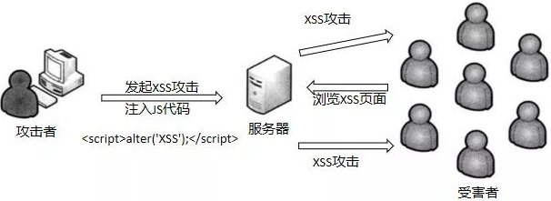
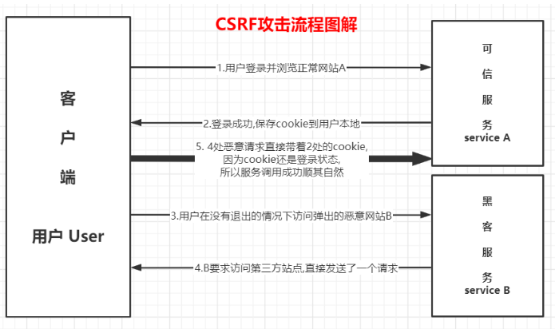

### 一、常见网站攻击

#### [1.XSS Cross Site Scripting 跨站脚本](https://zh.wikipedia.org/wiki/%E8%B7%A8%E7%B6%B2%E7%AB%99%E6%8C%87%E4%BB%A4%E7%A2%BC)



##### 原理：

不需要你做任何的登录认证，它会通过合法的操作（比如在url中输入、在评论框中输入），向你的页面注入脚本（可能是js、hmtl代码块等）。

最后导致的结果可能是：盗用Cookie破坏页面的正常结构，插入广告等恶意内容D-doss攻击。

可以利用安全漏洞:通过富文本编辑器外联图片地址,因为引图的时候不判断图片地址,从而进行流量攻击,消耗大量流量。

##### 解决方案：

·1、编码：

　　修复编码漏洞,对用户输入的数据进行HTML Entity 编码。把字符转换成 转义字符

2、过滤：

　　移除用户输入的和事件相关的属性。如onerror可以自动触发攻击，还有onclick等。

　　(总而言是，过滤掉一些不安全的内容)移除用户输入的Style节点、Script节点、Iframe节点。 (尤其是Script节点，它可是支持跨域的呀，一定要移除)。  

3、校正

　　避免直接对HTML Entity进行解码。使用DOM Parse转换，校正不配对的DOM标签

[1]: https://owasp.org/www-community/attacks/xss/


#### [2.CSRF  Cross-site request forgery 跨站请求伪造](https://zh.wikipedia.org/wiki/%E8%B7%A8%E7%AB%99%E8%AF%B7%E6%B1%82%E4%BC%AA%E9%80%A0)

##### 原理：




##### 满足的条件：

·1.登录受信任网站A，并在本地生成Cookie。（如果用户没有登录网站A，那么网站B在诱导的时候，请求网站A的api接口时，会提示你登录）

2.在不登出A的情况下，访问危险网站B（其实是利用了网站A的漏洞）。

##### 案例：

1.GET 类型的CSRF

```html
　
```

2.POST类型的CSRF

```html
<iframe style="display:none" name="csrf-frame"></iframe>
<form method='POST' action='http://www.bank.example/withdraw' target="csrf-frame" id="csrf-form">
  <input type='hidden' name='account' value='test1'>　　　　
  <input type='hidden' name='amount' value='888'>　　　
  <input type='hidden' name='for' value='sam'>　 　　
  <input type='submit' value='submit'>
</form>
<script>document.getElementById("csrf-form").submit()</script>
```


解决方案：

1.每次请求带token校验

2.验证 HTTP Referer 字段；

3.在 HTTP 头中自定义属性并验证；

4.Chrome浏览器端启用SameSite cookie,SameSite 标记的 cookie，只能发送来自同域名的请求。

5.短信验证码校验

> CSRF 和 XSS 的区别
>
> 区别一：
>
> 　　CSRF：需要用户先登录网站A，获取 cookie。XSS：不需要登录。
>
> 区别二：（原理的区别）
>
> 　　CSRF：是利用网站A本身的漏洞，去请求网站A的api。XSS：是向网站 A 注入 JS代码，然后执行 JS 里的代码，篡改网站A的内容。


[1]: https://github.com/pillarjs/understanding-csrf
[2]: https://www.cnblogs.com/hikoukay/p/12861382.html
[3]: https://github.com/wbbhacker/understanding-csrf

> ### [第 28 题：cookie 和 token 都存放在 header 中，为什么不会劫持 token？](https://github.com/Advanced-Frontend/Daily-Interview-Question/issues/31#top)#31
>
> 1、首先token不是防止XSS的，而是为了防止CSRF的；
> 2、CSRF攻击的原因是浏览器会自动带上cookie，而浏览器不会自动带上token

#### 3.点击劫持

点击劫持是一种视觉欺骗的攻击手段。攻击者将需要攻击的网站通过 iframe 嵌套的方式嵌入自己的网页中，并将 iframe 设置为透明，在页面中透出一个按钮诱导用户点击。

1.   特点

   - 隐蔽性较高，骗取用户操作
   - "UI-覆盖攻击"
   - 利用iframe或者其它标签的属性

2. 点击劫持原理

   用户在登陆 A 网站的系统后，被攻击者诱惑打开第三方网站，而第三方网站通过 iframe 引入了 A 网站的页面内容，用户在第三方网站中点击某个按钮（被装饰的按钮），实际上是点击了 A 网站的按钮。

3. 如何防御

   - X-FRAME-OPTIONS 

     `X-FRAME-OPTIONS`是一个 HTTP 响应头，在现代浏览器有一个很好的支持。这个 HTTP 响应头 就是为了防御用 iframe 嵌套的点击劫持攻击。

     该响应头有三个值可选，分别是：

     - DENY，表示页面不允许通过 iframe 的方式展示
     - SAMEORIGIN，表示页面可以在相同域名下通过 iframe 的方式展示
     - ALLOW-FROM，表示页面可以在指定来源的 iframe 中展示

   - JavaScript 防御

     对于某些远古浏览器来说，并不能支持上面的这种方式，那我们只有通过 JS 的方式来防御点击劫持了。

     ```javascript
     <head>
       <style id="click-jack">
         html {
           display: none !important;
         }
       </style>
     </head>
     <body>
       <script>
         if (self == top) {
           var style = document.getElementById('click-jack')
           document.body.removeChild(style)
         } else {
           top.location = self.location
         }
       </script>
     </body>
     
     ```

#### 4.URL跳转漏洞

借助未验证的URL跳转，将应用程序引导到不安全的第三方区域，从而导致的安全问题。

1. 实现方式

   - Header头跳转

   - JavaScript 跳转

   - META标签跳转

     > 自己代码漏洞

     

2. 如何防御

   1. referer限制

   - 加入有效验证性Token

#### 5.SQL 注入

​	所谓SQL注入，就是通过把SQL命令插入到Web表单递交或输入域名或页面请求的查询字符串，最终达到欺骗服	务器执行恶意的SQL命令。

​	**SQL注入的本质:数据和代码未分离，即数据当做了代码来执行。**

1. 如何防御：
   - **严格限制Web应用的数据库的操作权限**，给此用户提供仅仅能够满足其工作的最低权限，从而最大限度的减少注入攻击对数据库的危害
   - **后端代码检查输入的数据是否符合预期**，严格限制变量的类型，例如使用正则表达式进行一些匹配处理。
   - **对进入数据库的特殊字符（'，"，，<，>，&，\*，; 等）进行转义处理，或编码转换**。基本上所有的后端语言都有对字符串进行转义处理的方法，比如 lodash 的 lodash._escapehtmlchar 库。
   - **所有的查询语句建议使用数据库提供的参数化查询接口**，参数化的语句使用参数而不是将用户输入变量嵌入到 SQL 语句中，即不要直接拼接 SQL 语句。例如 Node.js 中的 mysqljs 库的 query 方法中的 ? 占位参数。

#### 6.os命令式注入攻击

OS命令注入和SQL注入差不多，只不过SQL注入是针对数据库的，而OS命令注入是针对操作系统的。OS命令注入攻击指通过Web应用，执行非法的操作系统命令达到攻击的目的。只要在能调用Shell函数的地方就有存在被攻击的风险。倘若调用Shell时存在疏漏，就可以执行插入的非法命令。

1. 如何防御：
   - 后端对前端提交内容进行规则限制（比如正则表达式）。
   - 在调用系统命令前对所有传入参数进行命令行参数转义过滤。
   - 不要直接拼接命令语句，借助一些工具做拼接、转义预处理，例如 Node.js 的 `shell-escape npm`包

#### 7.Http Heads攻击

#### 8.上传文件攻击

#### 9.session攻击，会话劫持

​	用某种手段得到用户session ID，从而冒充用户进行请求

​	防御方法：

　　每次登陆重置sessionID
　　设置HTTPOnly，防止客户端脚本访问cookie信息，阻止xss攻击
　　关闭透明化sessionID
　　user-agent头信息验证
　　token校验

#### 10.DDOS攻击

​	分布式拒绝服务攻击（Distributed Denial of Service），简单说就是发送大量请求是使服务器瘫痪。DDos攻击是在DOS攻击基础上的，可以通俗理解，dos是单挑，而ddos是群殴，因为现代技术的发展，dos攻击的杀伤力降低，所以出现了DDOS，攻击者借助公共网络，将大数量的计算机设备联合起来，向一个或多个目标进行攻击。

1. 案例

　　SYN Flood ,简单说一下tcp三次握手，客户端先服务器发出请求，请求建立连接，然后服务器返回一个报文，表明请求以被接受，然后客户端也会返回一个报文，最后建立连接。那么如果有这么一种情况，攻击者伪造ip地址，发出报文给服务器请求连接，这个时候服务器接受到了，根据tcp三次握手的规则，服务器也要回应一个报文，可是这个ip是伪造的，报文回应给谁呢，第二次握手出现错误，第三次自然也就不能顺利进行了，这个时候服务器收不到第三次握手时客户端发出的报文，又再重复第二次握手的操作。如果攻击者伪造了大量的ip地址并发出请求，这个时候服务器将维护一个非常大的半连接等待列表，占用了大量的资源，最后服务器瘫痪。
CC攻击，在应用层http协议上发起攻击，模拟正常用户发送大量请求直到该网站拒绝服务为止。

2. 被攻击的原因:
   　　服务器带宽不足，不能挡住攻击者的攻击流量
3. 预防:
   　　最直接的方法增加带宽。但是攻击者用各地的电脑进行攻击，他的带宽不会耗费很多钱，但对于服务器来说，带宽非常昂贵。
      　　云服务提供商有自己的一套完整DDoS解决方案，并且能提供丰富的带宽资源

> 参考链接：
>
> https://en.wikipedia.org/wiki/HTTP_cookie#Network_eavesdropping

###  二、CSP 内容安全策略 Content Security Policy

#### 1.配置方法

- 方法一：配置 HTTP header  `Content-Security-Policy`

  配置好并启用后，不符合 CSP 的外部资源就会被阻止加载。

  > Content-Security-Policy-Report-Only
  >
  > 表示不执行限制选项，只是记录违反限制的行为。它必须与`report-uri`选项配合使用。

- 方法二：页面配置 `<meta>`  

  `<meta http-equiv="Content-Security-Policy" content="default-src 'self'; img-src https://*; child-src 'none';"`

#### 2.原理

白名单制度，开发者告诉客户端，哪些资源可以加载和执行，等同于提供白名单。它的实现和执行由浏览器完成，开发者只需提供配置。

