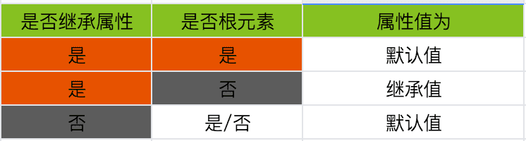
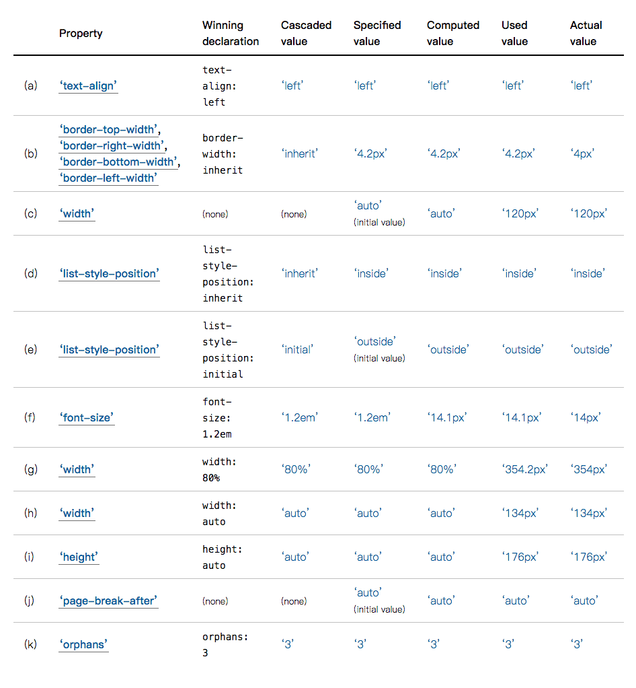

### 你知道DOM 元素最终的css属性值是怎么计算来的吗？

工作中经常疑惑DOM元素最终CSS属性值的由来，今天做个全面的整理。分为两部分

- css 属性值的分类
- 最终css属性值的计算过程

#### 一、css属性值的分类

按照最终值的计算流程大体分别四个阶段：

- 未声明值阶段（初始值、继承值）
- 声明值阶段（声明值、级联值、指定值）
- 布局计算阶段（布局前：计算值，布局后：使用值）
- 浏览器最终显示阶段 （实际值）

详细可分为8种：初始值、继承值、声明值、级联值、指定值、计算值、使用值、实际值。

下面详细介绍:

##### 1.默认值 initial value

css属性的初始值都是默认定义的值。如`overflow` 初始值为：’visible‘。

css所有属性都可以通过'initial' ，显示指定属性的值为初始值。

##### 2.继承值 inherited value

css属性可分为’可继承属性‘ 和 ’不可继承属性‘。

可继承属性的继承值为它父元素对应属性的**计算值( computed value)**。对于没有父元素的根元素，其可继承属性的继承值为它的**初始值(initial value)**。

如 color属性 为可继承属性，元素em 可继承其父元素p的color属性，显示为 green 色；

```css
p{color:green};
```

```html
<p>This paragraph has <em>emphasized text</em> in it.</p>
```


> 非可继承属性的无继承值，如css 属性border属性为非可继承属性，不可继承其父元素的border属性

在css属性未声明阶段属性值为：



css所有属性都可以通过’inherit‘ ，显示指定属性的值可继承。

##### 3.声明值 Declared Values

应用于元素的每个属性声明都是该元素对应属性的**声明值(declared values)**。如下：

该例子中p元素对应的width属性的声明值有三个分别为：

- .name 中声明的 width 的属性值 100px

- .box p 中声明的width 的属性值 200px
- .box p.name 中声明的width 的属性值 300px

```css
p{
  border:1px solid #000;
}
.name {
  width:100px;
}
.box p{
  width:200px;
}
.box p.name{
  width:300px;
}
```

```html
<div class="box">
  <p class="name">柚子先生王彬彬</p>
</div>
```

##### 4.级联值 Cascaded Values

在声明值中 ，通过级联优先级筛选出 优先级最高的声明值作为 **级联值 (cascaded value)**。

上面声明值例子中，p元素通过级联优先级排序 三个声明值，最终选定级联优先级最高的 300px 为级联值。

##### 5.指定值 Specified Values

每个元素的每个属性都会有一个指定值，一般用 级联值 作为 **指定值(specified value)**。

在没有级联值的情况下：指定值为 初始值  或 默认值，你可以为属性显示设置'initial'/'inherit' 来指定属性的指定值为初始值/继承值。

##### 6.计算值 Computed Values

将 **指定值** 从相对值解析成绝对值 之后的结果 作为 **计算值(computed values)**。计算值 将作为子元素属性的继承值来用。

- 指定值的单位为：em、ex、vh、vm 需乘以合适的数值， 转换成绝对值 
- 关键词如 'smaller' ,'bolder'‘,需替换成它们定义的值
- 某些属性的百分比值 需乘以合适的系数
- 相对路径 需转换成 绝对路径

例如：一个元素的属性的指定值为：`font-size:16px; padding-top:2em`,则padding-top的计算值为 32px （fontSize 的 2倍）

通常来讲，计算值会在文档布局或其它要求性能较高的操作（如网络请求、获取其祖先元素的属性值以求自身属性值操作）之前 ，对指定值 进行 解析。注：说明某些属性的指定值还没有完全 解析

##### 7.使用值 Used Value

**使用值(used value) **是将计算值完成所有剩余计算，使其可以在文档布局中使用的绝对值。如果一个元素没有该属性，则改元素没有该属性的 使用值。

例如： 声明值`width:'auto'` 在它祖先元素未完成布局之前（即它祖先元素为获得实际值之前），不会解析成一个长度值，因为’auto‘是相对于它的祖先元素来解析，它祖先元素没解析出来，它肯定也解析不出来。所以它的计算值(computed value) 为 'auto'，使用值为一个绝对值比如：’100px‘。

##### 8.实际值 Actual Value

一般使用值 会被用做 实际值(Actual Value)，但是限于浏览器的对某些属性值的限制，实际值还会跟使用值不同。

比如：谷歌浏览器 元素属性的 font-size 最小值只能为12px，用户声明font-size:1px; 完全计算结果 使用值为 1px，但是最后实际在谷歌浏览器显示的实际值为：12px。

综合上所述，例子：



#### 二、最终css属性值的计算过程

1. 首先针对每个元素上的每个属性，收集其声明值
2. 根据级联优先级，对收集来声明值进行排序，得出优先级最高的声明值，作为级联值
3. 一般用级联值作为指定值，如果没有级联值，则用初始值或继承值作为指定值
4. 在布局之前或有高性能操作之前，根据级联值 计算出 绝对值 作为 计算值
5. 布局之后 再把 计算值 进一步解析为 使用值
6. 最后根据客户端环境限制，将使用值 转化为 实际值

css属性值的分类及计算过程大体就是这样子，如果感兴趣可以看参考链接的英文文档。

有疑惑欢迎留言。

*参考链接:*

[1]:https://developer.mozilla.org/en-US/docs/Web/CSS/Reference
[2]:https://drafts.csswg.org/css-cascade-4/#value-stages

