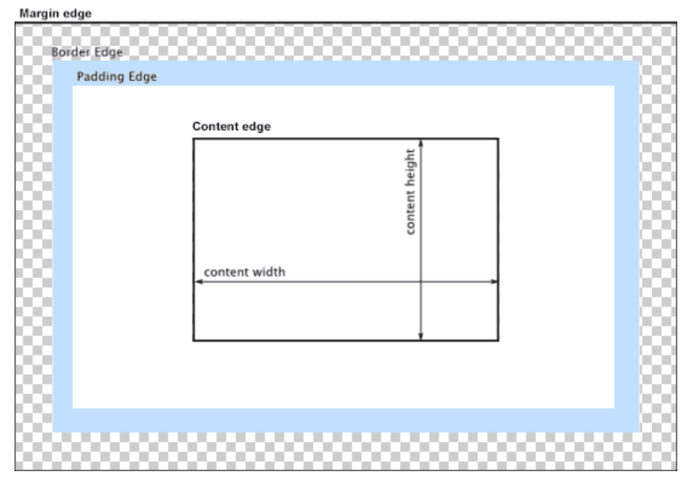

### 1.[Box Model](https://developer.mozilla.org/en-US/docs/Web/CSS/CSS_Box_Model/Introduction_to_the_CSS_box_model)

#### 1.css基础盒子模型

浏览器渲染引擎通过矩形的标准css基础盒子模型渲染每个html元素。

盒子模型由content域、padding区域、border区域、margin区域四部分组成。

css决定盒子模型的大小、位置、属性（颜色、背景）等等。

box-sizing:

- content-box

  元素宽度为：content-width

  width：100px，则元素content实际宽度为100px

- border-box

  元素宽度为：width+padding+border

  Width:100px;padding:10px;border:10px solid #f00; ，则content元素实际宽度为80px

### 2.[Visual formatting model](https://developer.mozilla.org/en-US/docs/Web/CSS/Visual_formatting_model)