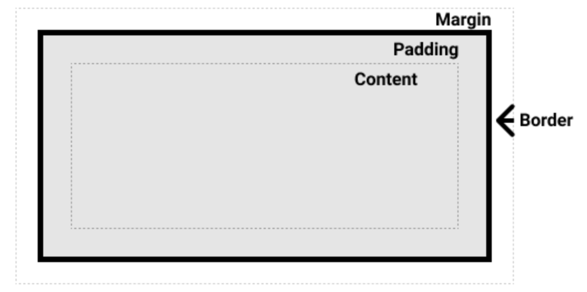

### [containing block  包含块](https://developer.mozilla.org/en-US/docs/Web/CSS/Containing_block)

#### 1.定义：

containing block 会影响一个元素的大小跟位置，通常containing block 是挨着最近的块级元素的 content area

> 每个元素盒子会被划分成四个区域：
>
> 1. Content area
> 2. padding area
> 3. border area
> 4. Margin area
>
> 
>
> position属性值： static、relative、absolute、fixed、sticky

#### 2.影响：

1. containing block 会影响元素大小跟位置
2. 应用于绝对定位元素（position:absolute/fixed）的width、height、margin、padding、偏移属性的百分比值 都是通过containing block 计算的

#### 3.识别包含块：

1. position：static / relative / sticky 时：

   containing block 由最近的祖先块容器（a block contain） 或  块级格式化上下文 （establishes a formatting context）的 content box组成

2. position: absolute 时：

   containing block 由最近的position 属性值为：fixed / absolute / relative / sticky的祖先元素的padding box组成

3. position:fixed 时 ：

   containing block 由视图 viewport 或 页面区域 建立

4. position: absolute / fixed 时：

   containing block 也会由最近的包含以下属性的 祖先元素的padding box 组成

   - transform和perspective 的属性值不为none
   - will-change属性值为：transform和perspective
   - filter 的属性值为none
   - contain:paint

> 根元素<html> 的containing block 被叫做 初始包含块，由视口 viewport 和 页面区域 建立

#### 4.通过containing block计算百分比属性

- height、top、bottom 根据包含块的height 计算 百分比值
- width、left、right、**margin、padding**根据包含块的**width** 计算百分比值 