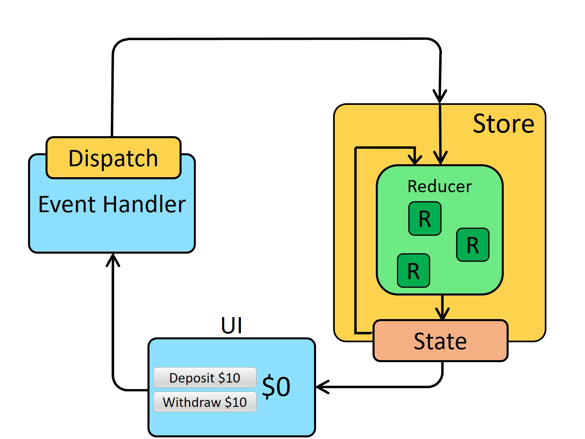

### 1.Redux

#### 1.Top-Level Exports

##### 1.[createStore(reducer, [preloadedState\], [enhancer])](https://redux.js.org/api/createstore)

1. `reducer` *(Function)*: A [reducing function](https://redux.js.org/understanding/thinking-in-redux/glossary#reducer) that returns the next [state tree](https://redux.js.org/understanding/thinking-in-redux/glossary#state), given the current state tree and an [action](https://redux.js.org/understanding/thinking-in-redux/glossary#action) to handle.
2. [`preloadedState`] *(any)*: The initial state. You may optionally specify it to hydrate the state from the server in universal apps, or to restore a previously serialized user session. **If you produced `reducer` with [`combineReducers`](https://redux.js.org/api/combinereducers), this must be a plain object with the same shape as the keys passed to it.** Otherwise, you are free to pass anything that your `reducer` can understand.
3. [`enhancer`] *(Function)*: The store enhancer. You may optionally specify it to enhance the store with third-party capabilities such as middleware, time travel, persistence, etc. The only store enhancer that ships with Redux is [`applyMiddleware()`](https://redux.js.org/api/applymiddleware).

> - Don't create more than one store in an application! Instead, use [`combineReducers`](https://redux.js.org/api/combinereducers) to create a single root reducer out of many.
>
> - Redux state is normally plain JS objects and arrays.
>
> - If your state is a plain object, make sure you never mutate it! Immutable updates require making copies of each level of data, typically using the object spread operator ( `return { ...state, ...newData }` ).
>
> - For universal apps that run on the server, create a store instance with every request so that they are isolated. Dispatch a few data fetching actions to a store instance and wait for them to complete before rendering the app on the server.
>
> - When a store is created, Redux dispatches a dummy action to your reducer to populate the store with the initial state. You are not meant to handle the dummy action directly. Just remember that your reducer should return some kind of initial state if the state given to it as the first argument is `undefined`, and you're all set.
>
> - To apply multiple store enhancers, you may use [`compose()`](https://redux.js.org/api/compose).
>
>   

##### 2.[combineReducers(reducers)](https://redux.js.org/api/combinereducers)

```javascript
rootReducer = combineReducers({potato: potatoReducer, tomato: tomatoReducer})
// This would produce the following state object
{
  potato: {
    // ... potatoes, and other state managed by the potatoReducer ...
  },
  tomato: {
    // ... tomatoes, and other state managed by the tomatoReducer, maybe some nice sauce? ...
  }
}
```

##### 3.[applyMiddleware(...middlewares)](https://redux.js.org/api/applymiddleware)

- `...middleware` (*arguments*): Functions that conform to the Redux *middleware API*. Each middleware receives [`Store`](https://redux.js.org/api/store)'s [`dispatch`](https://redux.js.org/api/store#dispatchaction) and [`getState`](https://redux.js.org/api/store#getState) functions as named arguments, and returns a function. That function will be given the `next` middleware's dispatch method, and is expected to return a function of `action` calling `next(action)` with a potentially different argument, or at a different time, or maybe not calling it at all. The last middleware in the chain will receive the real store's [`dispatch`](https://redux.js.org/api/store#dispatchaction) method as the `next` parameter, thus ending the chain. So, the middleware signature is `({ getState, dispatch }) => next => action`.

```javascript
import { createStore, applyMiddleware } from 'redux'
import todos from './reducers'

function logger({ getState }) {
  return next => action => {
    console.log('will dispatch', action)

    // Call the next dispatch method in the middleware chain.
    const returnValue = next(action)

    console.log('state after dispatch', getState())

    // This will likely be the action itself, unless
    // a middleware further in chain changed it.
    return returnValue
  }
}

const store = createStore(todos, ['Use Redux'], applyMiddleware(logger))

store.dispatch({
  type: 'ADD_TODO',
  text: 'Understand the middleware'
})
// (These lines will be logged by the middleware:)
// will dispatch: { type: 'ADD_TODO', text: 'Understand the middleware' }
// state after dispatch: [ 'Use Redux', 'Understand the middleware' ]
```

###### 同步数据处理



###### 异步数据处理


```javascript
import { createStore, combineReducers, applyMiddleware } from 'redux'
import thunk from 'redux-thunk'
import * as reducers from './reducers'

const reducer = combineReducers(reducers)
// applyMiddleware supercharges createStore with middleware:
const store = createStore(reducer, applyMiddleware(thunk))

function fetchSecretSauce() {
  return fetch('https://www.google.com/search?q=secret+sauce')
}

// These are the normal action creators you have seen so far.
// The actions they return can be dispatched without any middleware.
// However, they only express “facts” and not the “async flow”.
function makeASandwich(forPerson, secretSauce) {
  return {
    type: 'MAKE_SANDWICH',
    forPerson,
    secretSauce
  }
}

function apologize(fromPerson, toPerson, error) {
  return {
    type: 'APOLOGIZE',
    fromPerson,
    toPerson,
    error
  }
}

function withdrawMoney(amount) {
  return {
    type: 'WITHDRAW',
    amount
  }
}

// Even without middleware, you can dispatch an action:
store.dispatch(withdrawMoney(100))

// But what do you do when you need to start an asynchronous action,
// such as an API call, or a router transition?

// Meet thunks.
// A thunk is a function that returns a function.
// This is a thunk.
function makeASandwichWithSecretSauce(forPerson) {
  // Invert control!
  // Return a function that accepts `dispatch` so we can dispatch later.
  // Thunk middleware knows how to turn thunk async actions into actions.
  return function (dispatch) {
    return fetchSecretSauce().then(
      sauce => dispatch(makeASandwich(forPerson, sauce)),
      error => dispatch(apologize('The Sandwich Shop', forPerson, error))
    )
  }
}

// Thunk middleware lets me dispatch thunk async actions
// as if they were actions!
store.dispatch(makeASandwichWithSecretSauce('Me'))

// It even takes care to return the thunk's return value
// from the dispatch, so I can chain Promises as long as I return them.
store.dispatch(makeASandwichWithSecretSauce('My wife')).then(() => {
  console.log('Done!')
})

// In fact I can write action creators that dispatch
// actions and async actions from other action creators,
// and I can build my control flow with Promises.
function makeSandwichesForEverybody() {
  return function (dispatch, getState) {
    if (!getState().sandwiches.isShopOpen) {
      // You don't have to return Promises, but it's a handy convention
      // so the caller can always call .then() on async dispatch result.
      return Promise.resolve()
    }

    // We can dispatch both plain object actions and other thunks,
    // which lets us compose the asynchronous actions in a single flow.
    return dispatch(makeASandwichWithSecretSauce('My Grandma'))
      .then(() =>
        Promise.all([
          dispatch(makeASandwichWithSecretSauce('Me')),
          dispatch(makeASandwichWithSecretSauce('My wife'))
        ])
      )
      .then(() => dispatch(makeASandwichWithSecretSauce('Our kids')))
      .then(() =>
        dispatch(
          getState().myMoney > 42
            ? withdrawMoney(42)
            : apologize('Me', 'The Sandwich Shop')
        )
      )
  }
}

// This is very useful for server side rendering, because I can wait
// until data is available, then synchronously render the app.

import { renderToString } from 'react-dom/server'

store
  .dispatch(makeSandwichesForEverybody())
  .then(() => response.send(renderToString(<MyApp store={store} />)))

// I can also dispatch a thunk async action from a component
// any time its props change to load the missing data.

import { connect } from 'react-redux'
import { Component } from 'react'

class SandwichShop extends Component {
  componentDidMount() {
    this.props.dispatch(makeASandwichWithSecretSauce(this.props.forPerson))
  }

  componentDidUpdate(prevProps) {
    if (prevProps.forPerson !== this.props.forPerson) {
      this.props.dispatch(makeASandwichWithSecretSauce(this.props.forPerson))
    }
  }

  render() {
    return <p>{this.props.sandwiches.join('mustard')}</p>
  }
}

export default connect(state => ({
  sandwiches: state.sandwiches
}))(SandwichShop)
```


```javascript
//react-thunk 原理
// standard middleware definition, with 3 nested functions:
// 1) Accepts `{dispatch, getState}`
// 2) Accepts `next`
// 3) Accepts `action`
const thunkMiddleware =
  ({ dispatch, getState }) =>
  next =>
  action => {
    // If the "action" is actually a function instead...
    if (typeof action === 'function') {
      // then call the function and pass `dispatch` and `getState` as arguments
      return action(dispatch, getState)
    }

    // Otherwise, it's a normal action - send it onwards
    return next(action)
  }
```

>React-thunk 功能类似于 vuex 里面定义的actions ， reducer 功能类似于 vuex 中的 mutations
>
>thunk 本质上就是给 action 传`dispatch` 参数


https://sourcegraph.com/github.com/reduxjs/redux-thunk/-/blob/src/index.ts?L37

https://redux.js.org/tutorials/essentials/part-5-async-logic

##### 4.[bindActionCreators(actionCreators, dispatch)](https://redux.js.org/api/bindactioncreators)

1. `actionCreators` (*Function* or *Object*): An [action creator](https://redux.js.org/understanding/thinking-in-redux/glossary#action-creator), or an object whose values are action creators.
2. `dispatch` (*Function*): A [`dispatch`](https://redux.js.org/api/store#dispatchaction) function available on the [`Store`](https://redux.js.org/api/store) instance.

```ts
function bindActionCreator<A extends AnyAction = AnyAction>(
  actionCreator: ActionCreator<A>,
  dispatch: Dispatch
) {
  return function (this: any, ...args: any[]) {
    return dispatch(actionCreator.apply(this, args))
  }
}


export default function bindActionCreators(
  actionCreators: ActionCreator<any> | ActionCreatorsMapObject,
  dispatch: Dispatch
) {
  if (typeof actionCreators === 'function') {
    return bindActionCreator(actionCreators, dispatch)
  }

  const boundActionCreators: ActionCreatorsMapObject = {}
  for (const key in actionCreators) {
    const actionCreator = actionCreators[key]
    if (typeof actionCreator === 'function') {
      boundActionCreators[key] = bindActionCreator(actionCreator, dispatch)
    }
  }
  return boundActionCreators
}
```

> https://sourcegraph.com/github.com/reduxjs/redux/-/blob/src/bindActionCreators.ts?L17

##### 5.[compose(...functions)](https://redux.js.org/api/compose)

Composes functions from right to left.

#### 2.Store API

##### 1.[getState()](https://redux.js.org/api/store#getState)

Returns the current state tree of your application. It is equal to the last value returned by the store's reducer.

##### 2.[dispatch(action)](https://redux.js.org/api/store#dispatchaction)

Dispatches an action. This is the only way to trigger a state change.

##### 3.[subscribe(listener)](https://redux.js.org/api/store#subscribelistener)

Adds a change listener. It will be called any time an action is dispatched, and some part of the state tree may potentially have changed. You may then call [`getState()`](https://redux.js.org/api/store#getState) to read the current state tree inside the callback.

##### 4.[replaceReducer(nextReducer)](https://redux.js.org/api/store#replacereducernextreducer)

Replaces the reducer currently used by the store to calculate the state.

It is an advanced API. You might need this if your app implements code splitting, and you want to load some of the reducers dynamically. You might also need this if you implement a hot reloading mechanism for Redux.

1. `nextReducer` (*Function*) The next reducer for the store to use.


### 2.react-redux

#### 1.[Provider](https://react-redux.js.org/api/provider)

`store` ([Redux Store](https://redux.js.org/api/store)) The single Redux `store` in your application.

`children` (ReactElement) The root of your component hierarchy.

`context` You may provide a context instance. If you do so, you will need to provide the same context instance to all of your connected components as well. Failure to provide the correct context results in runtime error:

```react
import React from 'react'
import ReactDOM from 'react-dom'
import { Provider } from 'react-redux'

import { App } from './App'
import createStore from './createReduxStore'

const store = createStore()

ReactDOM.render(
  <Provider store={store}>
    <App />
  </Provider>,
  document.getElementById('root')
)
```

#### 2.[Hooks](https://react-redux.js.org/api/hooks)

##### 1.useSelector()

##### 2.useDispatch()

##### 3.useStore()

##### 4.useActions()

##### 5.useShallowEqualSelector()

#### 3.[connect()](https://react-redux.js.org/api/connect)

```javascript
function connect(mapStateToProps?, mapDispatchToProps?, mergeProps?, options?)
```

#### 4.[connectAdvanced()](https://react-redux.js.org/api/connect-advanced)

#### 5.[batch()](https://react-redux.js.org/api/batch)


### 3.深入浅出Redux原理

##### **1.Redux 数据流向**


##### 2.**Redux应用原则**

* 单一数据源
* State是只读的
* Reducer必须是一个纯函数

https://www.clariontech.com/blog/mvc-vs-flux-vs-redux-the-real-differences

http://fluxxor.com/guides/installation.html
