#### [1.React Hooks 介绍](https://reactjs.org/docs/hooks-reference.html)

对函数组件进行增强，让函数型组件可以存储状态，可以拥有处理副作用的能力。让开发者在不使用类组件的情况下，实现相同的功能。

> 副作用：在一个组件中，只要不是转化成视图的代码就是副作用。比如获取dom，为Dom 添加元素、设置定时器、发送ajax 等。在类组件中通常使用声明周期处理副作用，在函数组件中使用hooks处理

#### 2.Hooks 要解决的问题

1. 类组件的不足（Hooks 要解决的问题）

   1. 缺少逻辑复用机制

      为了复用逻辑增加无实际渲染效果的组件，增加了组件层级显示十分臃肿增加了调试的难度以及运行效率的降低

   2. 类组件经常变得很复杂难以维护

      将一组件相干的业务拆分到了多个生命周期函数中

      在一个生命周期函数内，存在多个不相干的业务逻辑

   3. 类成员方法不能保证this指向的正确性

#### 3.Hooks 使用

##### [1.useState（）](https://reactjs.org/docs/hooks-state.html)

定义：用于为函数组件引入状态

###### 1.useState方法的使用细节

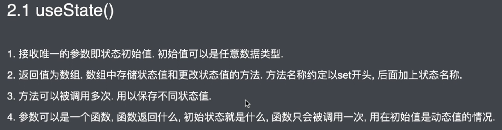

1. 参数是函数的情况：

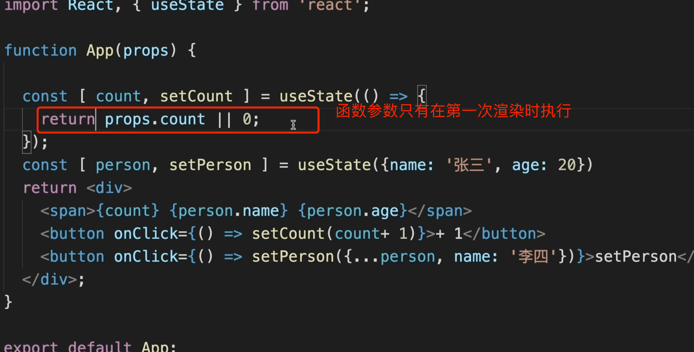

2.  Using Multiple State Variables  方法可以被调用多次

   ```react
   function ExampleWithManyStates() {
     // Declare multiple state variables!
     const [age, setAge] = useState(42);
     const [fruit, setFruit] = useState('banana');
     const [todos, setTodos] = useState([{ text: 'Learn Hooks' }]);
   ```

   You **don’t have to** use many state variables. State variables can hold objects and arrays just fine, so you can still group related data together. However, unlike `this.setState` in a class, updating a state variable always *replaces* it instead of merging it.

###### 2.设置状态值方法的使用细节

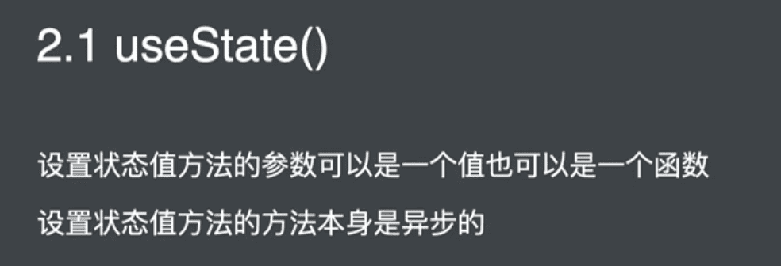

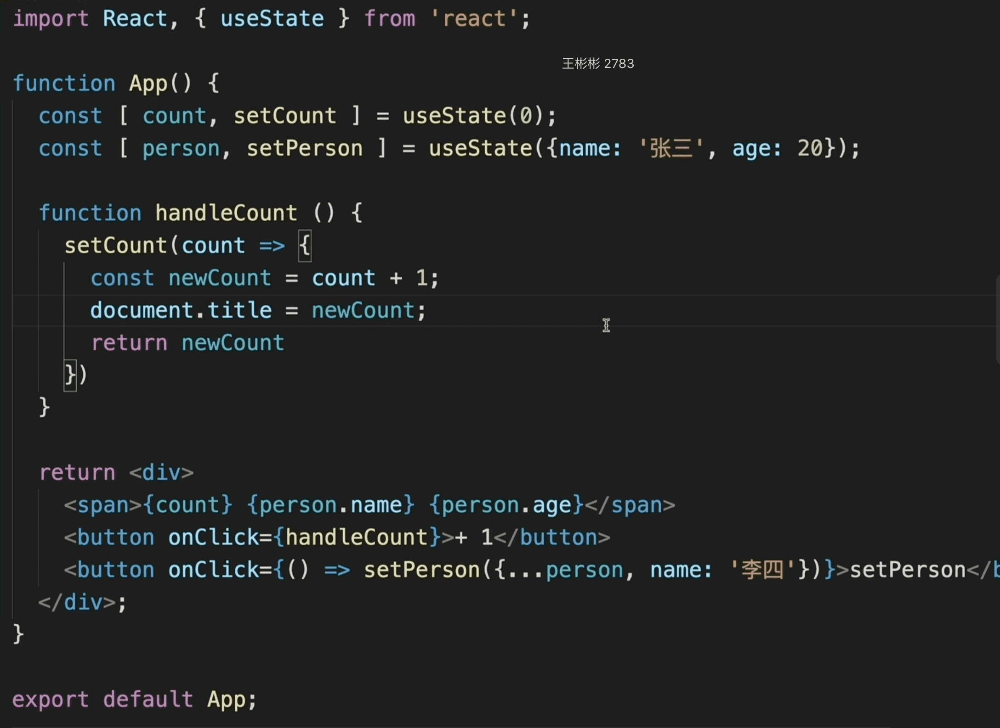

##### 2.useReducer()

useReducer是另一种让函数组件保存状态的方式。

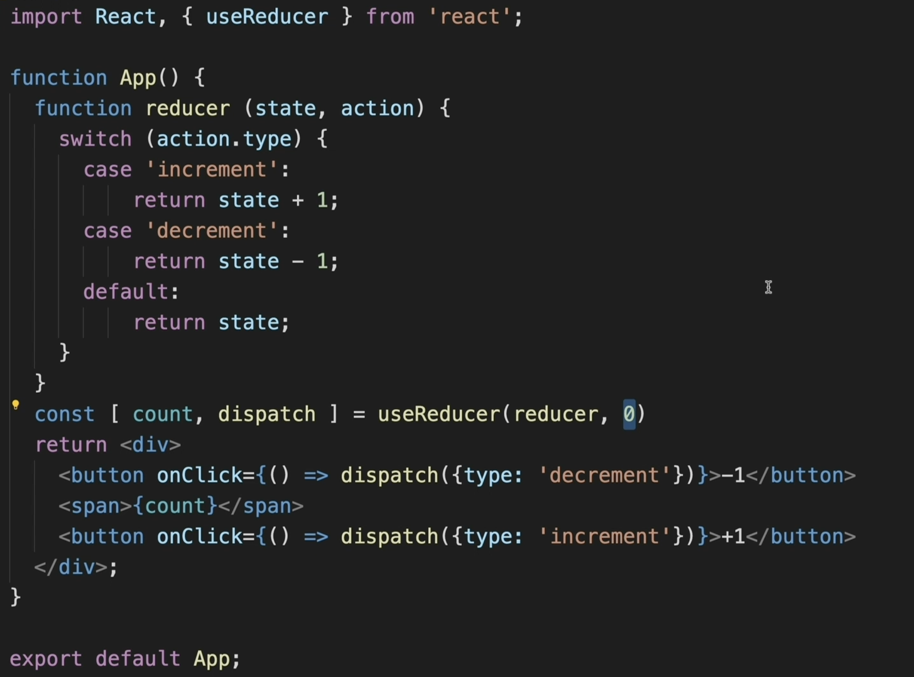

##### 3.useContext()

在跨组件层级获取数据时简化获取数据的代码

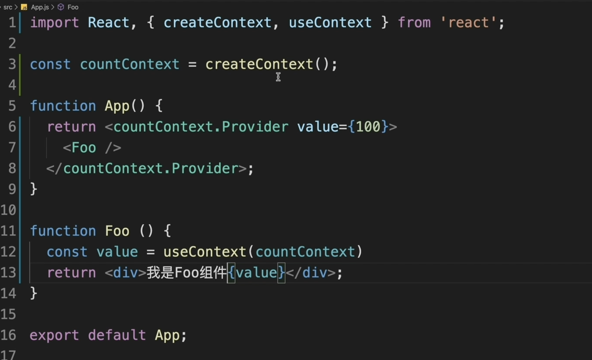

##### 4.useEffect()

让函数型组件拥有处理副作用的能力，类似声明周期函数。

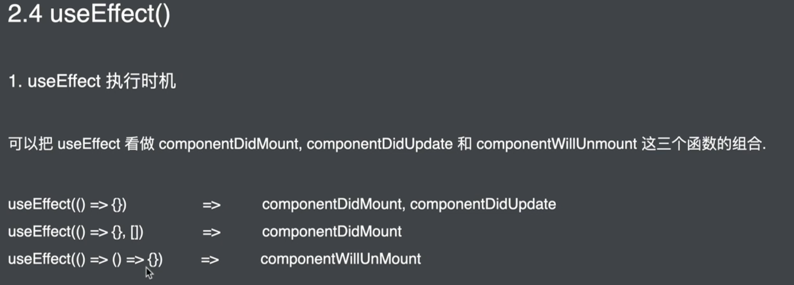

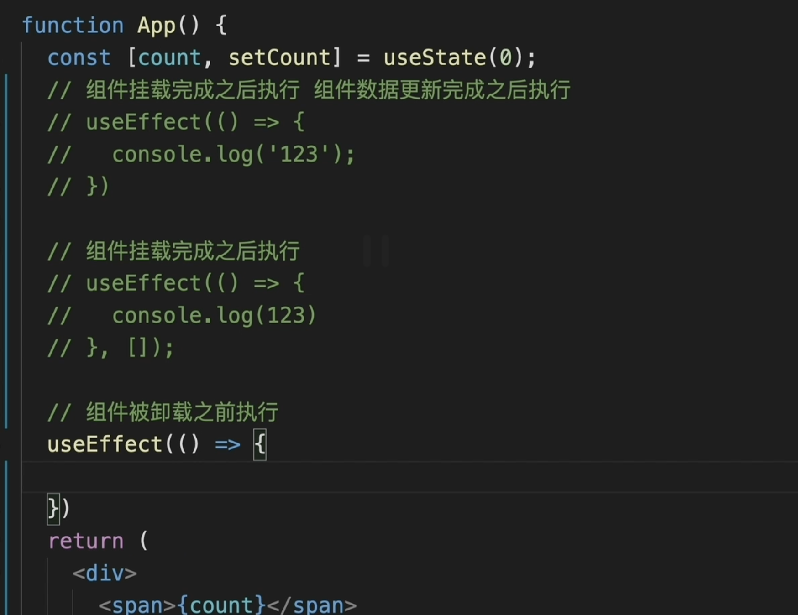

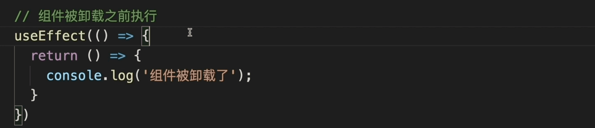

###### useEffect 例子

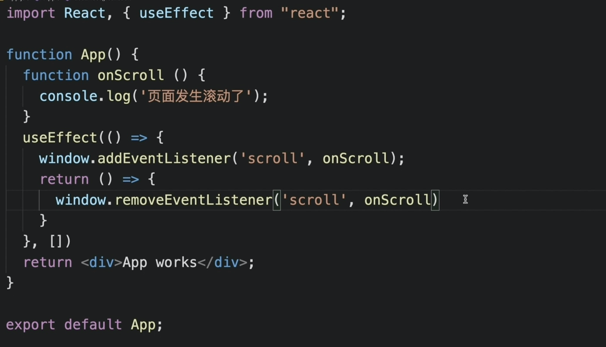

`ReactDOM.unmountComponentAtNode()` 卸载组件

###### useEffect 解决的问题

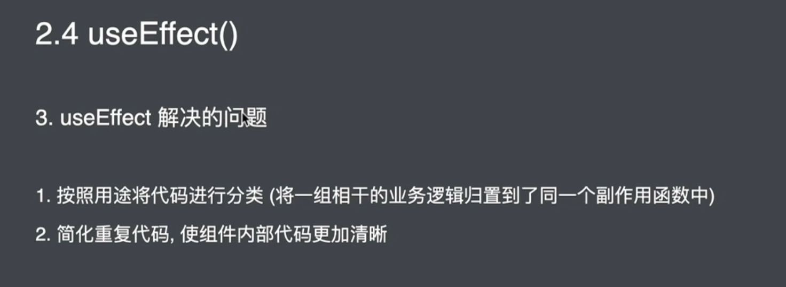

###### useEffect 钩子函数的第二个参数

当数据发生改变的时候执行useEffect，第二个参数指定 具体数据发生改变时执行函数

只有指定数据发生变化时触发effect

```
useEffect(()=>{
	document.title = count;
},[count]);
```

###### useEffect 钩子函数结合异步函数

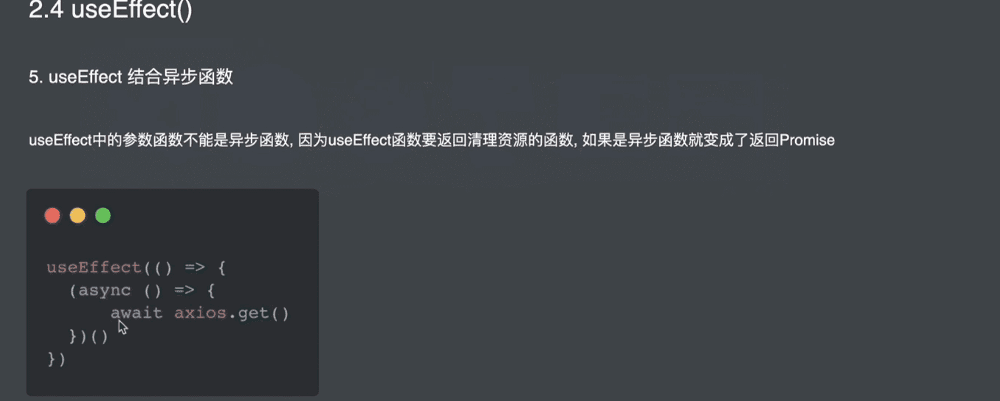

##### 5.useMemo()

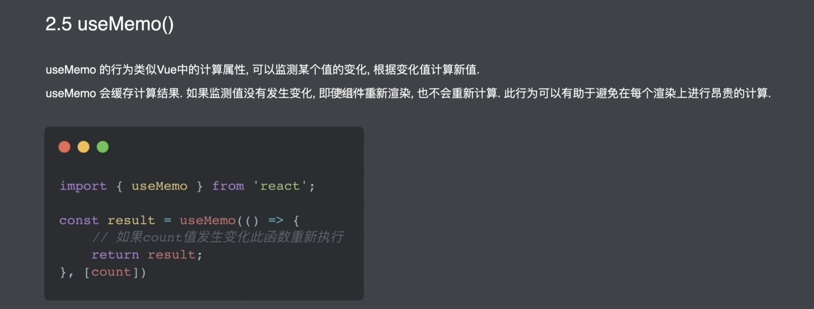

```react

import React, { useState, useMemo } from "react";
// bool 的改变导致组件重新渲染，但是不会重新计算result，因为count 没发生变化
export default function App() {
  const [count, setCount] = useState(0);
  const [bool, setBool] = useState(true);
  const result = useMemo(() => {
    console.log("重新渲染了");
    return count * 2;
  }, [count]);
  return (
    <div>
      <span>
        {count} {result}
      </span>
      <span> {bool ? "真" : "假"} </span>
      <button
        onClick={() => {
          setCount(count + 1);
        }}
      >
        +1
      </button>
      <button
        onClick={() => {
          console.log("s");
          setBool(!bool);
        }}
      >
        reset
      </button>
    </div>
  );
}

```

##### 6.memo 方法

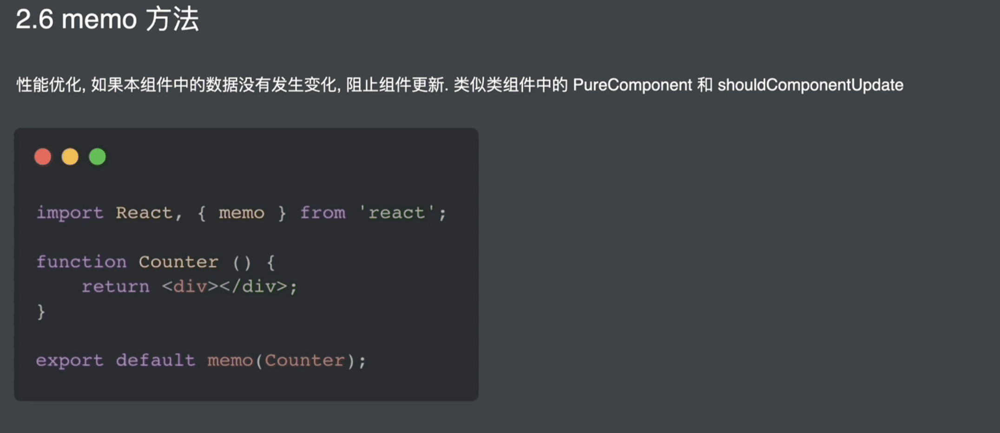

```react
import "./styles.css";
import React, { useState } from "react";

export default function App() {
  const [count, setCount] = useState(0);
  return (
    <div>
      <span> {count} </span>
      <button
        onClick={() => {
          setCount(count + 1);
        }}
      >
        +1
      </button>
      <FooMemo />
    </div>
  );
}
const FooMemo = React.memo(Foo);
function Foo() {
  console.log("Foo 重新渲染");
  return <div>我是Foo组件</div>;
}

```

##### 7.useCallback钩子函数

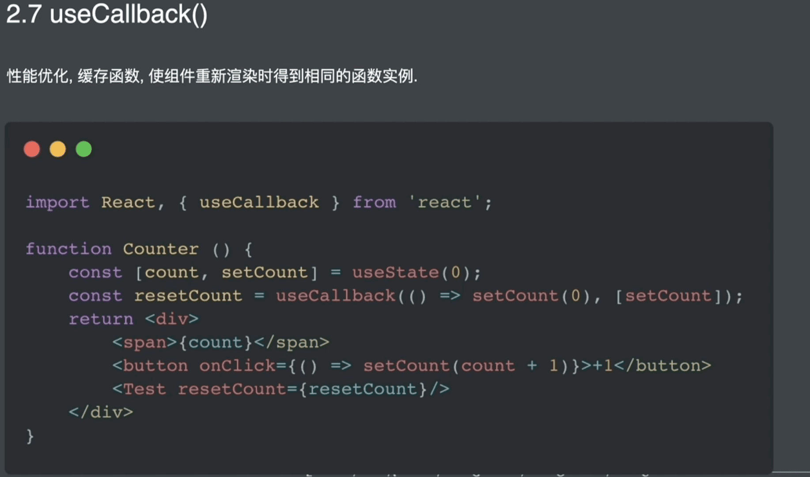

防止Counter组件重新渲染时，resetCount 函数重新生成导致Test组件重新渲染。

```react
import React, { useState, useCallback } from "react";

export default function App() {
  const [count, setCount] = useState(0);
  const resetCount = useCallback(() => {
    setCount(0);
  }, [setCount]);
  return (
    <div>
      <span> {count} </span>
      <button
        onClick={() => {
          setCount(count + 1);
        }}
      >
        +1
      </button>
      <FooMemo resetCount={resetCount} />
    </div>
  );
}
const FooMemo = React.memo(Foo);
function Foo(props) {
  console.log("Foo 重新渲染");
  return (
    <div>
      <button onClick={props.resetCount}>reset</button>
      我是Foo组件
    </div>
  );
}
```

##### 8.useRef()

1.绑定Dom 后者 类组件，函数组件不行，函数组件要用 `forwardRef()`

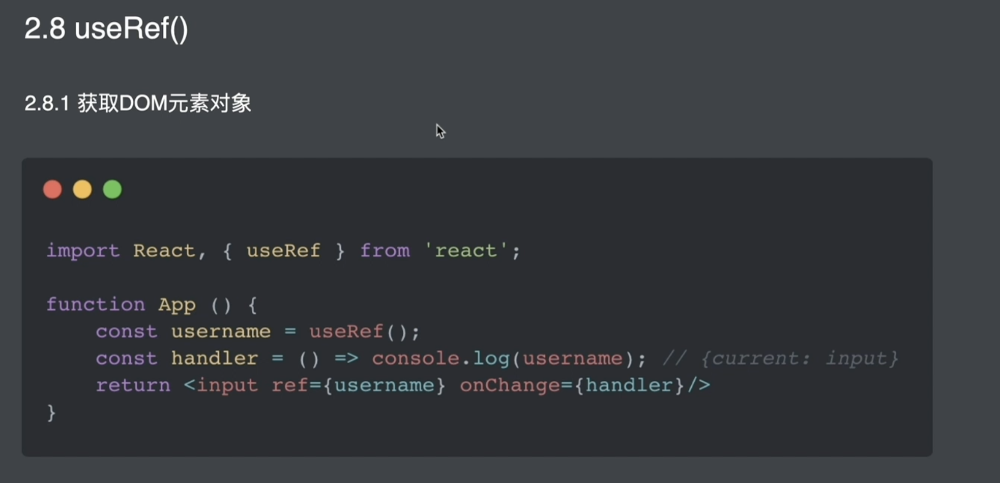

2.保存数据，跨组件周期

```react
// 用useRef 保存 timerId
import React, { useState, useEffect } from "react";

function App() {
  const [count, setCount] = useState(0);
  let timerId = null;
  useEffect(() => {
    timerId = setInterval(() => {
      setCount((count) => count + 1);
    }, 500);
  }, []);
  const stopCount = () => {
    clearInterval(timerId);
  };
  return (
    <div>
      {count}
      <button onClick={stopCount}>停止</button>
    </div>
  );
}

export default App;
```

#### 4.自定义hooks 

> 记忆点：自定义hooks是一个函数名以'use'字符串开头的js函数。

##### 1. FriendStatus 组件 与  FriendListItem 组件有相同的逻辑

```javascript
// FriendStatus 组件
import React, { useState, useEffect } from 'react';

function FriendStatus(props) {
  const [isOnline, setIsOnline] = useState(null);
  useEffect(() => {
    function handleStatusChange(status) {
      setIsOnline(status.isOnline);
    }
    ChatAPI.subscribeToFriendStatus(props.friend.id, handleStatusChange);
    return () => {
      ChatAPI.unsubscribeFromFriendStatus(props.friend.id, handleStatusChange);
    };
  });

  if (isOnline === null) {
    return 'Loading...';
  }
  return isOnline ? 'Online' : 'Offline';
}


// FriendListItem 组件

import React, { useState, useEffect } from 'react';

function FriendListItem(props) {
  const [isOnline, setIsOnline] = useState(null);
  useEffect(() => {
    function handleStatusChange(status) {
      setIsOnline(status.isOnline);
    }
    ChatAPI.subscribeToFriendStatus(props.friend.id, handleStatusChange);
    return () => {
      ChatAPI.unsubscribeFromFriendStatus(props.friend.id, handleStatusChange);
    };
  });

  return (
    <li style={{ color: isOnline ? 'green' : 'black' }}>
      {props.friend.name}
    </li>
  );
}

```

##### 2.提取组件相同的逻辑

**A custom Hook is a JavaScript function whose name starts with ”`use`” and that may call other Hooks.**

Traditionally in React, we’ve had two popular ways to share stateful logic between components: [render props](https://reactjs.org/docs/render-props.html) and [higher-order components](https://reactjs.org/docs/higher-order-components.html). We will now look at how Hooks solve many of the same problems without forcing you to add more components to the tree.

When we want to share logic between two JavaScript functions, we extract it to a third function. Both components and Hooks are functions, so this works for them too!

```javascript
import { useState, useEffect } from 'react';

function useFriendStatus(friendID) {
  const [isOnline, setIsOnline] = useState(null);

  useEffect(() => {
    function handleStatusChange(status) {
      setIsOnline(status.isOnline);
    }

    ChatAPI.subscribeToFriendStatus(friendID, handleStatusChange);
    return () => {
      ChatAPI.unsubscribeFromFriendStatus(friendID, handleStatusChange);
    };
  });

  return isOnline;
}
```

##### 3.使用自定义hooks

```javascript
function FriendStatus(props) {
  const isOnline = useFriendStatus(props.friend.id);

  if (isOnline === null) {
    return 'Loading...';
  }
  return isOnline ? 'Online' : 'Offline';
}

function FriendListItem(props) {
  const isOnline = useFriendStatus(props.friend.id);

  return (
    <li style={{ color: isOnline ? 'green' : 'black' }}>
      {props.friend.name}
    </li>
  );
}
```

##### 4.问题

###### 1.**Do I have to name my custom Hooks starting with “`use`”?** 

Please do. This convention is very important. Without it, we wouldn’t be able to automatically check for violations of [rules of Hooks](https://reactjs.org/docs/hooks-rules.html) because we couldn’t tell if a certain function contains calls to Hooks inside of it.

###### 2.**Do two components using the same Hook share state?**

No. Custom Hooks are a mechanism to reuse *stateful logic* (such as setting up a subscription and remembering the current value), but every time you use a custom Hook, all state and effects inside of it are fully isolated.

###### 3.**How does a custom Hook get isolated state?** 

Each *call* to a Hook gets isolated state. Because we call `useFriendStatus` directly, from React’s point of view our component just calls `useState` and `useEffect`. And as we [learned](https://reactjs.org/docs/hooks-state.html#tip-using-multiple-state-variables) [earlier](https://reactjs.org/docs/hooks-effect.html#tip-use-multiple-effects-to-separate-concerns), we can call `useState` and `useEffect` many times in one component, and they will be completely independent.


##### 5.Tips

1.  [Pass Information Between Hooks](https://reactjs.org/docs/hooks-custom.html#tip-pass-information-between-hooks)
2. [`useYourImagination()`](https://reactjs.org/docs/hooks-custom.html#useyourimagination)

[1]: https://reactjs.org/docs/hooks-custom.html

#### 5.Captrue Value 特性

函数式组件

```javascript
function Demo() {
  const [num, setNum] = useState(0);

  const handleClick = () => {
    setTimeout(() => {
      alert(num);
    }, 3000);
  };

  return (
    <div>
      <div>当前点击了{num}次</div>
      <button onClick={() => { setNum(num + 1) }}>点我</button>
      <button onClick={handleClick}>展示现在的值</button>
    </div>
  );
};
// 点击 ’展示现在的值‘ 按钮 ，紧接着点击 ’点我‘ 按钮 两次，三秒之后弹出 num 为 0
```

类组件

```javascript
class Demo extends Component {
  state = {
    num: 0,
  }

  handleClick = () => {
    setTimeout(() => {
      alert(this.state.num);
    }, 3000);
  }

  render() {
    const { num } = this.state;
    return (
      <div>
        <p>当前点击了{num}次</p>
        <button onClick={() => { this.setState({ num: num + 1 }) }}>点击</button>
        <button onClick={this.handleClick}>展示现在的值</button>
      </div>
    );
  }
};
// 点击 ’展示现在的值‘ 按钮 ，紧接着点击 ’点我‘ 按钮 两次，三秒之后弹出 num 为 2
```

Capture value 特性

```react

// 点击一次增加 count，然后在紧接着点击一次减少count
// 如果没有captrue 机制 ，两次弹出count 数值都是0，实际是先显示1， 然后显示0
useEffect(()=>{
    setTimeout(() => {
      alert('count: ' + count);
    }, 3000)
  }, [count]);

  return (
    <div>
      <p>You clicked {count} times</p>
      <button onClick={() => setCount(count + 1)}>
        增加 count
      </button>
      <button onClick={() => setCount(count - 1)}>
        减少 count
      </button>
    </div>
  );
}
```

如果想要在3s 之后获取到此时此刻的count 变量，而不是我3s 之前的count 如下：

```react
 // 利用 useRef 可以规避 capture value 特性：
  const countRef = useRef(null);
  const handleAlertClick = useCallback(
    () => {
      setTimeout(() => {
        alert("You clicked on: " + countRef.current);
      }, 3000);
    },
    [count]
  );

  return (
    <div>
      <p>You clicked {count} times</p>
      <button
        onClick={() => {
          countRef.current = count + 1;
          setCount(count + 1);
        }}
      >
        增加 count
      </button>
      <button onClick={handleAlertClick}>显示 count</button>
    </div>
  );
```

> #### 如何绕过 Capture Value
>
> 利用 `useRef` 就可以绕过 Capture Value 的特性。**可以认为 `ref` 在所有 Render 过程中保持着唯一引用，因此所有对 `ref` 的赋值或取值，拿到的都只有一个最终状态**，而不会在每个 Render 间存在隔离。
>
> ```javascript
> function Example() {
>   const [count, setCount] = useState(0);
>   const latestCount = useRef(count);
> 
>   useEffect(() => {
>     // Set the mutable latest value
>     latestCount.current = count;
>     setTimeout(() => {
>       // Read the mutable latest value
>       console.log(`You clicked ${latestCount.current} times`);
>     }, 3000);
>   });
>   // ...
> }
> ```
>
> 也可以简洁的认为，`ref` 是 Mutable 的，而 `state` 是 Immutable 的。

**如果说我们 UI 在概念上是当前应用状态的一个函数，那么事件处理程序和视觉输出都应该是渲染结果的一部分。我们的事件处理程序应该有一个特定的 props 和 state**。然而在类组件中，通过`this.state`读取的数据并不能保证其是一个特定的state。`handleClick` 事件处理程序并没有与任何一个特定的渲染绑定在一起。 Reac Hooks 在某一个特定渲染中 state 和props 是与其相绑定的。

> **每次 Render 的内容都会形成一个快照并保留下来，因此当状态变更而 Rerender 时，就形成了 N 个 Render 状态，而每个 Render 状态都拥有自己固定不变的 Props 与 State**。
>
> 通过这个示例，相信会比较容易地理解 **Capture Value** 特性，并如何使用 `ref` 来暂时绕过它。在知道并理解这个特性后，有助于进一步熟悉了 React Hooks 的运行机制，减少掉坑的次数。

#### 6.Function VS Class 组件

##### 1.Captrue props

```javascript
// class Component
class ProfilePage extends React.Component {
  showMessage = () => {
    alert("Followed " + this.props.user);
  };

  handleClick = () => {
    setTimeout(this.showMessage, 3000);
  };

  render() {
    return <button onClick={this.handleClick}>Follow</button>;
  }
}
//Function Component
function ProfilePage(props) {
  const showMessage = () => {
    alert("Followed " + props.user);
  };

  const handleClick = () => {
    setTimeout(showMessage, 3000);
  };

  return <button onClick={handleClick}>Follow</button>;
}

// 两个组件都描述一个逻辑：点击按钮3秒后alert 父级传入的用户名。那么点击按钮后的3秒内，父级修改了this.state.user 

<ProfilePageFunction user={this.state.user} />
<ProfilePageClass user={this.state.user} />
  
 // Class Component 展示的是修改后的值 
 // Function Component 展示的是修改前的值
```

> 那么 React 文档中描述的 `props` 不是不可变（Immutable） 数据吗？为啥在运行时还会发生变化呢？
>
> 原因在于，虽然 `props` 不可变，是 `this` 在 Class Component 中是可变的，因此 `this.props` 的调用会导致每次都访问最新的 `props`。
>
> 而 Function Component 不存在 `this.props` 的语法，因此 `props` 总是不可变的。
>
> ```react
> // Function Component：
> function ProfilePage(props) {
>   setTimeout(() => {
>     // 就算父组件 reRender，这里拿到的 props 也是初始的
>     console.log(props);
>   }, 3000);
> }
> 
> // Class Component :
> 
> class ProfilePage extends React.Component {
>   render() {
>     setTimeout(() => {
>       // 如果父组件 reRender，this.props 拿到的永远是最新的。
>       // 并不是 props 变了，而是 this.props 指向了新的 props，旧的 props 找不到了
>       console.log(this.props);
>     }, 3000);
>   }
> }
> ```
>
> 
>
> 如果希望在 Class Component 捕获瞬时 Props，可以： `const props = this.props;`，但这样的代码很蹩脚，所以如果希望拿到稳定的 `props`，使用 Function Component 是更好的选择。

##### 2.**怎么替代`shouldComponentUpdate`**

Function Component

```javascript
const Button = React.memo(props => {
  // your component
});
```

```react
function Parent({ a, b }) {
  // Only re-rendered if `a` changes:
  const child1 = useMemo(() => <Child1 a={a} />, [a]);
  // Only re-rendered if `b` changes:
  const child2 = useMemo(() => <Child2 b={b} />, [b]);
  return (
    <>
      {child1}
      {child2}
    </>
  );
}
```

Class Component 

```react
class Button extends React.PureComponent{}
// 这样就自带了 shallowEqual 的 shouldComponentUpdate
```

##### 3.怎么替代forceupdate

React 官方文档提供了一种方案：

```javascript
const [ignored, forceUpdate] = useReducer(x => x + 1, 0);

function handleClick() {
  forceUpdate();
}
```

每次执行 `dispatch` 时，只要 `state` 变化就会触发组件更新。当然 `useState` 也同样可以模拟：

```javascript
const useUpdate = () => useState(0)[1];
```

 `useState` 下标为 1 的项是用来更新数据的，而且就算数据没有变化，调用了也会刷新组件，所以可以把返回一个没有修改数值的 `setValue`，这样它的功能就仅剩下刷新组件了。

##### 4.怎么获取上一个props

虽然不怎么常用，但是毕竟 Class Component 可以通过 `componentDidUpdate` 拿到 `previousProps` 与 `nextProps`，对于 Function Component，最好通过自定义 Hooks 方式拿到上一个状态：

```javascript
function Counter() {
  const [count, setCount] = useState(0);
  const prevCount = usePrevious(count);
  return (
    <h1>
      Now: {count}, before: {prevCount}
    </h1>
  );
}

function usePrevious(value) {
  const ref = useRef();
  useEffect(() => {
    ref.current = value;
  });
  return ref.current;
}
```

通过 `useEffect` 在组件渲染完毕后再执行的特性，再利用 `useRef` 的可变特性，让 `usePrevious` 的返回值是 “上一次” Render 时的。

可见，合理运用 `useEffect` `useRef`，可以做许多事情，而且封装成 CustomHook 后使用起来仍然很方便。

##### 5.性能注意事项

`useState` 函数的参数虽然是初始值，但由于整个函数都是 Render，因此每次初始化都会被调用，如果初始值计算非常消耗时间，建议使用函数传入，这样只会执行一次：

```react
function FunctionComponent(props) {
  const [rows, setRows] = useState(() => createRows(props.count));
}
```

##### 6.React Hooks 依赖数组的工作方式

在React Hooks 提供的很多API都有遵循依赖数组的工作方式，比如useCallback、useEffect、useMemo等。

> 使用了这类 API，其传入的函数、数据等等都会被缓存。被缓存的内容其依赖的 props、state 等值就像上面的例子一样都是“不变”的。只有当依赖数组中的依赖发生变化，它才会被重新创建，得到最新的 props、state。所以在用这类 API 时我们要特别注意，在依赖数组内一定要填入依赖的 props、state 等值。

```react
function Demo() {
  const [num, setNum] = useState(0);

  const handleClick = useCallback(() => {
    setNum(num + 1);
  }, []);

  return (
    <div>
      <p>当前点击了{num}次</p>
      <button onClick={handleClick}>点击</button>
    </div>
  );
}
// 始终为1
```

```react
function Demo() {
  const [num, setNum] = useState(0);

  const handleClick = useCallback(() => {
    setNum(num + 1);
  }, [num]); // 添加依赖num

  return (
    <div>
      <p>当前点击了{num}次</p>
      <button onClick={handleClick}>点击</button>
    </div>
  );
};
// 添加依赖 
```

#### 7.Effect 完全使用指南

##### 1.Each Render Has Its Own Props and State

##### 2.Each Reander Has Its Own Event Handlers

 **our function gets called many times (once per each render), but every one of those times the `count` value inside of it is constant and set to a particular value (state for that render).**

```react
function Counter() {
  const [count, setCount] = useState(0);

  function handleAlertClick() {
    setTimeout(() => {
      alert('You clicked on: ' + count);
    }, 3000);
  }

  return (
    <div>
      <p>You clicked {count} times</p>
      <button onClick={() => setCount(count + 1)}>
        Click me
      </button>
      <button onClick={handleAlertClick}>
        Show alert
      </button>
    </div>
  );
}
//Increment the counter to 3
//Press “Show alert”
//Increment it to 5 before the timeout fires
```

This is not specific to React — regular functions work in a similar way:

```javascript
function sayHi(person) {
  const name = person.name;
  setTimeout(() => {
    alert('Hello, ' + name);
  }, 3000);
}

let someone = {name: 'Dan'};
sayHi(someone);

someone = {name: 'Yuzhi'};
sayHi(someone);

someone = {name: 'Dominic'};
sayHi(someone);
```

This explains how our event handler captures the `count` at the time of the click. If we apply the same substitution principle, each render “sees” its own `count`:

```javascript
// During first render
function Counter() {
  const count = 0; // Returned by useState()
  // ...
  function handleAlertClick() {
    setTimeout(() => {
      alert('You clicked on: ' + count);
    }, 3000);
  }
  // ...
}

// After a click, our function is called again
function Counter() {
  const count = 1; // Returned by useState()
  // ...
  function handleAlertClick() {
    setTimeout(() => {
      alert('You clicked on: ' + count);
    }, 3000);
  }
  // ...
}

// After another click, our function is called again
function Counter() {
  const count = 2; // Returned by useState()
  // ...
  function handleAlertClick() {
    setTimeout(() => {
      alert('You clicked on: ' + count);
    }, 3000);
  }
  // ...
}
```

**Inside any particular render, props and state forever stay the same.** But if props and state are isolated between renders, so are any values using them (including the event handlers). They also “belong” to a particular render. So even async functions inside an event handler will “see” the same `count` value.

*Side note: I inlined concrete `count` values right into `handleAlertClick` functions above. This mental substitution is safe because `count` can’t possibly change within a particular render. It’s declared as a `const` and is a number. It would be safe to think the same way about other values like objects too, but only if we agree to avoid mutating state. Calling `setSomething(newObj)` with a newly created object instead of mutating it is fine because state belonging to previous renders is intact.*

##### 3.Each Render Has Its Own Effects

```react
function Counter() {
  const [count, setCount] = useState(0);

  useEffect(() => {
    document.title = `You clicked ${count} times`;
  });

  return (
    <div>
      <p>You clicked {count} times</p>
      <button onClick={() => setCount(count + 1)}>
        Click me
      </button>
    </div>
  );
}
```

**Conceptually, you can imagine effects are a \*part of the render result\*.**

Strictly saying, they’re not (in order to [allow Hook composition](https://overreacted.io/why-do-hooks-rely-on-call-order/) without clumsy syntax or runtime overhead). But in the mental model we’re building up, effect functions *belong* to a particular render in the same way that event handlers do.

> To make sure we have a solid understanding, let’s recap our first render:
>
> - **React:** Give me the UI when the state is `0`.
> - **Your component:**
>   - Here’s the render result: `<p>You clicked 0 times</p>`.
>   - Also remember to run this effect after you’re done: `() => { document.title = 'You clicked 0 times' }`.
> - **React:** Sure. Updating the UI. Hey browser, I’m adding some stuff to the DOM.
> - **Browser:** Cool, I painted it to the screen.
> - **React:** OK, now I’m going to run the effect you gave me.
>   - Running `() => { document.title = 'You clicked 0 times' }`.
>
> ------
>
> Now let’s recap what happens after we click:
>
> - **Your component:** Hey React, set my state to `1`.
> - **React:** Give me the UI for when the state is `1`.
> - **Your component:**
>   - Here’s the render result: `<p>You clicked 1 times</p>`.
>   - Also remember to run this effect after you’re done: `() => { document.title = 'You clicked 1 times' }`.
> - **React:** Sure. Updating the UI. Hey browser, I’ve changed the DOM.
> - **Browser:** Cool, I painted your changes to the screen.
> - **React:** OK, now I’ll run the effect that belongs to the render I just did.
>   - Running `() => { document.title = 'You clicked 1 times' }`.

##### 4.Each Render Has Its Own… Everything

```react
// 点击五次会依次弹出
function Counter() {
  const [count, setCount] = useState(0);

  useEffect(() => {
    setTimeout(() => {
      console.log(`You clicked ${count} times`);
    }, 3000);
  });

  return (
    <div>
      <p>You clicked {count} times</p>
      <button onClick={() => setCount(count + 1)}>
        Click me
      </button>
    </div>
  );
}


// class 组件的话， 弹出结果不一样了就
componentDidUpdate() {
    setTimeout(() => {
      console.log(`You clicked ${this.state.count} times`);
    }, 3000);
  }

// 可修改可以跟function 组件一致
 componentDidUpdate() {
    const count = this.state.count;
    setTimeout(() => {
      console.log(`You clicked ${count} times`);
    }, 3000);
  }
```

**It doesn’t matter whether you read from props or state “early” inside of your component.** 

```react
// 这两个是等价的
function Example(props) {
  useEffect(() => {
    setTimeout(() => {
      console.log(props.counter);
    }, 1000);
  });
  // ...
}


function Example(props) {
  const counter = props.counter;
  useEffect(() => {
    setTimeout(() => {
      console.log(counter);
    }, 1000);
  });
  // ...
}
```

```react
function Example() {
  const [count, setCount] = useState(0);
  const latestCount = useRef(count);

  useEffect(() => {
    // Set the mutable latest value
    latestCount.current = count;
    setTimeout(() => {
      // Read the mutable latest value
      console.log(`You clicked ${latestCount.current} times`);
    }, 3000);
  });
  // ...
```

##### 5.Synchronization , Not Lifecycle

**React synchronizes the DOM according to our current props and state.** There is no distinction between a “mount” or an “update” when rendering.

You should think of effects in a similar way. **`useEffect` lets you \*synchronize\* things outside of the React tree according to our props and state.**

Still, of course running all effects on *every* render might not be efficient. (And in some cases, it would lead to infinite loops.)

##### 6.Teaching React to Diff Your Effects

##### 7.Don’t Lie to React About Dependencies 

```react
function SearchResults() {
  async function fetchData() {
    // ...
  }

  useEffect(() => {
    fetchData();
  }, []); // Is this okay? Not always -- and there's a better way to write it.

  // ...
}
```

“But I only want to run it on mount!”, you’ll say. For now, remember: if you specify deps, ***all\* values from inside your component that are used by the effect \*must\* be there**. Including props, state, functions — anything in your component.


##### 8.What Happens When Dependencies Lie

**updater form**

```react
function Counter() {
  const [count, setCount] = useState(0);

  useEffect(() => {
    const id = setInterval(() => {
      setCount(count + 1);
    }, 1000);
    return () => clearInterval(id);
  }, []);

  return <h1>{count}</h1>;
}

//方法一
useEffect(() => {
  const id = setInterval(() => {
    setCount(count + 1);
  }, 1000);
  return () => clearInterval(id);
}, [count]);

// 方法二 updater form
  useEffect(() => {
    const id = setInterval(() => {
      setCount(c => c + 1);
    }, 1000);
    return () => clearInterval(id);
  }, []);


//handleClick 触发 count 为几 ，怎么修改达到预期？ 
// https://overreacted.io/react-as-a-ui-runtime/#batching
	const [count, setCount] = useState(0);

  function increment() {
    setCount(count + 1);
  }

  function handleClick() {
    increment();
    increment();
    increment();
  }

```

##### 9.Functional Updates and Google Doc

Remember how we talked about synchronization being the mental model for effects? An interesting aspect of synchronization is that you often want to keep the “messages” between the systems untangled from their state. For example, editing a document in Google Docs doesn’t actually send the *whole* page to the server. That would be very inefficient. Instead, it sends a representation of what the user tried to do.

**However, even `setCount(c => c + 1)` isn’t that great.** It looks a bit weird and it’s very limited in what it can do. For example, if we had two state variables whose values depend on each other, or if we needed to calculate the next state based on a prop, it wouldn’t help us. Luckily, `setCount(c => c + 1)` has a more powerful sister pattern. Its name is `useReducer`.

##### 10.Decoupling Updates fror

**When setting a state variable depends on the current value of another state variable, you might want to try replacing them both with `useReducer`.**

 A reducer lets you **decouple expressing the “actions” that happened in your component from how the state updates in response to them**.

##### 11.Why useReducer Is the Cheat Mode of Hooks

**Even in that case, `dispatch` identity is still guaranteed to be stable between re-renders.**

You may be wondering: how can this possibly work? How can the reducer “know” props when called from inside an effect that belongs to another render? The answer is that when you `dispatch`, React just remembers the action — but it will *call* your reducer during the next render. At that point the fresh props will be in scope, and you won’t be inside an effect.

**This is why I like to think of `useReducer` as the “cheat mode” of Hooks. It lets me decouple the update logic from describing what happened. This, in turn, helps me remove unnecessary dependencies from my effects and avoid re-running them more often than necessary.**

##### 12.Moving Functions Inside Effects

##### 13.But I Can’t Put This Function Inside an Effect

This is just a consequence of embracing the data flow and the synchronization mindset. **The same solution works for function props passed from parents:**

```jsx
function Parent() {
  const [query, setQuery] = useState('react');

  // ✅ Preserves identity until query changes  const fetchData = useCallback(() => {    const url = 'https://hn.algolia.com/api/v1/search?query=' + query;    // ... Fetch data and return it ...  }, [query]);  // ✅ Callback deps are OK
  return <Child fetchData={fetchData} />
}

function Child({ fetchData }) {
  let [data, setData] = useState(null);

  useEffect(() => {
    fetchData().then(setData);
  }, [fetchData]); // ✅ Effect deps are OK

  // ...
}
```

##### 14.Are Functions Part of the Data Flow?

**With classes, function props by themselves aren’t truly a part of the data flow.**

**With `useCallback`, functions can fully participate in the data flow.**

 We can say that if the function inputs changed, the function itself has changed, but if not, it stayed the same. Thanks to the granularity provided by `useCallback`, changes to props like `props.fetchData` can propagate down automatically.

Similarly, [`useMemo`](https://reactjs.org/docs/hooks-reference.html#usememo) lets us do the same for complex objects:

```jsx
function ColorPicker() {
  // Doesn't break Child's shallow equality prop check
  // unless the color actually changes.
  const [color, setColor] = useState('pink');
  const style = useMemo(() => ({ color }), [color]);
  return <Child style={style} />;
}
```

n **I want to emphasize that putting `useCallback` everywhere is pretty clunky.** It’s a nice escape hatch and it’s useful when a function is both passed down *and* called from inside an effect in some children. Or if you’re trying to prevent breaking memoization of a child component. But Hooks lend themselves better to [avoiding passing callbacks down](https://reactjs.org/docs/hooks-faq.html#how-to-avoid-passing-callbacks-down) altogether.

##### 15.Speaking of Race Conditions

```jsx
class Article extends Component {
  state = {
    article: null
  };
  componentDidMount() {
    this.fetchData(this.props.id);
  }
  componentDidUpdate(prevProps) {
    if (prevProps.id !== this.props.id) {
      this.fetchData(this.props.id);
    }
  }
  async fetchData(id) {
    const article = await API.fetchArticle(id);
    this.setState({ article });
  }
  // ...
}
```

This is definitely better! But it’s still buggy. The reason it’s buggy is that the request may come out of order. So if I’m fetching `{id: 10}`, switch to `{id: 20}`, but the `{id: 20}` request comes first, the request that started earlier but finished later would incorrectly overwrite my state.

This is called a race condition, and it’s typical in code that mixes `async` / `await` (which assumes something waits for the result) with top-down data flow (props or state can change while we’re in the middle of an async function).


If the async approach you use supports cancellation, that’s great! You can cancel the async request right in your cleanup function.

Alternatively, the easiest stopgap approach is to track it with a boolean:

```jsx
function Article({ id }) {
  const [article, setArticle] = useState(null);

  useEffect(() => {
    let didCancel = false;

    async function fetchData() {
      const article = await API.fetchArticle(id);
      if (!didCancel) {
        setArticle(article);
      }
    }

    fetchData();

    return () => {
      didCancel = true;
    };
  }, [id]);

  // ...
}
```

16.Raising the Bar


[1]: https://segmentfault.com/a/1190000018549675	"精度《Function VS Class 组件》"
[2]: https://segmentfault.com/a/1190000018639033	"精读《useEffect 完全指南》"
[3]: https://overreacted.io/how-are-function-components-different-from-classes/	" How Are Function Components Different from Classes?"
[4]: https://overreacted.io/a-complete-guide-to-useeffect/	"A Complete Guide to useEffect"
[5]: https://overreacted.io/react-as-a-ui-runtime/#batching	"React as a UI Runtime"


总结： class 组件与 函数式组件的不同？


