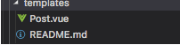

### 一、静态网站

#### 1.静态网站的好出

​	省钱、快速、安全

#### 2.静态网站框架

​	**JAMStack**(Javascript API Markup) ：使用**SSG**（static site generators） 静态网站生成技术的框架

#### 3.使用场景

​	不适合有大量路由页面的应用、不适合有大量动态内容的应用

### 二、Gridsome基础

#### 1.gridsome.config.js

插件和项目配置设置

#### 2.页面生成

1. 文件系统生成，在src/pages/ 创建.vue 文件自动生成
2. 编程式创建页面，在gridsome.server.js  中的 createPages hook 中创建

#### 3.Vue-méta

生成页面head 信息

#### 4.Collections 集合 预取数据

数据的预取，保存在collections 的Node 中

```javascript
module.exports = function (api) {
  api.loadSource(async actions => {
    const collection = actions.addCollection('Post')
    const { data } = await axios.get('https://api.example.com/posts')
    for (const item of data) {
      collection.addNode({
        id: item.id,
        title: item.title,
        content: item.content
      })
    }
  })
}
```

数据的获取从graphQL 中查询获取

```javascript
// in Pages & Templates
// dev 模式下 spa， build 构建之后会是静态页面
<template>
  <div>
    <div v-for="edge in $page.posts.edges" :key="edge.node.id">
        <g-link to="/">{{ edge.node.title }}</g-link> 
    </div>
  </div>
</template>

<page-query>
query {
  posts: allWordPressPost {
    edges {
      node {
        id
        title
      }
    }
  }
}
</page-query>

//Components 用这个
<static-query>
```

注：在created 里面请求数据 build 之后会是SPA 页面

```javascript
export default {
  data(){
    return {
      posts:[]
    }
  },
  async created(){
    const {data} = await await axios.get('http://jsonplaceholder.typicode.com/posts')
    this.posts = data
  }
}
```

#### 5.模板 template 

模板放在templates 文件夹下，并在gridsome.config.js 中配置 templates



```javascript
// gridsome.config.js
module.exports = {
  siteName: 'Gridsome',
  plugins: [],
  templates:{
    Post:[
      {
        path:'/post/:id',
        component:'./src/templates/Post.vue'
      }
    ]
  }
}
```

```javascript
// template/Post.vue
<template>
<layout>
  <div>
    <h1>{{ $page.post.title }}</h1>
    <div>{{ $page.post.content }}</div>
  </div>
</layout>
</template>
<!—ID! ID不为空-->
<page-query>
query ($id: ID!) {
  post(id: $id){
    id
    title
    content
  }
}
</page-query>

<script>
export default {
  name: 'PostPage',
  metaInfo(){
    return {
      title: this.$page.post.title
    }
  }
}
</script>


<style>

</style>
```

#### 6.Layout 布局

要在main.js 中注册才能使用

### 三、案例

#### 1.导入数据

可以导入任何形式的数据

```javascript
import with  source plugins 
import from APIs
import from local files （markdown、images、YAML、CSV、JSON）
     @gridsome/source-filesystem 插件读取markdown 文件、
     @gridsome/transformer-remark 插件把markdown 导入graphGL
```

#### 2.Strapi 通用的内容管理系统

demo：

Super user 2404016117@qq.com Wbb121628170
User demo 2404016117@qq.com admin

创建好内容保存之后，publish 才可以查询到

