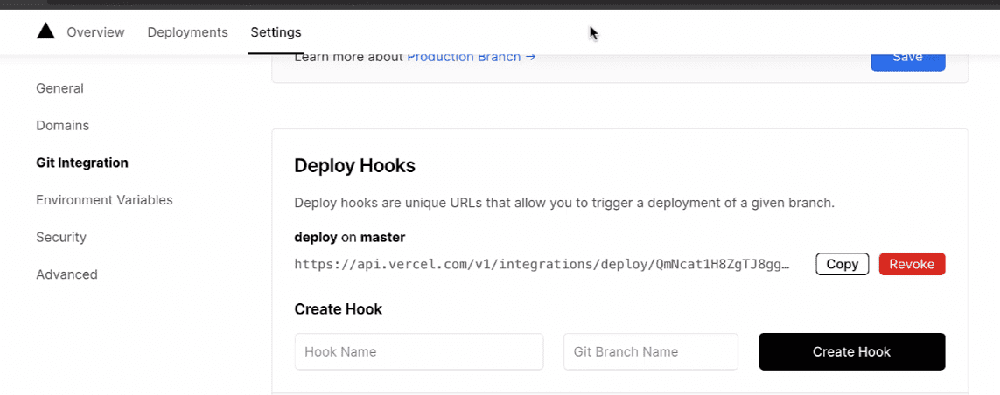
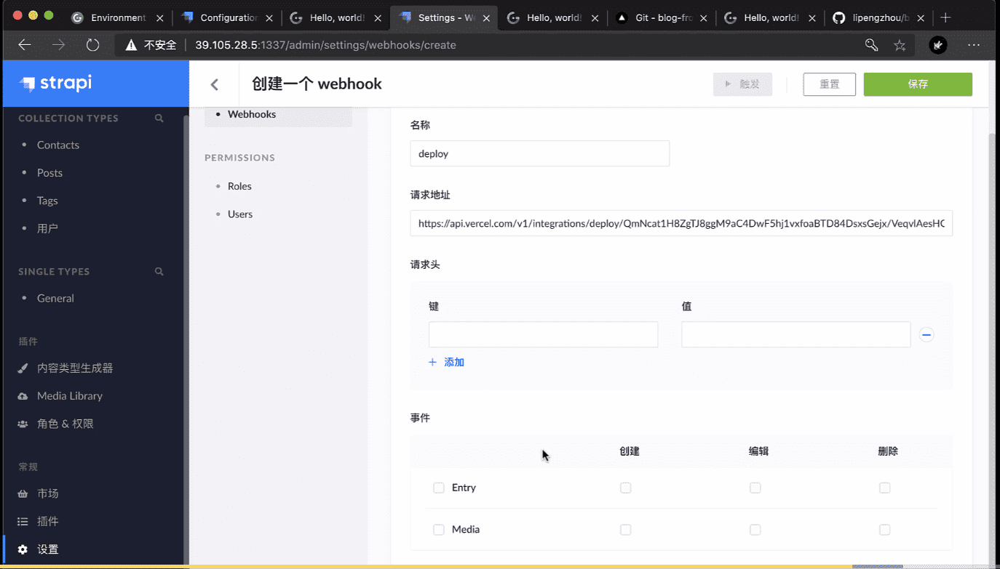

### 一、静态网站

#### 1.静态网站的好出

​	省钱、快速、安全

#### 2.静态网站框架

​	**JAMStack**(Javascript API Markup) ：使用**SSG**（static site generators） 静态网站生成技术的框架

#### 3.使用场景

​	不适合有大量路由页面的应用、不适合有大量动态内容的应用

### 二、Gridsome基础

#### 1.gridsome.config.js

插件和项目配置设置

#### 2.页面生成

1. 文件系统生成，在src/pages/ 创建.vue 文件自动生成
2. 编程式创建页面，在gridsome.server.js  中的 createPages hook 中创建

#### 3.Vue-méta

生成页面head 信息

#### 4.Collections 集合 预取数据

数据的预取，保存在collections 的Node 中

```javascript
module.exports = function (api) {
  api.loadSource(async actions => {
    const collection = actions.addCollection('Post')
    const { data } = await axios.get('https://api.example.com/posts')
    for (const item of data) {
      collection.addNode({
        id: item.id,
        title: item.title,
        content: item.content
      })
    }
  })
}
```

数据的获取从graphQL 中查询获取

```javascript
// in Pages & Templates
// dev 模式下 spa， build 构建之后会是静态页面
<template>
  <div>
    <div v-for="edge in $page.posts.edges" :key="edge.node.id">
        <g-link to="/">{{ edge.node.title }}</g-link> 
    </div>
  </div>
</template>

<page-query>
query {
  posts: allWordPressPost {
    edges {
      node {
        id
        title
      }
    }
  }
}
</page-query>

//Components 用这个
<static-query>
```

注：在created 里面请求数据 build 之后会是SPA 页面

```javascript
export default {
  data(){
    return {
      posts:[]
    }
  },
  async created(){
    const {data} = await await axios.get('http://jsonplaceholder.typicode.com/posts')
    this.posts = data
  }
}
```

#### 5.模板 template 

模板放在templates 文件夹下，并在gridsome.config.js 中配置 templates


```javascript
// gridsome.config.js
module.exports = {
  siteName: 'Gridsome',
  plugins: [],
  templates:{
    Post:[
      {
        path:'/post/:id',
        component:'./src/templates/Post.vue'
      }
    ]
  }
}
```

```javascript
// template/Post.vue
<template>
<layout>
  <div>
    <h1>{{ $page.post.title }}</h1>
    <div>{{ $page.post.content }}</div>
  </div>
</layout>
</template>
<!—ID! ID不为空-->
<page-query>
query ($id: ID!) {
  post(id: $id){
    id
    title
    content
  }
}
</page-query>

<script>
export default {
  name: 'PostPage',
  metaInfo(){
    return {
      title: this.$page.post.title
    }
  }
}
</script>


<style>

</style>
```

#### 6.Layout 布局

要在main.js 中注册才能使用

### 三、案例

#### 1.导入数据

可以导入任何形式的数据

```javascript
import with  source plugins 
import from APIs
import from local files （markdown、images、YAML、CSV、JSON）
     @gridsome/source-filesystem 插件读取markdown 文件、
     @gridsome/transformer-remark 插件把markdown 导入graphGL
```

#### 2.Strapi 通用的内容管理系统

demo：

Super user 2404016117@qq.com Wbb121628170
User demo 2404016117@qq.com admin

121628170@qq.com Wbb121628170


创建好内容保存之后，publish 才可以查询到

字段要从“角色与权限”菜单中去配置访问权限

#### 3.获取Strapi 中的数据

1. Strapi 安装 GraphGL 插件
2. gridsome项目中安装 `@gridsome/source-strapi` 插件
3. 配置

```javascript
module.exports = {
  siteName: 'Gridsome',
  plugins: 
    {
      use: '@gridsome/source-strapi',
      options: {
        apiURL: 'http://localhost:1337',
        queryLimit: 1000, // Defaults to 100
        contentTypes: ['post'],
        // singleTypes: ['impressum'],
        // Possibility to login with a Strapi user,
        // when content types are not publicly available (optional).
        loginData: {
          identifier: '',
          password: ''
        }
      }
    }
  ]
}
```

> 删除content Type 从编辑处 点击删除
>
> 


#### 4.获取分页数据

```javascript
query ($page: Int) {
  posts: allBlogPost(perPage: 10, page: $page) @paginate { // posts 为别名
    pageInfo {
      totalPages
      currentPage
    }
    edges {
      node {
        id
        title
        path
      }
    }
  }
}

```

>  分页访问地址为：http://192.168.170.183:8080/ 第一页 http://192.168.170.183:8080/2 第二页

分页插件用gridsome 的[Pager](https://gridsome.org/docs/pagination/)

#### 5.创建文章和tag模板

gridsome.config.js 配置模板信息

```javascript
module.exports = {
  siteName: 'Gridsome',
  plugins: [
    {
      use: '@gridsome/source-filesystem',
      options: {
        path: 'content/blog/**/*.md',
        typeName: 'BlogPost',
      }, 
    },
    {
      use: '@gridsome/source-strapi',
      options: {
        apiURL: 'http://localhost:1337',
        queryLimit: 1000, // Defaults to 100
        contentTypes: ['post','tag'],  // 查询那些数据，就要在这里声明下
        // typeName: 'Strapi', // 默认为Strapi
        // singleTypes: ['impressum'],
        // Possibility to login with a Strapi user,
        // when content types are not publicly available (optional).
        loginData: {
          identifier: '',
          password: ''
        }
      }
    }
  ],
  templates:{
    StrapiPost:[  // 规则为 typeName+contentTypes
      {
        path:'/post/:id',
        component:'./src/templates/Post.vue'
      }
    ],
    StrapiTag:[  // 规则为 typeName+contentTypes
      {
        path:'/tag/:id',
        component:'./src/templates/Tag.vue'
      }
    ]
  }
}
```

#### 6.处理markdwon格式的文章内容

>  strapi content 是支持markdown的，且有预览功能

```html
<article>
    <div class="container">
        <div class="row">
            <div class="col-lg-8 col-md-10 mx-auto" v-html="mdToHtml($page.post.content)">

            </div>
        </div>
    </div>
</article>
```


```javascript
<script>
import MarkdownIt from 'markdown-it'
const    md = new MarkdownIt()

export default {
  name: 'PostPage',
  methods:{
    mdToHtml(markdown){
      return md.render(markdown)
    }
  }
}
</script>
```

#### 7.基本设置

single type 是单个数据（即只有一个数据）， content type 是数据集合

` singleTypes: ['impressum']`  拿单个数据节点

```javascript
module.exports = {
  siteName: 'Gridsome',
  plugins: [
    {
      use: '@gridsome/source-filesystem',
      options: {
        path: 'content/blog/**/*.md',
        typeName: 'BlogPost',
      }, 
    },
    {
      use: '@gridsome/source-strapi',
      options: {
        apiURL: 'http://localhost:1337',
        queryLimit: 1000, // Defaults to 100
        contentTypes: ['post','tag'], 
        // typeName: 'Strapi', // 默认为Strapi
        singleTypes: ['general'],
        // Possibility to login with a Strapi user,
        // when content types are not publicly available (optional).
        loginData: {
          identifier: '',
          password: ''
        }
      }
    }
  ],
  templates:{
    StrapiPost:[  // 规则为 typeName+contentTypes
      {
        path:'/post/:id',
        component:'./src/templates/Post.vue'
      }
    ],
    StrapiTag:[  // 规则为 typeName+contentTypes
      {
        path:'/tag/:id',
        component:'./src/templates/Tag.vue'
      }
    ]
  }
  
}
```

请求的接口可以在权限设置那边查看或者去官网查看


### 四、Strapi 部署

#### 1.修改配置

strapi 项目中的 config/database.js 修改使用数据库的类型

```javascript
module.exports = ({ env }) => ({
  defaultConnection: 'default',
  connections: {
    default: {
      connector: 'bookshelf',
      settings: {
        client: 'mysql',
        host: env('DATABASE_HOST', 'localhost'),
        port: env.int('DATABASE_PORT', 3306),
        database: env('DATABASE_NAME', 'strapi'),
        username: env('DATABASE_USERNAME', 'strapi'),
        password: env('DATABASE_PASSWORD', 'strapi'),
      },
      options: {},
    },
  },
});
```

#### 2.安装mysql 包

```json
"dependencies": {
    "@gridsome/source-strapi": "^0.2.0",
    "knex": "<0.20.0",
    "sqlite3": "^5.0.0",
    "mysql": 版本号,
    "strapi": "3.3.3",
    "strapi-admin": "3.3.3",
    "strapi-connector-bookshelf": "3.3.3",
    "strapi-plugin-content-manager": "3.3.3",
    "strapi-plugin-content-type-builder": "3.3.3",
    "strapi-plugin-email": "3.3.3",
    "strapi-plugin-graphql": "^3.3.3",
    "strapi-plugin-upload": "3.3.3",
    "strapi-plugin-users-permissions": "3.3.3",
    "strapi-utils": "3.3.3"
  },
```

#### 3.上传服务器

上传服务器，安装依赖包并构建。

用`pm2`启动 

`pm2 start npm -- run start --name blog-backend`

浏览器访问：`ip:1337/admin`  strapi 后台管理地址

`ip:1337` strapi 主页

#### 4.配置gridsome 开发、生产环境变量,

链接远端strapi 服务

https://gridsome.org/docs/environment-variables/

创建`.env.development` 和 `.env.production` 文件，来区分开发、生产环境

```ini
GRIDSOME_API_URL=https://api.example.com
DB_USER=root
DB_PASS=s1mpl3
```

```javascript
// gridsome.config.js
module.exports = {
  plugins: [
    {
      use: '@gridsome/source-plugin',
      options: {
        username: process.env.DB_USER,
        password: process.env.DB_PASS
      }
    }
  ]
}

```

### 五、用vercel部署gridsome

vercel 部署gridsome，gridsome、strapi更新是都会触发vercel自动部署。

1. vercel 中创建钩子

   Settings-> Git integration -> Deploy Hooks 

   创建Hooks 并复制



2. strapi 中配置webhooks

   设置-> webhooks 创建webhooks




这样当strapi 中的数据发生变化，触发vercel中的hooks，重新构建部署gridsome


