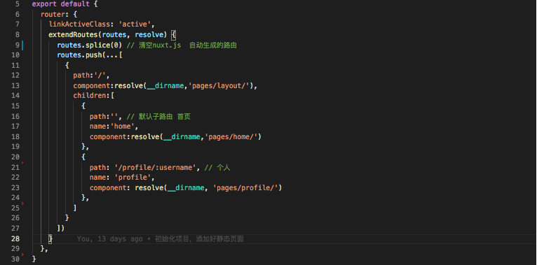

### 一、同构渲染

#### 1.定义

基于React、Vue等框架，客户端渲染和服务端渲染的结合。

1. 在服务端执行一次，用于实现服务器端渲染（首屏直出）

2. 在客户端再执行一次，用于接管页面交互

#### 2.优点

1. 核心解决SEO和首屏渲染慢的问题
2. 拥有传统服务端渲染的优点，也有客户端渲染的有点

#### 3.缺点

1. **开发条件所限**
   1. 浏览器特定的代码只能在某些声明周期钩子函数中使用
   2. 一些外部扩展库可能需要特殊处理才能在服务端渲染应用中运行
   3. 不能在服务端渲染期间操作DOM
   4. 某些代码操作需要区分运行环境
2. **涉及构建设置和部署的更多要求**
   1. 客户端渲染 构建 仅构建客户端应用即可  部署 可以部署在任意web服务器中
   2. 同构渲染 构建 需要构建两端  部署 只能部署在Node.js Server
3. **更多的服务器端负载**
   1. 在Node 中渲染完整的应用程序，相比仅仅提供静态文件的服务器需要大量占用CPU资源
   2. 如果应用在高流量环境下使用，需要准备响应的服务器负载
   3. 需要更多的服务端渲染优化工程处理

### 二、Nuxt的使用方式

1. 初始项目
2. 已有的Node.js 服务端项目，直接把Nuxt当作一个中间件继承到Node Web Server中
3. 现有的vue.js 项目，非常熟悉Nuxt.js ，至少10%的改动

### 三、路由

##### 1.动态路由

```javascript
<nuxt-link to="/">首页</nuxt-link>
```

nuxt.js 默认根据pages 文件自动生成路由
在 Nuxt.js 里面定义带参数的动态路由，需要创建对应的以下划线作为前缀的 Vue 文件 或 目录。

```javascript
pages/
--| _slug/
-----| comments.vue
-----| index.vue
--| users/
-----| _id.vue
--| index.vue
```

手动自己配置路由，要通过nuxt.config.js 文件配置



##### 2.路由参数效验

```javascript
export default {
  validate({ params }) {
    // 必须是number类型
    return /^\d+$/.test(params.id)
  }
}
```

##### 3.中间件

中间件允许您定义一个自定义函数运行在一个页面或一组页面渲染之前
每一个中间件应放置在 middleware/ 目录
文件名的名称将成为中间件名称 (middleware/auth.js将成为 auth 中间件)
中间件的执行流程顺序：

1. nuxt.config.js 
2. 匹配布局 
3. 匹配页面

应用场景：页面权限等

```javascript
// middleware/authenticated.js 定义
export default function (context) {
  context.userAgent = process.server
    ? context.req.headers['user-agent']
    : navigator.userAgent
}

// index.vue 使用
export default {
  middleware: 'stats'
}
```


