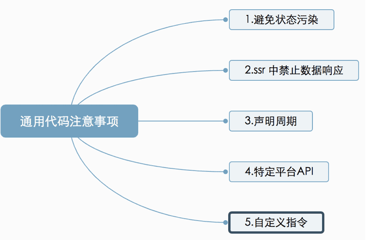

### 一、通用代码需要注意的事项



1. 为避免交叉请求造成的状态污染，应该保证服务端每个请求都是全新的、独立的应用实例

2. 将数据进行响应式的过程在服务端是多余的，所以在服务端渲染中应该禁用

3. 只有beforeCreate 和 created 声明周期会在服务端渲染中调用

4. 通用代码不可接受特定平台的API，如window和document，会在Node中报错

    axios 客户端和服务端实现了相同的api，通过XMLhttpRequest 和 http 模块

5. 大多数自定义指令会操作DOM，在SSR中会报错

   1. 创建组件
   2. 在创建服务器renderer时，使用 directive 选项所提供“服务器端版本”

### 二、构建配置


激活时，应用程序根元素添加一个特殊的属性 `<div id="app" data-server-rendered="true"> `, 告诉客户端这部分代码是在服务端渲染的(是否可以页面的一部分在客户端渲染，一部分在服务器渲染？)。
可通过 app.$mount('#app’, true) 强制激活。

### 三、路由与代码分割

#### 1.路由

```javascript
// entry-server.js 文件
import { createApp } from './app'

export default async context => {

// 因为有可能会是异步路由钩子函数或组件，所以我们将返回一个 Promise，
// 以便服务器能够等待所有的内容在渲染前，
// 就已经准备就绪。
// context 接收 渲染函数 renderer 的 renderToString 方法传进来的对象
const { app, router } = createApp()


// 设置服务器端 router 的位置
router.push(context.url)


// bind 绑定router里面的this
await new Promise(router.onReady.bind(router))

return app

}
//entry-client.js 文件
// 客户端入口
import { createApp } from './app'

// 客户端特定引导逻辑……

const { app , router} = createApp()

// 这里假定 App.vue 模板中根元素具有 `id="app”`
//因为路由器必须要提前解析路由配置中的异步组件，才能正确地调用组件中可能存在的路由钩子,所以要. 在挂载 app 之前调用 router.onReady
router.onReady(()=>{
    app.$mount('#app')
})
```

#### 2.代码分割

Vue 提供异步组件 .因为路由器必须要提前解析路由配置中的异步组件，才能正确地调用组件中可能存在的路由钩子,所以要在挂载 app 之前调用 router.onReady

```javascript
const Foo = () => import('./Foo.vue')
```

#### 3.预加载

```javascript
<link rel=“preload” href=“app.js” as=“script”> // 预加载当前页面的js。
<link rel=“prefetch” href=“app.next.js”>.  // 预加载下一个面页面的js、只在空闲时段加载，不影响当前页面。
```

### 四、数据预取和状态

#### 1.预取：只是存放在服务端的vuex

serverPrefetch： 在服务端渲染期间 fetch 异步数据，服务端渲染之前会调用serverPrefetch

```javascript
export default {
    serverPrefetch () {
    // 发起 action，返回 Promise
    // this.$store.dispatch('getPosts')
        return this.getPosts()
    }
}
```

#### 2.同步：服务端渲染同步到客户端 

```javascript
// entry-server.js
 context.rendered = () => {
    // Renderer 会把context.state 数据对象内联到页面模板中
    // 最终发送给客户端的页面中包含一段监本：window._INITIAL_STATE_ = context.state
    // 客户端就要吧页面中的winodw.__INITIAL_STATE_ 拿出来填充到客户端 store 容器中
    context.state = store.state
}
```

#### 3.客户端渲染合并服务端传过来的store  entry-client.js

```javascript
if (window.__INITIAL_STATE__){
    store.replaceState(window.__INITIAL_STATE__)
}
```

注：通过给页面内嵌代码window._INITIAL_STATE_ = context.state，把服务端预期数据传给客户端。不这样的报服务端渲染与客户端渲染不一致错误。

### 五、Head 管理

使用vue-meta 插件进行管理

#### 1.步骤一：实例化

```javascript
import VueMeta from 'vue-meta'
Vue.use(VueMeta)
Vue.mixin({
    metaInfo: {
        titleTemplate: '%s - 拉勾教育'
    }
})
```

#### 2.步骤二：获取meta

entry-server.js  服务端入口 拿到meta 并设置给上下文 context，渲染模板的时候能从context 中拿到meta

```javascript
const meta = app.$meta()
context.meta = meta  // 模板中能拿到context
```

#### 3.步骤三：配置模板

```javascript
{{{ meta.inject().title.text() }}}
{{{ meta.inject().meta.text() }}}
```

#### 4.步骤四：页面设置 metaInfo 数据

```javascript
export default {
    name: 'HomePage',
    metaInfo: {
        title: '首页'
    }
}
```

##### 渲染结果：

```html
<title>首页 - 拉勾教育</title>
```

注：Vue模板中 {{}} 会对HTML进行转义插值，Vue模板中 {{{}}}不会对HTML进行转义插值，Vue实例对象的 data 属性是一个对象，Vue组件中 data 属性是一个函数

