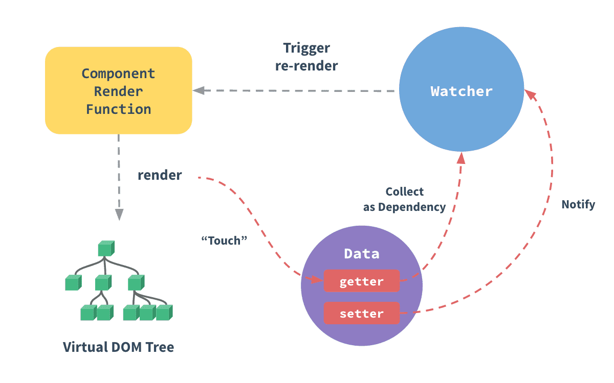

### Vue知识点

#### 1.Vue响应原理

>  Vue 使用 Object.defineProperty() 与 发布订阅 实现响应原理

1.  JavaScript 对象传入 Vue 实例作为 `data` 选项，Vue 将遍历此对象所有的属性，并使用 `Object.defineProperty`把这些属性全部转为 `getter/setter`

> vue.js首先通过Object.defineProperty来对要监听的数据进行getter和setter劫持，当数据的属性被赋值/取值的时候，vue.js就可以察觉到并做相应的处理。

2. 每个getter 是个 发布/订阅模式中的 主题(subject), 对应组件中的watch 是 观察者

> 通过订阅发布模式，我们可以为对象的每个属性都创建一个发布者，当有其他订阅者依赖于这个属性的时候，则将订阅者加入到发布者的队列中。利用Object.defineProperty的数据劫持，在属性的setter调用的时候，该属性的发布者通知所有订阅者更新内容。

˙