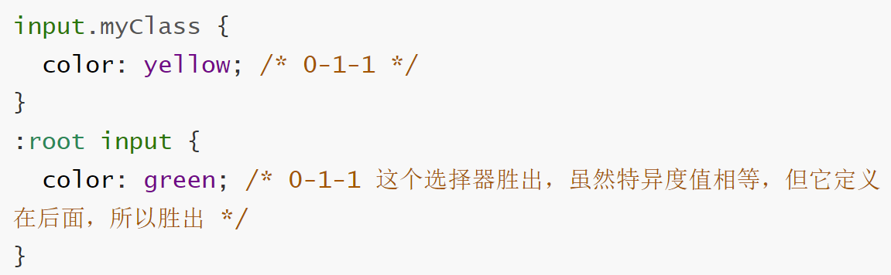
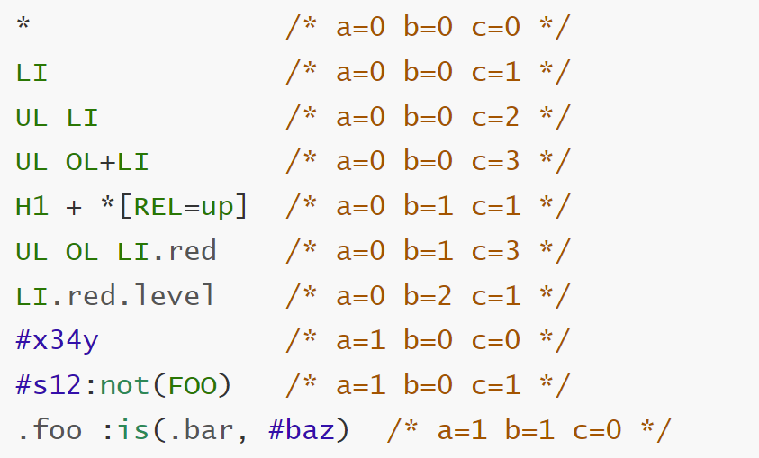
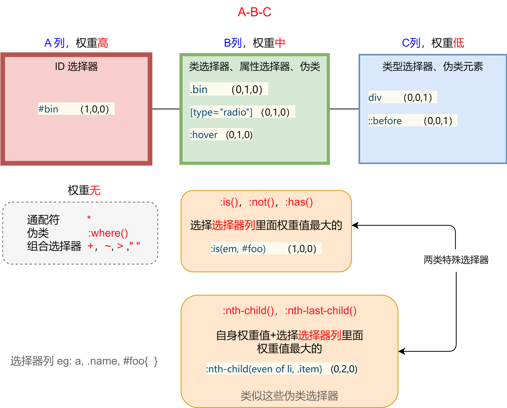

### css选择器的特异度

#### 1.css选择器特异度算法

css特异度算法是基于三类选择器，三列形式权重来计算的，形式为： A-B-C。

A = ID选择器的数量

B= 类选择器的数量+ 属性选择器的数量+伪类的数量

C= 类型选择器的数量+伪类元素的数量

比较时，先比较A值，A值大的胜出。如果A值相等，则比较B值，B值大的胜出。如果B值相等，则比较C值，C值大的胜出。如果C值也相等， 则定义（书写）在下面的选择器胜出。

```css
:root input {
  color: green; /* 0-1-1 - 胜出 因为 B 值 1>0 */
}
html body main input {
  color: yellow; /* 0-0-4 */
}
```

```css
#myElement {
  color: yellow; /* 1-0-0 */
}
#myApp [id="myElement"] {
  color: green; /* 1-1-0  - 胜出，因为 A值相等，则比较B值，1 > 0 */
}
```
```css
:root input {
  color: green; /* 0-1-1 -  胜出，因为B值 1> 0 */
}
html body main input {
  color: yellow; /* 0-0-4 */  /*4 是因为有4个类型选择器html body main input*/
}
```

```css
input.myClass {  
  color: yellow; /* 0-1-1 */
}
:root input {
  color: green; /* 0-1-1 这个选择器胜出，虽然特异度值相等，但它定义在后面，所以胜出 */
}
```



#### 2.特殊的类别

因为有些伪类是给其他选择器提供”执行上下文“，所以它们的权重有些特别。

1.`:is()`、`:not()`、`:has()`

这三个伪类计算权重时，选择`选择器列`里面权重最大的

`:is(em, #foo)`   特异度值为`(1,0,0)`, 因为`#foo` 为`(1,0,0)`  大于  `em` 为`(0,0,1)`  所以取 `(1,0,0)`


2.类似`:nth-child`、`nth-last-child()`

类似这种的伪类计算权重时，自身权重值+选择“选择器列”里面权重值最大的

`:nth-child(even of li, .item)` 特异度为`(0,2,0)`  `.item` + 自身

3.通配符`*`、`:where()`、组合选择器 `+`、`~`、`>` 、`""` ，忽略权重。

`.qux:where(em, #foo#bar#baz)` 特异度值为(0,1,0), 因为`:where`权重忽略，所以不用看里面的选择器列。

```css
*               /* a=0 b=0 c=0 */
LI              /* a=0 b=0 c=1 */
UL LI           /* a=0 b=0 c=2 */
UL OL+LI        /* a=0 b=0 c=3 */
H1 + *[REL=up]  /* a=0 b=1 c=1 */
UL OL LI.red    /* a=0 b=1 c=3 */
LI.red.level    /* a=0 b=2 c=1 */
#x34y           /* a=1 b=0 c=0 */
#s12:not(FOO)   /* a=1 b=0 c=1 */
.foo :is(.bar, #baz)  /* a=1 b=1 c=0 */
```



#### 3.行内样式

行内样式会覆盖样式表的样式，可以看做`1-0-0-0`。eg: `<div style="font-weight: bold;"></div>`

只有一种方法可以覆盖行内样式，通过用`!important`


[1]: https://www.w3.org/TR/selectors/#specificity	" css 选择器特异度"
[2]: https://developer.mozilla.org/en-US/docs/Web/CSS/Specificity	"MDN css 特异度"

