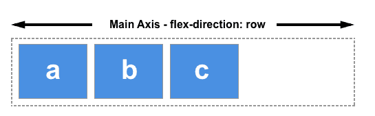
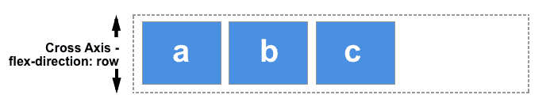

### [1.Main Axis](https://developer.mozilla.org/en-US/docs/Glossary/Main_Axis)

The main axis in [flexbox](https://developer.mozilla.org/en-US/docs/Glossary/Flexbox) is defined by the direction set by the [`flex-direction`](https://developer.mozilla.org/en-US/docs/Web/CSS/flex-direction) property.

On the main axis you can control the sizing of flex items by adding any available space to the items themselves, by way of `flex` properties on the items. Or, you can control the space between and around items by using the `justify-content` property.

### [2.Cross Axis](https://developer.mozilla.org/en-US/docs/Glossary/Cross_Axis)

The cross axis in [flexbox](https://developer.mozilla.org/en-US/docs/Glossary/Flexbox) runs perpendicular to the [main axis](https://developer.mozilla.org/en-US/docs/Glossary/Main_Axis).

Alignment of items on the cross axis is achieved with the `align-items` property on the flex container or `align-self` property on individual items. In the case of **a multi-line flex container**, with additional space on the cross axis, you can use `align-content` to control the spacing of the rows.

https://css-tricks.com/snippets/css/a-guide-to-flexbox/#aa-prefixing-flexbox

> `flex`布局，父元素要固定。因为子元素是相对于父元素的宽度来计算空间分配的。