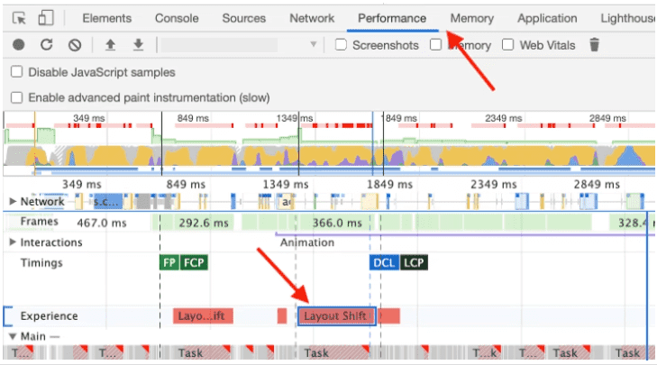
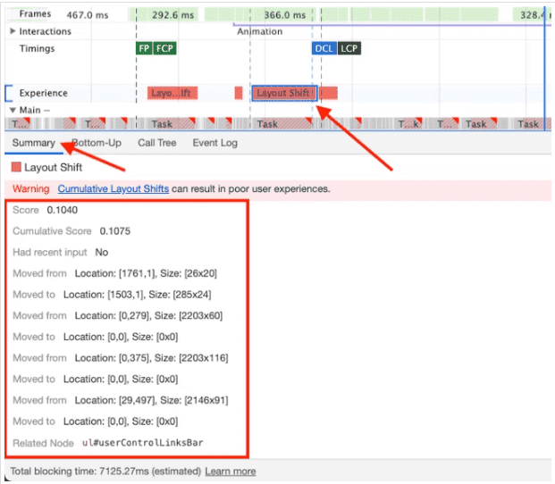

## 1.Measure performance with the RAIL model

### 1.The 4 parts of the RAIL performance model

Response、Animation、Idle、Load


### 2.Focus on the user

 The table below describes key metrics of how users perceive performance delays:

| 0 to 16 ms       | Users are exceptionally good at tracking motion, and they dislike it when animations aren't smooth. They perceive animations as smooth so long as 60 new frames are rendered every second. That's 16 ms per frame, including the time it takes for the browser to paint the new frame to the screen, leaving an app about 10 ms to produce a frame. |
| ---------------- | ------------------------------------------------------------ |
| 0 to 100 ms      | Respond to user actions within this time window and users feel like the result is immediate. Any longer, and the connection between action and reaction is broken. |
| 100 to 1000 ms   | Within this window, things feel part of a natural and continuous progression of tasks. For most users on the web, loading pages or changing views represents a task. |
| 1000 ms or more  | Beyond 1000 milliseconds (1 second), users lose focus on the task they are performing. |
| 10000 ms or more | Beyond 10000 milliseconds (10 seconds), users are frustrated and are likely to abandon tasks. They may or may not come back later. |

### 3.Response: process events in under 50ms [#](https://web.dev/rail/#response:-process-events-in-under-50ms)

### 4.Animation: produce a frame in 10 ms [#](https://web.dev/rail/#animation:-produce-a-frame-in-10-ms)

### 5.Idle: maximize idle time [#](https://web.dev/rail/#idle:-maximize-idle-time)

### 6.Load: deliver content and become interactive in under 5 seconds [#](https://web.dev/rail/#load:-deliver-content-and-become-interactive-in-under-5-seconds)


[1]: https://web.dev/rail/	"Measure performance with the RAIL model"
[2]: https://developers.google.com/web/fundamentals/performance/get-started	"Loading Perforance"
[3]: https://web.dev/animations-overview/	" Why are some animations slow？"


## 2.Layout shfit

### 1.What is CLS？

The Cumulative Layout Shift (CLS) metric 累计布局偏移

CLS is a measure of the largest burst of *layout shift scores* for every [unexpected](https://web.dev/cls/#expected-vs.-unexpected-layout-shifts) layout shift that occurs during the entire lifespan of a page.

### 2.How to measure CLS 

##### Field tools

- [Chrome User Experience Report](https://developers.google.com/web/tools/chrome-user-experience-report)
- [PageSpeed Insights](https://developers.google.com/speed/pagespeed/insights/)
- [Search Console (Core Web Vitals report)](https://support.google.com/webmasters/answer/9205520)
- [`web-vitals` JavaScript library](https://github.com/GoogleChrome/web-vitals)

##### Lab tools

- [Chrome DevTools](https://developers.google.com/web/tools/chrome-devtools/)
- [Lighthouse](https://developers.google.com/web/tools/lighthouse/)
- [WebPageTest](https://webpagetest.org/)

###### 1.Layout Instability API

`PerformanceObserver`

```javascript
let cls = 0;
new PerformanceObserver((entryList) => {
  for (const entry of entryList.getEntries()) {
    if (!entry.hadRecentInput) {
      cls += entry.value;
      console.log('Current CLS value:', cls, entry);
    }
  }
}).observe({type: 'layout-shift', buffered: true});
```

nformation about layout shifts is reported using a combination of two APIs: the [`LayoutShift`](https://wicg.github.io/layout-instability/#layoutshift) and [`LayoutShiftAttribution`](https://wicg.github.io/layout-instability/#sec-layout-shift-attribution) interfaces.

##### 2.DevTools





> 高亮layout shift 区域 
>
> 快速方便发现页面中的layout shift
>
> To enable Layout Shift Regions in DevTools, go to **Settings > More Tools > Rendering > Layout Shift Regions** then refresh the page that you wish to debug.

### 3.Identifying the cause of a layout shift [#](https://web.dev/debug-layout-shifts/#identifying-the-cause-of-a-layout-shift)

Layout shifts can be caused by the following events:

#### 1.Changes to the position of a DOM element

- Stylesheets that are loaded late or overwrite previously declared styles.
- Animation and transition effects.

#### 2.Changes to the dimensions of a DOM element

- Stylesheets that are loaded late or overwrite previously declared styles.
- Images and iframes without `width` and `height` attributes that load after their "slot" has been rendered.
- Text blocks without `width` or `height` attributes that swap fonts after the text has been rendered.

#### 3.Insertion or removal of a DOM element

- Insertion of ads and other third-party embeds.
- Insertion of banners, alerts, and modals.
- Infinite scroll and other UX patterns that load additional content above existing content.

#### 4.Animations that trigger layout

Some animation effects can [trigger layout](https://gist.github.com/paulirish/5d52fb081b3570c81e3a). A common example of this is when DOM elements are 'animated' by incrementing properties like `top` or `left` rather than using CSS's [`transform`](https://developer.mozilla.org/docs/Web/CSS/transform) property. Read [How to create high-performance CSS animations](https://web.dev/animations-guide/) for more information.

### 4.How to improve CLS

CSS [`transform`](https://developer.mozilla.org/docs/Web/CSS/transform) property allows you to animate elements without triggering layout shifts:

- Instead of changing the `height` and `width` properties, use `transform: scale()`.

- To move elements around, avoid changing the `top`, `right`, `bottom`, or `left` properties and use `transform: translate()` instead.

  

[1]: https://web.dev/cls/	"Cumulative Layout Shift 累计布局偏移 CLS"
[2]: https://web.dev/debug-layout-shifts/	"debug-layout-shifts"


