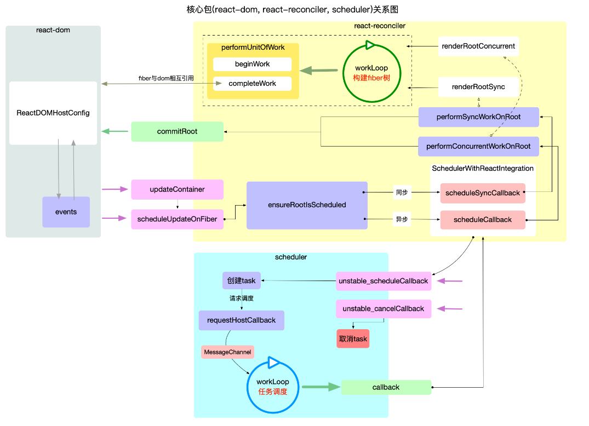

### 1.基本概念

#### 1.宏观包结构

##### 1.react

*react 基础包, 只提供定义 react 组件(*`ReactElement`*)的必要函数, 一般来说需要和渲染器(*`react-dom`*,*`react-native`*)一同使用. 在编写*`react`*应用的代码时, 大部分都是调用此包的 api.*

##### 2.react-dom

*react 渲染器之一, 是 react 与 web 平台连接的桥梁(可以在浏览器和 nodejs 环境中使用), 将*`react-reconciler`*中的运行结果输出到 web 界面上. 在编写*`react`*应用的代码时,大多数场景下, 能用到此包的就是一个入口函数*`ReactDOM.render(<App/>, document.getElementById('root'))`*, 其余使用的 api, 基本是*`react`*包提供的.*

##### 3.react-reconciler

*react 得以运行的核心包(综合协调*`react-dom`*,*`react`*,*`scheduler`*各包之间的调用与配合).*
*管理 react 应用状态的输入和结果的输出. 将输入信号最终转换成输出信号传递给渲染器.*

##### 4.scheduler

*调度机制的核心实现, 控制由*`react-reconciler`*送入的回调函数的执行时机, 在*`concurrent`*模式下可以实现任务分片. 在编写*`react`*应用的代码时, 同样几乎不会直接用到此包提供的 api.*

#### 2.宏观总览

##### 1.架构分层

###### 1.接口层

react包

###### 2.内核层

1. 调度器 scheduler

   `scheduler`包, 核心职责只有 1 个, 就是执行回调.

   - 把`react-reconciler`提供的回调函数, 包装到一个任务对象中.
   - 在内部维护一个任务队列, 优先级高的排在最前面.
   - 循环消费任务队列, 直到队列清空.

2. 构造器 react-reconciler

   `react-reconciler`包, 有 3 个核心职责:

   1. 装载渲染器, 渲染器必须实现[`HostConfig`协议](https://github.com/facebook/react/blob/v17.0.2/packages/react-reconciler/README.md#practical-examples)(如: `react-dom`), 保证在需要的时候, 能够正确调用渲染器的 api, 生成实际节点(如: `dom`节点).
   2. 接收`react-dom`包(初次`render`)和`react`包(后续更新`setState`)发起的更新请求.
   3. 将`fiber`树的构造过程包装在一个回调函数中, 并将此回调函数传入到`scheduler`包等待调度.

3. 渲染器 react-dom

   `react-dom`包, 有 2 个核心职责:

   1. 引导`react`应用的启动(通过`ReactDOM.render`).
   2. 实现[`HostConfig`协议](https://github.com/facebook/react/blob/v17.0.2/packages/react-reconciler/README.md#practical-examples)([源码在 ReactDOMHostConfig.js 中](https://github.com/facebook/react/blob/v17.0.2/packages/react-dom/src/client/ReactDOMHostConfig.js)), 能够将`react-reconciler`包构造出来的`fiber`树表现出来, 生成 dom 节点(浏览器中), 生成字符串(ssr).

##### 2.内核关系



### 2.两大工作循环

#### 1.任务调度循环

`react`应用得以运行的保证, 它需要循环调用, 控制所有任务(`task`)的调度.

#### 2.fiber构造循环

控制 fiber 树的构造, 整个过程是一个[深度优先遍历](https://7km.top/algorithm/dfs).

#### 3.区别与联系

1. 区别
   - `任务调度循环`是以`二叉堆`为数据结构(详见[react 算法之堆排序](https://7km.top/algorithm/heapsort)), 循环执行`堆`的顶点, 直到`堆`被清空.
   - `任务调度循环`的逻辑偏向宏观, 它调度的是每一个任务(`task`), 而不关心这个任务具体是干什么的(甚至可以将`Scheduler`包脱离`react`使用), 具体任务其实就是执行回调函数`performSyncWorkOnRoot`或`performConcurrentWorkOnRoot`.
   - `fiber构造循环`是以`树`为数据结构, 从上至下执行深度优先遍历(详见[react 算法之深度优先遍历](https://7km.top/algorithm/dfs)).
   - `fiber构造循环`的逻辑偏向具体实现, 它只是任务(`task`)的一部分(如`performSyncWorkOnRoot`包括: `fiber`树的构造, `DOM`渲染, 调度检测), 只负责`fiber`树的构造.
2. 联系
   - `fiber构造循环`是`任务调度循环`中的任务(`task`)的一部分. 它们是从属关系, 每个任务都会重新构造一个`fiber`树.

#### 4.主干逻辑

 两大循环的分工可以总结为: 大循环(任务调度循环)负责调度`task`, 小循环(fiber 构造循环)负责实现`task` .

1. 输入: 将每一次更新(如: 新增, 删除, 修改节点之后)视为一次`更新需求`(目的是要更新`DOM`节点).

2. 注册调度任务: `react-reconciler`收到`更新需求`之后, 并不会立即构造`fiber树`, 而是去调度中心`scheduler`注册一个新任务`task`, 即把`更新需求`转换成一个`task`.

3. 执行调度任务(输出): 调度中心`scheduler`通过`任务调度循环`来执行`task`(`task`的执行过程又回到了`react-reconciler`包中).
   - `fiber构造循环`是`task`的实现环节之一, 循环完成之后会构造出最新的 fiber 树.
   - `commitRoot`是`task`的实现环节之二, 把最新的 fiber 树最终渲染到页面上, `task`完成.

主干逻辑就是`输入到输出`这一条链路, 为了更好的性能(如`批量更新`, `可中断渲染`等功能), `react`在输入到输出的链路上做了很多优化策略, 比如本文讲述的`任务调度循环`和`fiber构造循环`相互配合就可以实现`可中断渲染`.

### 3.高频对象

#### 1.react包

##### 1. `reactElement`对象

```react
export type ReactElement = {|
  // 用于辨别ReactElement对象
  $typeof: any,

  // 内部属性
  type: any, // 表明其种类
  key: any,
  ref: any,
  props: any,

  // ReactFiber 记录创建本对象的Fiber节点, 还未与Fiber树关联之前, 该属性为null
  _owner: any,

  // __DEV__ dev环境下的一些额外信息, 如文件路径, 文件名, 行列信息等
  _store: {validated: boolean, ...},
  _self: React$Element<any>,
  _shadowChildren: any,
  _source: Source,
|};
```


所有采用`jsx`语法书写的节点, 都会被编译器转换, 最终会以`React.createElement(...)`的方式, 创建出来一个与之对应的`ReactElement`对象.

> 1. `key`属性在`reconciler`阶段会用到, 目前只需要知道所有的`ReactElement`对象都有 key 属性(且[其默认值是 null](https://github.com/facebook/react/blob/v17.0.2/packages/react/src/ReactElement.js#L348-L357), 这点十分重要, 在 diff 算法中会使用到).
> 2. `type`属性决定了节点的种类:

##### 2.`reactComponent`对象

对于`ReactElement`来讲, `ReactComponent`仅仅是诸多`type`类型中的一种.

`ReactComponent`是诸多`ReactElement`种类中的一种情况, 但是由于`ReactComponent`是 class 类型, 自有它的特殊性(可[对照源码](https://github.com/facebook/react/blob/v17.0.2/packages/react/src/ReactBaseClasses.js), 更容易理解).

1. `ReactComponent`是 class 类型, 继承父类`Component`, 拥有特殊的方法(`setState`,`forceUpdate`)和特殊的属性(`context`,`updater`等).
2. 在`reconciler`阶段, 会依据`ReactElement`对象的特征, 生成对应的 fiber 节点. 当识别到`ReactElement`对象是 class 类型的时候, 会触发`ReactComponent`对象的生命周期, 并调用其 `render`方法, 生成`ReactElement`子节点.

##### 3.`reactElement`内存结构

- `class`和`function`类型的组件,其子节点是在 render 之后(`reconciler`阶段)才生成的. 此处只是单独表示`ReactElement`的数据结构.
- 父级对象和子级对象之间是通过`props.children`属性进行关联的(与 fiber 树不同).
- `ReactElement`虽然不能算是一个严格的树, 也不能算是一个严格的链表. 它的生成过程是自顶向下的, 是所有组件节点的总和.
- `ReactElement`树(暂且用树来表述)和`fiber`树是以`props.children`为单位`先后交替`生成的(在 fiber 树构建章节详细解读), 当`ReactElement`树构造完毕, fiber 树也随后构造完毕.
- `reconciler`阶段会根据`ReactElement`的类型生成对应的`fiber`节点(不是一一对应, 比如`Fragment`类型的组件在生成`fiber`节点的时候会略过).

#### 2.`react-reconciler`包

在[宏观结构](https://7km.top/main/macro-structure)中介绍过, `react-reconciler`包是`react`应用的中枢, 连接渲染器(`react-dom`)和调度中心(`scheduler`), 同时自身也负责 fiber 树的构造.

##### 1.`Fiber`对象


> ###### react 源码调试方法
>
> https://gitee.com/machinist_wq/react-source-code


[1]: https://7km.top/main/scheduler/	" 调度原理"
[2]: https://github.com/wbbhacker/react-illustration-series	" react 架构原理"

