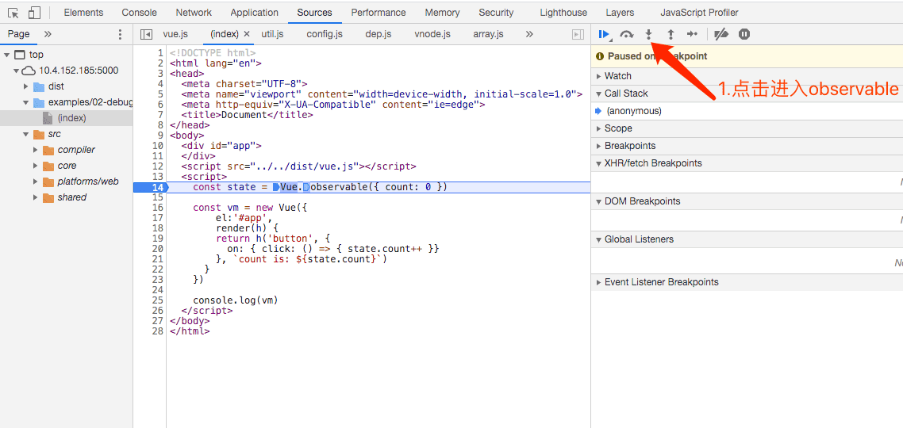
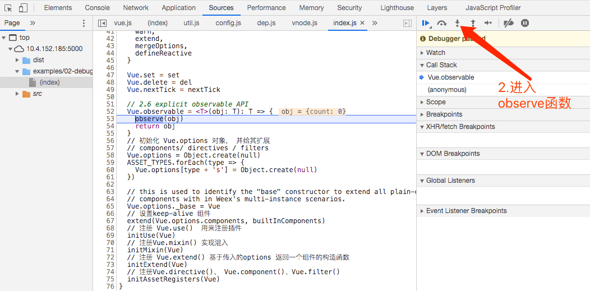
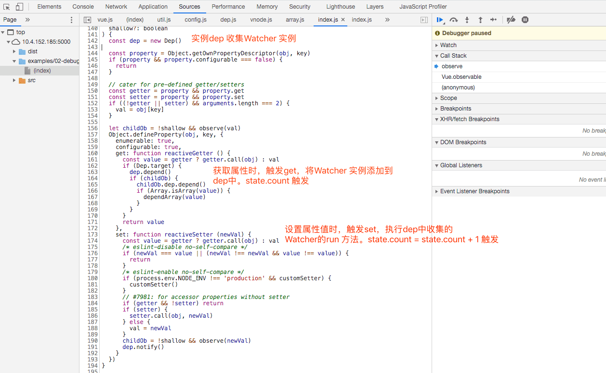
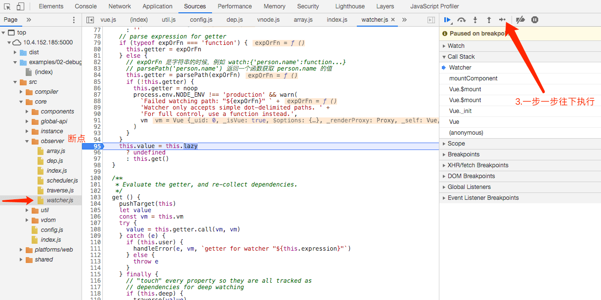
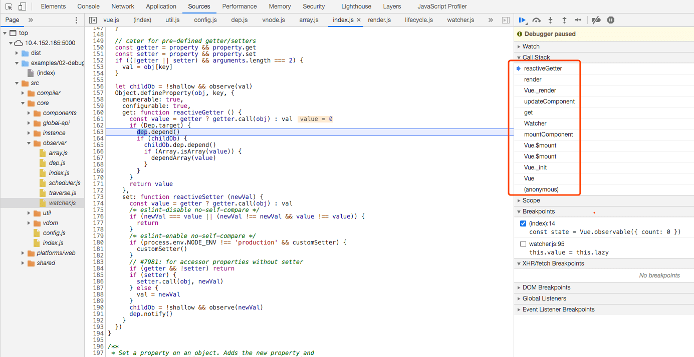

#### Vue中observable 原理详解

一直对`Vue.observable`方法的运行流程很疑惑，为什么对能对个不相关的对象进行监听，当对象属性发生改变时，更新视图？  更新视图的方法是在什么时候被添加进去的？带着疑惑先看下`Vue.observable`的官方文档。

#### 一、用法

Vue.observable(object)官方文档的用法描述：

让一个对象可响应。Vue 内部会用它来处理 `data` 函数返回的对象。

返回的对象可以直接用于[渲染函数](https://cn.vuejs.org/v2/guide/render-function.html)和[计算属性](https://cn.vuejs.org/v2/guide/computed.html)内，并且会在发生变更时触发相应的更新。也可以作为最小化的跨组件状态存储器，用于简单的场景：

```javascript
const state = Vue.observable({ count: 0 })
const Demo = {
  render(h) {
    return h('button', {
      on: { click: () => { state.count++ }}
    }, `count is: ${state.count}`)
  }
}
```

提取主要信息：让一个对象可响应。返回对象可用在渲染函数`render`和计算属性`computed `。

#### 二、分析源代码

在chrome浏览器中,运行上述例子，打断点调试。

> Vue 源码调试在《[vue首次渲染过程](https://wbbyouzi.com/archives/304)》 文章中有讲解。

1. `const state = Vue.observable({ count: 0 })` 位置打断点，刷新页面，进入`observable` 函数。





可以找到`Vue.observable` 调用的是 `observe `方法。`observe` 方法中实例化`Observer` 类，关于Observer类的讲解在《[vue响应式原理](https://wbbyouzi.com/archives/306)》文章 中有讲解。实例化Observer类，对参数object的属性进行get、set 劫持，源码在`src/core/observer/index.js`文件中。



首先你要知道Watcher 类实例分为：用户Watcher、计算Computed watcher、渲染 render Watcher。上述例子中很明显用到的是渲染render Watcher。那么渲染watcher 是什么时候添加 dep 去的？渲染watcher 被添加之前肯定是要先创建的，所以我们在watcher 创建的地方打上断点，文件路径为`src/core/obsrver/watcher.js`。



从调用栈中可以看出，渲染Watcher是在Vue.$mount 中执行的。一步一步往下执行找到了渲染Watcher 被添加的地方，下图：



可以看出，渲染watcher 被创建之时，执行自身的get 方法，get方法中`pushTarget(this)` 把当前watcher 赋值给了Dep.target ，并回调updateComponent 方法更新组件。进一步调用渲染render 函数，渲染是state.count 获取值时，触发了get 劫持。判断Dep.target 中有值，调用dep.depend()，把Dep.target中的渲染watcher 添加到dep中。当click事件点击时，state.count 赋值时，触发set劫持，执行`dep.notify()` ，告知渲染watcher ，重新渲染UI。

同理在计算属性中也是以上过程。

#### 三、总结

`Vue.observable(object)` 在渲染函数中执行的流程：

1. observer函数遍历劫持object参数
2. Vue 初始化时，在Vue.$mount 中创建渲染watcher
3. 渲染watcher时，调用自身get方法，把渲染watcher 赋值到全局变量Dep.target中，并回调updateComponent函数，触发render函数。
4. render函数执行时，获取state.count值时，,触发set 劫持，把渲染watcher 添加到dep中
5. 当click事件，重新赋值state.count 时，触发get 劫持，执行dep.notify ,更新UI

 

