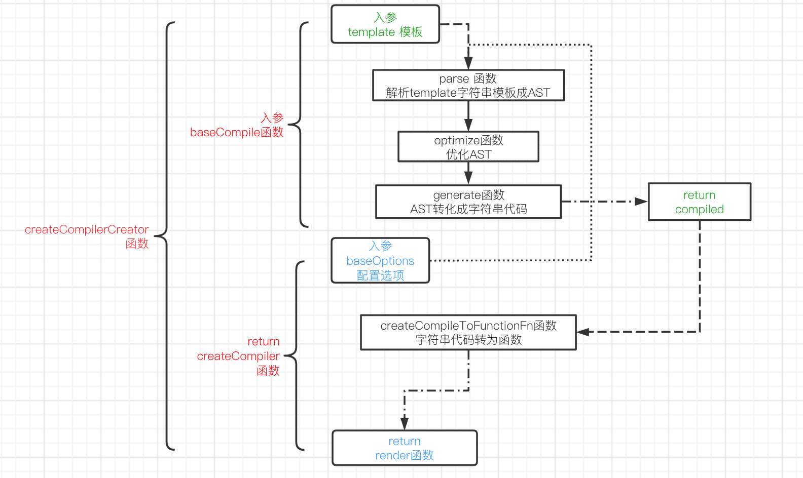

### Vue中模板编译的过程

#### 一、模板编译功能介绍

Vue的编译功能主要是将template字符串模板编译生成render函数，render函数的功能是用js创建Dom。

具体流程图如下：



#### 二、`createCompilerCreator` 函数

首先`createCompilerCreator`函数 传入 `baseCompile` 函数参数，直接返回 `createCompiler` 函数并赋值给`createCompiler` 变量。 `createCompiler`函数传入 baseOptions 执行 返回compile 对象。

直接把编译主体功能分离出来，通过入参传给 `createCompilerCreator`函数，科里化返回 `createCompiler`

```javascript
// src/compiler/create-compiler.js  编译主体返回注册其它属性
export function createCompilerCreator (baseCompile: Function): Function {
  return function createCompiler (baseOptions: CompilerOptions) {
  }
}

// src/compiler/index.js   编译主体部分
export const createCompiler = createCompilerCreator(baseCompile)

// src/platforms/web/compiler/index.js  编译配置选项部分
const { compile, compileToFunctions } = createCompiler(baseOptions)
```

你可能会想直接把baseOptions 和 baseCompile 传入 ``createCompiler`` 不更直接吗？

这样通过函数式编程科里化把 `createCompiler` 把编译主体功能抽离出来和 配置选项 `baseOptions` 分别单独文件，使功能模块化，方便以后扩展。

#### 三、`baseCompile` 函数

`baseCompile`功能是分三步处理template字符串模板

1. `parse` 函数将其转化成AST 树
2. `optimize`函数优化AST树，如删除一些无用的虚拟Dom
3. `generate` 函数将优化好的AST树，转化成代码字符串

```javascript
// src/compiler/index.js   编译主体部分
export const createCompiler = createCompilerCreator(function baseCompile (
  template: string,
  options: CompilerOptions
): CompiledResult {
  const ast = parse(template.trim(), options)
  if (options.optimize !== false) {
    optimize(ast, options)
  }
  const code = generate(ast, options)
  return {
    ast,
    render: code.render,
    staticRenderFns: code.staticRenderFns
  }
})
```

#### 四、`createCompiler` 函数

`createCompiler`函数处理 baseOptions 配置选项 及  调用baseCompile 函数，返回compile函数和通过`createCompileToFunctionFn` 函数把rende 及 staticRenderFns 字符串代码转化成函数的对象。


##### 五、`createCompileToFunctionFn` 函数

`createCompileToFunctionFn`函数通过 `new function(codeString)` ，把字符串格式的代码转化成程序代码。

并返回。

```javascript
// src/compiler/to-function.js
// createFunction 将字符串格式的代码转化成函数
function createFunction (code, errors) {
  try {
    return new Function(code)
  } catch (err) {
    errors.push({ err, code })
    return noop
  }
}
// createCompileToFunctionFn 函数返回 compileToFunctions 函数
function compileToFunctions(){
  const res = {}
  const compiled = compile(template, options)
  res.render = createFunction(compiled.render, fnGenErrors)
  res.staticRenderFns = compiled.staticRenderFns.map(code => {
    return createFunction(code, fnGenErrors)
  })
  return (cache[key] = res)
}
```

以上为编译模板的主要过程。