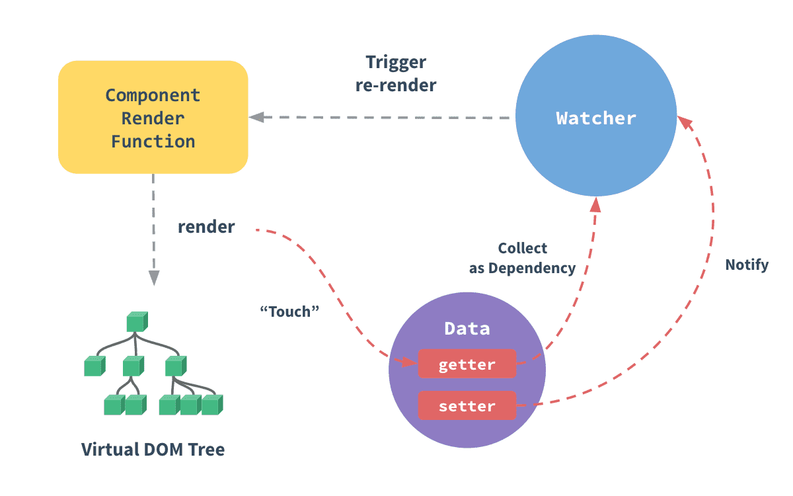

#### 1.Vue2响应原理

>  Vue 使用 Object.defineProperty() 与 发布订阅 实现响应原理

1.  JavaScript 对象传入 Vue 实例作为 `data` 选项，Vue 将遍历此对象所有的属性，并使用 `Object.defineProperty`把这些属性全部转为 `getter/setter`

> vue.js首先通过Object.defineProperty来对要监听的数据进行getter和setter劫持，当数据的属性被赋值/取值的时候，vue.js就可以察觉到并做相应的处理。

2. 每个getter 是个 发布/订阅模式中的 主题(subject), 对应组件中的watch 是 观察者

> 通过订阅发布模式，我们可以为对象的每个属性都创建一个发布者，当有其他订阅者依赖于这个属性的时候，则将订阅者加入到发布者的队列中。利用Object.defineProperty的数据劫持，在属性的setter调用的时候，该属性的发布者通知所有订阅者更新内容。



˙

#### [2.作用域插槽](https://v2.cn.vuejs.org/v2/guide/components-slots.html)

##### 1.基础用法

```vue
// base-layout
<div class="container">
  <header>
    <slot name="header">header content</slot> // header slot 未提供的时候，渲染header content内容 即默认内容
  </header>
  <main>
    <slot></slot>
  </main>
  <footer>
    <slot name="footer"></slot>
  </footer>
</div>

// 
<base-layout>
  <template v-slot:header>
    <h1>Here might be a page title</h1>
  </template>

  <p>A paragraph for the main content.</p>
  <p>And another one.</p>

  <template v-slot:footer>
    <p>Here's some contact info</p>
  </template>
</base-layout>
```

##### 2.编译作用域

**父级模板里的所有内容都是在父级作用域中编译的；子模板里的所有内容都是在子作用域中编译的。**


```vue
<navigation-link url="/profile">
  Clicking here will send you to: {{ url }}
  <!--
  这里的 `url` 会是 undefined，因为其 (指该插槽的) 内容是
  _传递给_ <navigation-link> 的而不是
  在 <navigation-link> 组件*内部*定义的。
  -->
</navigation-link>
```

##### [3.作用域插槽](https://v2.cn.vuejs.org/v2/guide/components-slots.html#%E4%BD%9C%E7%94%A8%E5%9F%9F%E6%8F%92%E6%A7%BD)

有时让插槽内容能够访问**子组件中**才有的数据是很有用的。

````vue
// 子组件 current-user
<span>
  <slot v-bind:user="user">
    {{ user.lastName }}
  </slot>
</span>

// 调用子组件
<current-user>
  <template v-slot:default="slotProps">
    {{ slotProps.user.firstName }}
  </template>
</current-user>
````

#### 3.动态组件&异步组件

##### 1.动态组件

使用`is` attribute 来切换不同组件，用`keep-alive` 来保存缓存组件

```vue
<component v-bind:is="currentTabComponent"></component>
```

##### 2.异步组件

异步加载

```js
new Vue({
  // ...
  components: {
    'my-component': () => import('./my-async-component')
  }
})
```

处理加载状态

```js
const AsyncComponent = () => ({
  // 需要加载的组件 (应该是一个 `Promise` 对象)
  component: import('./MyComponent.vue'),
  // 异步组件加载时使用的组件
  loading: LoadingComponent,
  // 加载失败时使用的组件
  error: ErrorComponent,
  // 展示加载时组件的延时时间。默认值是 200 (毫秒)
  delay: 200,
  // 如果提供了超时时间且组件加载也超时了，
  // 则使用加载失败时使用的组件。默认值是：`Infinity`
  timeout: 3000
})
```

#### 4.边界处理/父子组件传值

##### 1.访问根实例

在每个 `new Vue` 实例的子组件中，其根实例可以通过 `$root` property 进行访问。

##### 2.访问父组件实例

通过`this.$parent`可以从一个从一个子组件来访问父组件的实例。

##### 3.访问子组件实例

通过`Ref`

##### 4.依赖注入

```js
//在父组件中
provide: function () {
  return {
    getMap: this.getMap
  }
}

// 在子组件中
inject: ['getMap']
```

##### 5.$emit 自定义事件

#### 5.可复用性&组合

##### 1.mixin 混入

```js
// 定义一个混入对象
var myMixin = {
  created: function () {
    this.hello()
  },
  methods: {
    hello: function () {
      console.log('hello from mixin!')
    }
  }
}

// 定义一个使用混入对象的组件
var Component = Vue.extend({
  mixins: [myMixin]
})

var component = new Component() // => "hello from mixin!"
```

##### 2.自定义指令

除了核心功能默认内置的指令 (`v-model` 和 `v-show`)，Vue 也允许注册自定义指令。

```js
Vue.directive('focus', {
  // 当被绑定的元素插入到 DOM 中时……
  inserted: function (el) {
    // 聚焦元素
    el.focus()
  }
})
```

##### 3.自定义插件

Vue.js 的插件应该暴露一个 `install` 方法。这个方法的第一个参数是 `Vue` 构造器，第二个参数是一个可选的选项对象：

```js
MyPlugin.install = function (Vue, options) {
  // 1. 添加全局方法或 property
  Vue.myGlobalMethod = function () {
    // 逻辑...
  }

  // 2. 添加全局资源
  Vue.directive('my-directive', {
    bind (el, binding, vnode, oldVnode) {
      // 逻辑...
    }
    ...
  })

  // 3. 注入组件选项
  Vue.mixin({
    created: function () {
      // 逻辑...
    }
    ...
  })

  // 4. 添加实例方法
  Vue.prototype.$myMethod = function (methodOptions) {
    // 逻辑...
  }
}


// 调用插件
Vue.use(MyPlugin)
```

##### 4.过滤器

Vue.js 允许你自定义过滤器，可被用于一些常见的文本格式化。

```vue
<!-- 在双花括号中 -->
{{ message | capitalize }}

<!-- 在 `v-bind` 中 -->
<div v-bind:id="rawId | formatId"></div>

```

```javascript
filters: {
  capitalize: function (value) {
    if (!value) return ''
    value = value.toString()
    return value.charAt(0).toUpperCase() + value.slice(1)
  }
}
```

#### [6.`this.$set`](https://v2.cn.vuejs.org/v2/guide/reactivity.html#%E5%AF%B9%E4%BA%8E%E5%AF%B9%E8%B1%A1)

对于已经创建的实例，Vue 不允许动态添加根级别的响应式 property。但是，可以使用 `Vue.set(object, propertyName, value)` 方法向嵌套对象添加响应式 property。

Vue 不能检测以下数组的变动：1、当你利用索引直接设置一个数组项时，例如：`vm.items[indexOfItem] = newValue`、

2、当你修改数组的长度时，例如：`vm.items.length = newLength`


