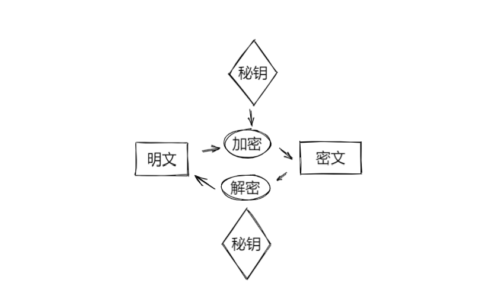
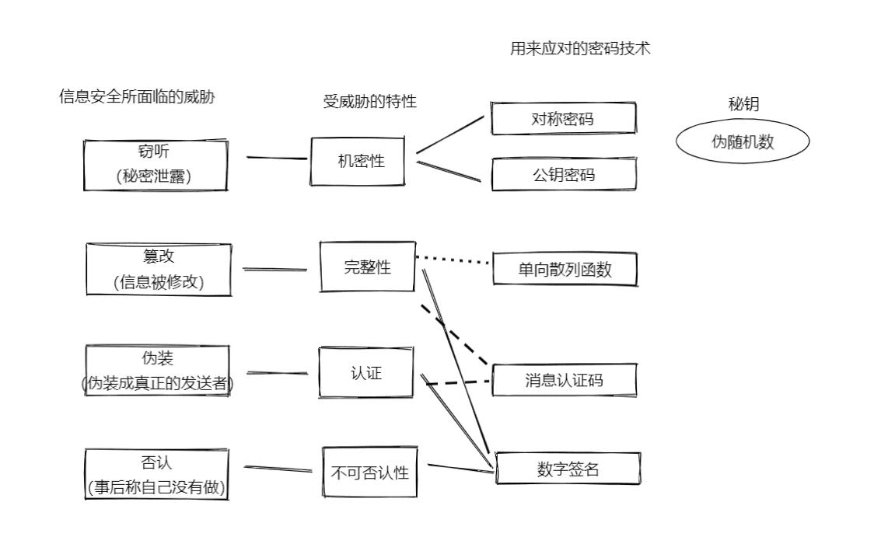
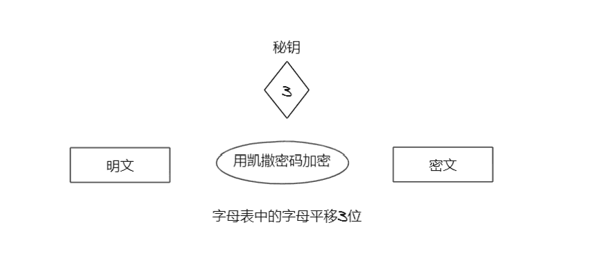
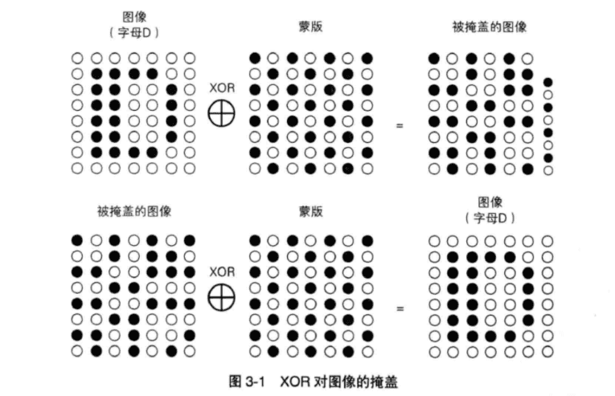

### 第1章  密码

#### 1.密码算法

加密算法+解密算法 = 密码算法

#### 2.秘钥



#### 3.对称密码与公钥密码

根据秘钥的使用方法：将秘密法分为**对称密码**与**公钥密码**两种；

1. 对称密码是指在加密与解密时使用**同一秘钥**的方式。

2. 公钥密码则是指加密与解密时使用**不同秘钥**的方式。

混合密码系统 ：将对称密码和公钥密码结合起来的密码方式称为混合密码系统。

#### 4.其它密码技术

##### 1.单向散列函数

单向散列函数是一种**保证完整性**的密码技术,

所保证的并不是机密性，而是完整性。完整性是指“数据是正牌的而不是伪造的”这一性质。

>  散列值是单向散列函数计算出来的数值。
>
> 散列值又称哈希值、密码效验和（cryptographic checksum）、指纹(fingerprint) 、消息摘要(message digest)

##### 2.消息认证码

消息认证码是一种能**保证完整性**和**提供认证**的密码技术。

> 认证机制：确认消息是否来自所期望的通信对象。

#### 3.数字签名

数字签名是一种能够保**证完整性**、**提供认证**并**防止否认**的密码技术。

#### 4.伪随机数生成器

Pseudo Random Number Generator（PRNG）是一种能模拟产生随机数列的算法。

随机数承担着秘钥生成的重要职责。

#### 5.总结



>  隐写术：
>
> 隐写术不是让消息内容变得无法解读，而是能够隐藏消息本身。
>
> 密码与隐写术结合：将嵌入的内容共进行加密生成密文，通过隐写术将密文隐藏到图片中。即使有人发现了密文，也无法读取嵌入的内容。

#### 6.密码与信息安全常识

1. 不用使用保密的密码算法
2. 使用低强度的密码比不进行任何加密更危险
3. 任何密码总有一天都会被破解
4. 密码知识信息安全的一部分

### 第2章 历史上的密码

#### 1.凯撒密码

凯撒密码是通过将明文中所使用的字母表按照一定的字数“平移”来进行机密的。



> 暴力破解又称穷举搜索

#### 2.简单替换密码

简单替换密码是将明文中所使用的字母表替换为另一套字母表的密码。

> 替换表相当于简单替换密码的秘钥
>
> 频率分析可破解简单替换密码

#### 3.Enigma

> 秘钥加密秘钥 （Key Encrypting Key， KEK）是用来加密秘钥的秘钥。

### 第3章 对称密码

#### 1.编码

将现实世界中的东西映射为比特序列的操作称为编码（encoding）。如：ASCII

#### 2.XOR 异或运算 

符号为: ⊕

```
0 XOR 0 = 0
1 XOR 0 = 1
0 XOR 1 = 1
1 XOR 1 = 0
```

如果将0理解为偶数，将1理解为奇数，就可以将XOR 和一般的加法运算等同起来。

A ⊕ B = C

C ⊕ A = B 



对于密码技术来说，能够产生不可预测的比特序列很重要。这种不可预测的比特序列称为**随机数**。

#### 3.一次性密码本

原理：将明文与一串随机的比特序列进行XOR运算。

明文与**长度相同的随机比特序列**（秘钥） 做XOR运算。

一次性密码本无法破解（无法判断它是否正确的明文）。


> 一次性密码本
>
> 秘钥的配送 
>
> 能使用一次性密码本的，机密性重过一切，且花费大量财力和人力来生成配送秘钥的场合。如果大国之间的一次性密码本。

一次性密码本是一种几乎没实用性的密码，但其思路孕育出了**流密码** stream scipher。

流密码使用的不是真正的随机比特序列，而是伪随机数生成器产生的比特序列。

流密码虽然不是无法破译的，但只要使用高性能的伪随机数生成器，就能够构建出高强度的密码系统。