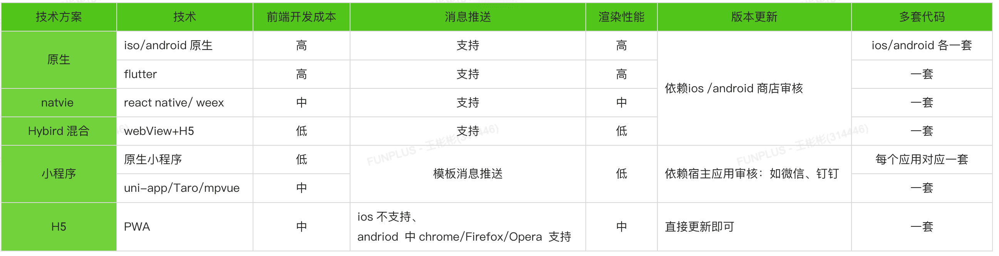

### 1.全包型

这类框架最大的特点就是从底层的渲染引擎、布局引擎，到中层的 DSL，再到上层的框架全部由自己开发，代表框架是 Qt 和 Flutter。这类框架优点非常明显：性能（的上限）高；各平台渲染结果一致。缺点也非常明显：需要完全重新学习 DSL（**[QML](https://doc.qt.io/qt-5/qtqml-index.html)/[Dart](https://dart.dev/)**），以及难以适配中国特色的端：小程序。

> 这类框架是最原始也是最纯正的的多端开发框架，由于底层到上层每个环节都掌握在自己手里，也能最大可能地去保证开发和跨端体验一致。但它们的框架研发成本巨大，渲染引擎、布局引擎、DSL、上层框架每个部分都需要大量人力开发维护。

#### [1.Qt](https://www.qt.io/zh-cn/)

#### [2.Flutter](https://flutter.dev/)

[Architectural layers](https://docs.flutter.dev/resources/architectural-overview)

### 2.Web技术型

这类框架把 Web 技术（JavaScript，CSS）带到移动开发中，自研布局引擎处理 CSS，使用 JavaScript 写业务逻辑，使用流行的前端框架作为 DSL，各端分别使用各自的原生组件渲染。代表框架是 React Native 和 Weex，这样做的优点有：

- 开发迅速；
- 复用前端生态；
- 易于学习上手，不管前端后端移动端，多多少少都会一点 JS、CSS。

缺点有：

- 交互复杂时难以写出高性能的代码，这类框架的设计就必然导致 JS 和 Native 之间需要通信，类似于手势操作这样频繁地触发通信就很可能使得 UI 无法在 16ms 内及时绘制。React Native 有一些声明式的组件可以避免这个问题，但声明式的写法很难满足复杂交互的需求。

- 由于没有渲染引擎，使用各端的原生组件渲染，相同代码渲染的一致性没有第一种高。

#### [1.React Native](https://reactnative.dev/) 

[Architecture](https://reactnative.dev/architecture/overview) 

A framework for building native applications using React。

#### [2.weex](https://github.com/alibaba/weex)

A framework for building Mobile cross-platform UI。

### 3.JavaScript 编译型

Taro、WePY 、uni-app 、 mpvue 、 chameleon、kbone它们的原理也都大同小异：先以 JavaScript 作为基础选定一个 DSL 框架，以这个 DSL 框架为标准在各端分别编译为不同的代码，各端分别有一个运行时框架或兼容组件库保证代码正确运行。

#### [1.uni-app](https://uniapp.dcloud.io/)

`uni-app` 是一个使用 [Vue.js (opens new window)](https://vuejs.org/)开发所有前端应用的框架，开发者编写一套代码，可发布到iOS、Android、Web（响应式）、以及各种小程序（微信/支付宝/百度/头条/飞书/QQ/快手/钉钉/淘宝）、快应用等多个平台。

#### [2.Taro](https://github.com/NervJS/taro)

开放式跨端跨框架解决方案，支持使用 React/Vue/Nerv 等框架来开发微信/京东/百度/支付宝/字节跳动/ QQ 小程序/H5/React Native 等应用。

#### [3.mpvue](https://github.com/Meituan-Dianping/mpvue)

[1]: https://www.infoq.cn/article/abc26cpsx44ycgt*hlzb
[2]: https://juejin.cn/post/6860421355767087118
[3]: https://zhuanlan.zhihu.com/p/569908070	"跨端架构的技术选型 2022"

