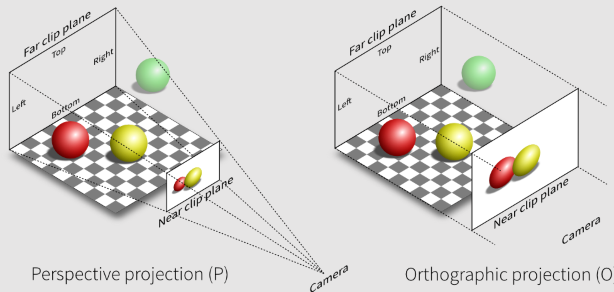

### 1.camera

#### 1.OrthographicCamera

OrthographicCamera 是一个 Three.js 中的相机类型，它可以用于创建正交投影的渲染效果。与透视投影不同，正交投影不考虑物体距离相机的远近，所有物体在屏幕上都是等比例的，不会产生透视变形。因此，OrthographicCamera 主要用于制作 2D 游戏和 UI 界面等效果。它的工作原理是将场景中的物体按照正交投影的方式投射到屏幕上，产生等比例的渲染效果。

#### 2.PerspectiveCamera

PerspectiveCamera 是 Three.js 中的一种相机类型，它可以用于创建透视投影的渲染效果。透视投影是一种模拟真实世界的投影方式，物体距离相机越远，它在屏幕上的大小就越小，产生了透视变形的效果。因此，PerspectiveCamera 主要用于制作 3D 游戏和场景等效果。它的工作原理是将场景中的物体按照透视投影的方式投射到屏幕上，产生逼真的 3D 渲染效果。

> 1.我直接添加两个相机，跟我组合两个相机去添加有什么区别呢
>
> 直接添加两个相机和将两个相机组合起来添加到一个 Group 中的区别在于，组合后可以方便地控制两个相机的位置、旋转和缩放，而不需要分别控制每个相机。此外，组合后可以将相机组合看作一个整体，方便在场景中移动、旋转或缩放整个相机组合。
>
> 另外，组合后的相机可以方便地实现 VR 或 AR 应用程序中的立体视觉效果和平面视觉效果的混合效果，而直接添加两个相机则需要手动控制两个相机的渲染顺序，可能会比较复杂。
>
> 总之，将两个相机组合起来添加到一个 Group 中，可以更方便地控制和使用两个相机，也更方便地实现一些复杂的效果。
>
> 2.`cameraOrtho.rotation.y = Math.PI;`
>
> 将 OrthographicCamera 实例的朝向沿 y 轴旋转 180 度，即使其朝向与默认朝向相反。默认情况下，OrthographicCamera 的朝向是沿着 z 轴负方向，但有时需要将其朝向反过来，例如在渲染 2D 地图时，需要将相机的朝向调整为沿着 z 轴正方向，从而使地图的正面朝向与屏幕上方向一致。
>
> 其中，cameraOrtho 是 OrthographicCamera 的实例，将其朝向沿 y 轴旋转 180 度后，其朝向就与默认朝向相反了，即沿着 z 轴正方向。这样就可以在渲染 2D 地图时得到正确的效果。

[1]: https://zhuanlan.zhihu.com/p/410548236	"正交/透视投影-从模型顶点到屏幕的变换"

