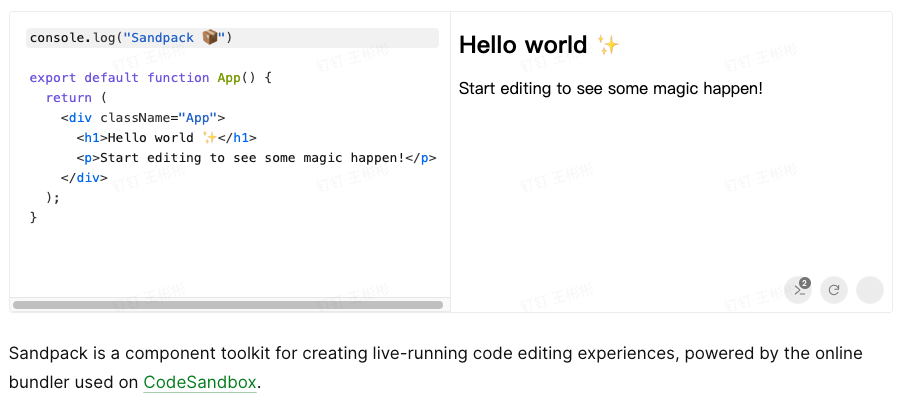

### [1.SandPack](https://sandpack.codesandbox.io/docs)

Run any JavaScript and Node.js app in any browser.

> 物料的定制：就可以借鉴 `json-editor` 库

[1]: https://thinkmore.xyz/DSL%E3%80%81%E8%A7%A3%E6%9E%90%E5%99%A8%E3%80%81%E5%8F%AF%E8%A7%86%E5%8C%96%E7%BC%96%E8%BE%91%E5%99%A8	" 物料管理"
[2]: https://thinkmore.xyz/DSL%E3%80%81%E8%A7%A3%E6%9E%90%E5%99%A8%E3%80%81%E5%8F%AF%E8%A7%86%E5%8C%96%E7%BC%96%E8%BE%91%E5%99%A8	"DSL、解析器、可视化编辑器"
[3]: https://github.com/jdorn/json-editor	"json-editor"
[4]: https://github.com/jquense/yup

