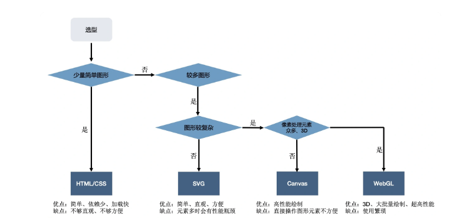

### 1.web开发中动画效果的实现方法

#### 1.animation+keyframes 、transition  

#### 2.canvas、2D、

#### 3.3D webgl 、webGPU

#### 4.setInterval()、requestAnimationFrame

#### 5.svg

#### 6.GIF

#### 7.序列帧

#### 8.web API animation //  兼容性不好

```css
const element = document.getElementById('some-element-you-want-to-animate');
let start;

function step(timestamp) {
  if (start === undefined)
    start = timestamp;
  const elapsed = timestamp - start;

  //这里使用`Math.min()`确保元素刚好停在200px的位置。
  element.style.transform = 'translateX(' + Math.min(0.1 * elapsed, 200) + 'px)';

  if (elapsed < 2000) { // 在两秒后停止动画
    window.requestAnimationFrame(step);
  }
}

window.requestAnimationFrame(step);
```



### 2.层次结构数据 （Hierarchy Data）

[d3-hierarchy](https://github.com/d3/d3-hierarchy)

2D layout algorithms for visualizing hierarchical data.