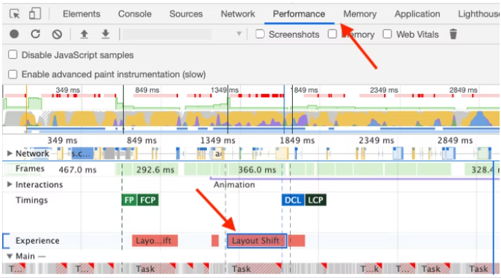
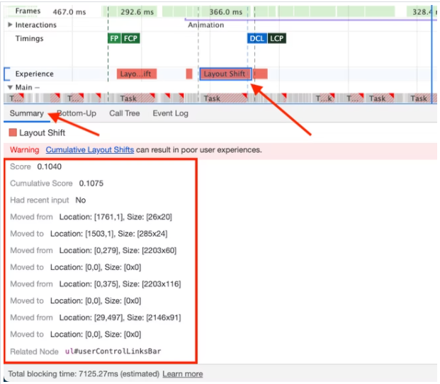

### 1.Layout shfit

#### 1.What is CLS？

The Cumulative Layout Shift (CLS) metric 累计布局偏移

CLS is a measure of the largest burst of *layout shift scores* for every [unexpected](https://web.dev/cls/#expected-vs.-unexpected-layout-shifts) layout shift that occurs during the entire lifespan of a page.

#### 2.How to measure CLS 

### Field tools

- [Chrome User Experience Report](https://developers.google.com/web/tools/chrome-user-experience-report)
- [PageSpeed Insights](https://developers.google.com/speed/pagespeed/insights/)
- [Search Console (Core Web Vitals report)](https://support.google.com/webmasters/answer/9205520)
- [`web-vitals` JavaScript library](https://github.com/GoogleChrome/web-vitals)

### Lab tools

- [Chrome DevTools](https://developers.google.com/web/tools/chrome-devtools/)
- [Lighthouse](https://developers.google.com/web/tools/lighthouse/)
- [WebPageTest](https://webpagetest.org/)

##### 1.Layout Instability API

`PerformanceObserver`

```javascript
let cls = 0;
new PerformanceObserver((entryList) => {
  for (const entry of entryList.getEntries()) {
    if (!entry.hadRecentInput) {
      cls += entry.value;
      console.log('Current CLS value:', cls, entry);
    }
  }
}).observe({type: 'layout-shift', buffered: true});
```

nformation about layout shifts is reported using a combination of two APIs: the [`LayoutShift`](https://wicg.github.io/layout-instability/#layoutshift) and [`LayoutShiftAttribution`](https://wicg.github.io/layout-instability/#sec-layout-shift-attribution) interfaces.

##### 2.DevTools





> 高亮layout shift 区域 
>
> 快速方便发现页面中的layout shift
>
> To enable Layout Shift Regions in DevTools, go to **Settings > More Tools > Rendering > Layout Shift Regions** then refresh the page that you wish to debug.

#### 3.How to improve CLS


CSS [`transform`](https://developer.mozilla.org/docs/Web/CSS/transform) property allows you to animate elements without triggering layout shifts:

- Instead of changing the `height` and `width` properties, use `transform: scale()`.

- To move elements around, avoid changing the `top`, `right`, `bottom`, or `left` properties and use `transform: translate()` instead.

  

[1]: https://web.dev/cls/	"Cumulative Layout Shift 累计布局偏移 CLS"
[2]: https://web.dev/debug-layout-shifts/	"debug-layout-shifts"


