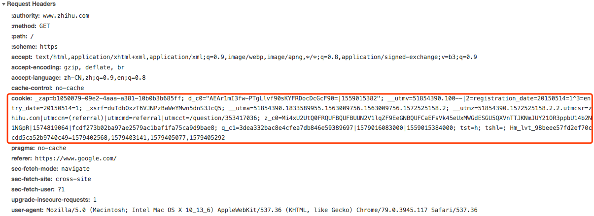
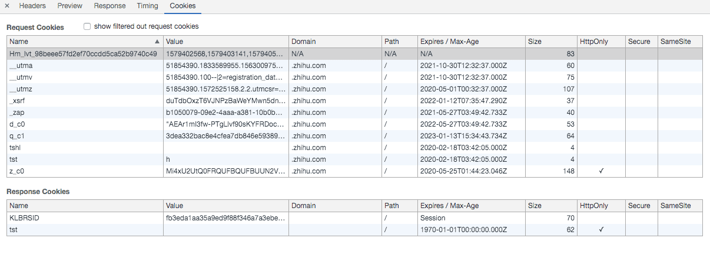

### 一、HTTP cookie

#### 1.定义

HTTP Cookie是服务器发送到用户浏览器并保存在本地的一小块数据。

#### 2.结构

1. Name
2. Value
3. 0或多个属性（name/value  键值对形式）

#### 3.属性

1. ##### **expires**  

   过期时间, 格式 `Wdy, DD-Mon-YYYY HH:MM:SS GMT`

   ```http
   Set-Cookie: name=Nicholas; expires=Sat, 02 May 2009 23:38:25 GMT
   ```

   > 没有设置 `expires` 选项时，cookie 的生命周期仅限于当前会话中，浏览器关闭自动删除

   

2. **domain**

   指定了 cookie 将要被发送至哪个或哪些域中

   ```http
   Set-Cookie: name=Nicholas; domain=nczonline.net
   ```

   > 1. 默认情况下，`domain`会被设置为创建该 cookie 的页面所在的域名
   >
   > 2. **`domain` 选项的值必须是发送 `Set-Cookie` 消息头的主机名的一部分**，例如我不能在 google.com 上设置一个 cookie，因为这会产生安全问题。不合法的 `domain` 选择将直接被忽略。
   > 3. 像 Yahoo! 这种大型网站，都会有许多 name.yahoo.com 形式的站点（例如：my.yahoo.com, finance.yahoo.com 等等）。将一个 cookie 的 `domain` 选项设置为 `yahoo.com`，就可以将该 cookie 的值发送至所有这些站点。浏览器会把 `domain` 的值与请求的域名做一个尾部比较（即从字符串的尾部开始比较），并将匹配的 cookie 发送至服务器。

   

3. **path**

   `path`选项指定了请求的资源 URL 中必须存在指定的路径时，才会发送`Cookie` 消息头

   ```http
   Set-Cookie:name=Nicholas;path=/blog
   ```

   > 1. `path` 属性的默认值是发送 `Set-Cookie` 消息头所对应的 URL 中的 `path` 部分。
   > 2. `path` 选项值会与 `/blog`，`/blogrool` 等等相匹配；任何以 `/blog` 开头的选项都是合法的。
   > 3. 需要注意的是，只有在 `domain` 选项核实完毕之后才会对 `path` 属性进行比较

4. **secure**

   只有当一个请求通过 SSL 或 HTTPS 创建时，包含 `secure` 选项的 cookie 才能被发送至服务器

   ```http
   Set-Cookie: name=Nicholas; secure
   ```

   > 1. 默认情况下，在 HTTPS 链接上传输的 cookie 都会被自动添加上 `secure` 选项。

5. **HttpOnly**

   告之浏览器该 cookie 绝不能通过 JavaScript 的 `document.cookie` 属性访

   ```http
   Set-Cookie: name=Nicholas; HttpOnly
   ```

   > 1. 设计该特征意在提供一个安全措施来帮助阻止通过 JavaScript 发起的**跨站脚本攻击 (Cross-site scripting XSS)** 窃取 cookie 的行为

6. **SameSite**

   2016年，谷歌浏览器第51版引入了一种新的Cookie，即“same site”，该Cookie只能在源于与目标域相同来源的请求中发送。

   ```
   Set-Cookie: name=Nicholas; SameSite=Strict | Lax
   ```

   > 限制缓解 **跨站请求伪造（ cross-site request forgery XSRF )** 攻击

   

#### 4.用法

1. **服务器端创建cookie**

   ```http
   Set-Cookie: value[; expires=date][; domain=domain][; path=path][; secure][; HttpOnly]
   ```

   > 1. 最常用的使用方式是按照 `name=value` 格式来指定 cookie 的值（大多数接口只支持该格式）。
   >
   > 2. 当存在一个 cookie，并允许设置可选项，该 cookie 的值会在随后的每次请求中被发送至服务器，cookie 的值被存储在名为 Cookie 的 HTTP 消息头中，并且只包含了 cookie 的值，**忽略全部设置选项;**
   > 3. **创建多个cookie 设置多次 `Set-Cookie` 即可**

   实例：

   

   

   

2. **Javascrpt 中的cookie**

   在 JavaScript 中通过 `document.cookie` 属性，你可以创建、维护和删除 cookie。

   创建 cookie 时该属性等同于 `Set-Cookie` 消息头，而在读取 cookie 时则等同于 `Cookie` 消息头。

   ```javascript
   document.cookie="name=Nicholas;domain=nczonline.net;path=/";
   ```

   > 设置 `document.cookie` 属性的值并不会删除存储在页面中的所有 cookie。它只简单的创建或修改字符串中指定的 cookie。下次发送一个请求到服务器时，通过 `document.cookie` 设置的 cookie 会和其它通过 `Set-Cookie` 消息头设置的 cookie 一并发送至服务器。
   >
   > 要使用 JavaScript 提取 cookie 的值，只需要从 `document.cookie` 中读取即可。
   >
   > 一旦 cookie 通过 JavaScript 设置后便不能提取它的选项，所以你将不能知道 `domain`，`path`，`expires` 日期或 `secure` 标记。

#### 5.cookie的维护与生命周期

1. cookie 中可以指定**任意数量的选项**，并且这些选项可以是**任意顺序**

   ```http
   Set-Cookie:name=Nicholas; domain=nczonline.net; path=/blog
   ```

2. 要想改变 cookie 的值，需要发送另一个**具有相同 cookie `name`，`domain`，`path` 的 `Set-Cookie` 消息头**

   **修改 cookie 选项的任意一项都将创建一个完全不同的新 cookie**

3. 在这个消息头中存在了两个名为 “name” 的 cookie，`path` 值越详细则 cookie 越靠前。 **按照 `domain-path-secure` 的顺序，设置越详细的 cookie 在字符串中越靠前**

   ```http
   Set-Cookie: name=Greg; domain=nczonline.net; path=/blog
   Set-Cookie: name=Nicholas; domain=nczonline.net; path=/
   ```

   假设我在 `ww.nczonline.net/blog` 下用默认选项创建了另一个 cookie：

   ```http
   Set-Cookie: name=Mike
   ```

   以 “Mike” 作为值的 cookie 使用了域名（`www.nczonline.net`）作为其 `domain` 值并且以全路径（`/blog`）作为其 `path` 值，则它较其它两个 cookie 更加详细。

4. **使用失效日期**

   当 cookie 创建时指定了失效日期，这个失效日期则关联了以 `name-domain-path-secure` 为标识的 cookie。

   ```http
   Set-Cookie:name=Mike;expires=Sat,03 May 2025 17:44:22 GMT
   ```

   修改name

   ```http
   Set-Cookie:name=Matt
   ```

   > 1. cookie 的失效日期并没有改变，因为 cookie 的标识符是相同的。实际上，只有你手工的改变 cookie 的失效日期，否则其失效日期不会改变
   > 2. 这意味着在同一个会话中，一个会话 cookie 可以变成一个持久化 cookie（一个可以在多个会话中存在的），反之则不可。
   > 3. 为了要将一个持久化 cookie 变为一个会话 cookie，你必须删除这个持久化 cookie，这只要设置它的失效日期为过去某个时间之后再创建一个同名的会话 cookie 就可以实现。

#### 6.cookie自动删除、限制条件

1. **cookie 自动删除**

   1. 会话 cooke (Session cookie) 在会话结束时（浏览器关闭）会被删除
   2. 持久化 cookie（Persistent cookie）在到达失效日期时会被删除
   3. 如果浏览器中的 cookie 数量达到限制，那么 cookie 会被删除以为新建的 cookie 创建空间。

2. **cookie限制条件**

   1. 不同浏览器对每个域名下cookie限制

      > Safari 和 Chrome 对与每个域名下的 cookie 个数没有限制

   2. 发向服务器的所有 cookie 的最大数量（空间）仍旧维持原始规范中所指出的：4KB

#### 7.cookie编码

原始规范中明确指出只有三个字符必须进行编码：**分号、逗号和空格**，规范中还提到可以进行 URL 编码，但并不是必须，在 RFC 中没有提及任何编码。

> 然而，几乎所有的实现都对 cookie 的值进行了一系列的 URL 编码。对于 `name=value` 格式，通常会对 `name` 和 `value` 分别进行编码，而不对等号 `=` 进行编码操作。

#### 8.cookie 种类

1. **session cookie**

   cookie 不设置 **expires** 属性即为 session cookie, 浏览器关闭时，浏览器自动删除session cookie

   > 别名：内存cookie(*n-memory cookie*)、瞬态cookie(*transient cookie* )、非持久cookie(*non-persistent cookie*)

2. **持久cookie （persistent cookie）**

   设置过期时间 expires 的 cookie

3. **安全cookie （secure cookie ）**

   设置secure 的cookie，安全cookie 只能通过加密连接https进行传输

4. **Http-Only cookie**

    设置 HttpOnly 的cookie，防止**跨站脚本攻击 (Cross-site scripting XSS)**

5. **同站点 cookie （Same-site cookie）**

   设置 Same-site 的cookie ，防止缓解**跨站请求伪造（ cross-site request forgery XSRF )**

6. **第三方cookie （Third-party cookie）**

   通常，cookie的域属性与Web浏览器的地址栏中显示的域匹配，称为第一方Cookie。但是，第三方Cookie属于与地址栏中显示的域不同的域。

   > 例如，假设用户访问了www.example.org。该网站包含来自ad.foxytracking.com的广告，该广告在下载后会设置属于该广告域（ad.foxytracking.com）的cookie。然后，用户访问另一个网站www.foo.com，该网站还包含来自ad.foxytracking.com的广告，并设置属于该域的cookie（ad.foxytracking.com）。最终，这两个Cookie都将在加载广告或访问其网站时发送给广告客户。然后，广告商可以使用这些cookie来建立用户在所有拥有该广告商广告的网站上的浏览历史记录。

7. **超级cookie （Supercookie）**

   超级Cookie是起源于顶级域（例如.com）或公共后缀（例如.co.uk）的cookie。

8. **僵尸cookie （zombie cookie）** 

   僵尸cookie是在删除后自动重新创建的cookie。

   > 这是通过将cookie的内容存储在多个位置（例如Flash Local共享对象，HTML5 Web存储以及其他客户端甚至服务器端位置）来实现的。 当检测到缺少cookie时，将使用存储在这些位置的数据重新创建cookie。

#### 9.应用场景

1. 会话状态管理（如用户登录状态、购物车、游戏分数或其它需要记录的信息）
2. 个性化设置（如用户自定义设置、主题等）
3. 浏览器行为跟踪（如跟踪分析用户行为等）

#### 10.缺点

1. cookie 可能获取不到；如：cookie被禁用、cookie被用户删除、不同浏览器的cookie 无法共享
2. cookie 安全性不高，如果cookie 没有设置httpOnly 属性，则很容易被人盗取
3. cookie 存储空间有限，只有4KB，并且不同浏览器对每个域名下cookie有数量限制

#### 11.***参考***

[1] https://en.wikipedia.org/wiki/HTTP_cookie

[2] https://www.kancloud.cn/kancloud/http-cookies-explained/48333

### 二、离线缓存


### 三、indexedDB


### 四、Storage

#### 1.LocalStorage 和 SessionStorage

1. 不同浏览器无法共享**localStorage**或**sessionStorage**中的信息。

2. 相同浏览器下，**同源的不同页面间**可以共享相同的 **localStorage**，

   不同页面或标签页间无法共享sessionStorage的信息，同标签页下同源iframe 可共享sessionStorage

3. **localStorage** 数据永久保存、clear()清空

   **sessionStorage** 窗口或标签页关闭数据被清空

#### 2.storage 事件

- storage 触发条件
  - 同一浏览器同源a、b两个页面
  - a注册storage 事件，b页面修改localStorage或sessionStorage 时触发
- `window.addEventListener('storage')`  `window.onStorage`

