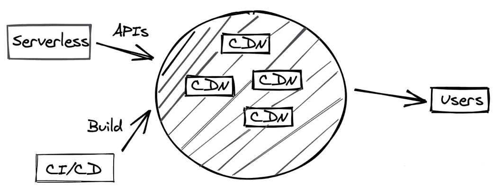

### 一、什么是 JAMStack

JAMStack（JAM 代表 JavaScript，API 和 Markup）是一种使用 [Static Site Generators](https://link.zhihu.com/?target=https%3A//www.staticgen.com/) (SSG) 技术、不依赖 Web Server 的前端架构。

它的核心是：不依赖 Web Server。

这看起来和把一个静态网站部署到文件服务器没什么区别。我理解，JAMStack = 现代 SSG 框架 + DevOps + Serverless，是一种「究极」的前后端分离。

> Nuxt.js、Next.js等

### 二、**JAMStack**的好处

#### 1.高性能

由于网页是静态生成的，没有额外的网络数据请求，它的 [Time to first byte](https://link.zhihu.com/?target=https%3A//en.wikipedia.org/wiki/Time_to_first_byte) (TTFB)性能是最佳的（因为不涉及后端、数据库等等）

#### 2.**易部署**

因为 JAMStack 不依赖 Web Server，部署就仅仅是把生成的网页放到 [CDN](https://link.zhihu.com/?target=https%3A//en.wikipedia.org/wiki/Content_delivery_network) 就可以了。

#### 3.**强安全**

同样因为不依赖 Web Server 的原因，就导致 JAMStack 网站的攻击面很小

#### 4.**易开发**

JAMStack 由于其特性，开发也极其简单，不强依赖后端，开发、测试仅仅是部署到一个静态文件服务器即可。现在「三大框架」都有相应的 SSG 方案，学习成本不高

对比 Client Side Rendering（CSR），SSG 的 TTFB 有明显的优势；同时由于提前渲染，SEO 也更友好。

对比 Server Side Rendering（SSR），SSG 部署简单，直接放到 CDN 即可，不依赖 Node Server 动态渲染。TTFB 也优于 SSR。