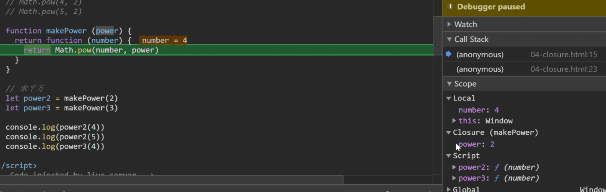
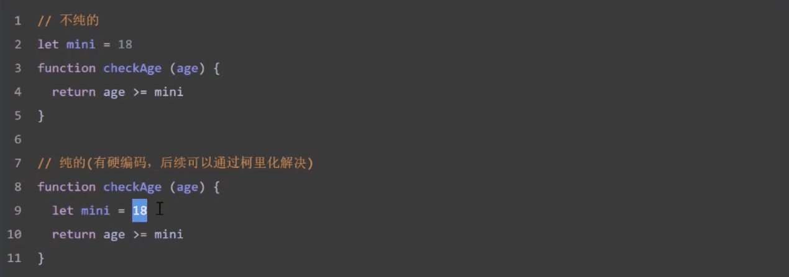

### 函数式编程 Functional Programming, FP

#### 1.什么是函数式编程：

函数式编程关心数据的映射，命令式编程关心解决问题的步骤
这里的映射就是数学上「函数」的概念——一种东西和另一种东西之间的对应关系。
面向函数编程

FP 是一种编程范式之一，其它编程范式还有*面向过程编程*、*面向对象编程*

- 面向对象编程的思维方式：把现实中的事物抽象程程序世界中的类和对象，通过封装、继承和多态来演示事物事件的联系

- 函数式编程的思维方式：把现实世界的事物和事物之间的联系抽象到程序世界（对运算过程进行抽象）
  - 程序的本质：根据输入通过某种运算获得相应的输出
  - 函数式编程中的函数指的不是程序中的函数（方法），而是数学中的函数即映射关系，例如`y=sin(x)` ,x和y的关系
  - 相同的输入始终要得到相同的输入（纯函数）
  - 函数式编程用来描述数据（函数）之间的映射

>函数编程(简称FP)不只代指Haskell Scala等之类的语言，还表示一种编程思维，软件思考方式，也称面向函数编程。 ***编程的本质是组合，组合的本质是范畴Category，而范畴是函数的组合。***
>
>　　首先，什么是函数式编程，这并没有唯一定义，它只是广泛聚合了一些编程风格的特性，我们可以将它与面向对象编程OOP进行对比， 两者区别是，OOP主要聚焦于数据的区别，而FP则注重数据结构的一致性。OOP最大优点是多态性和封装；而FP优势是不变性及其声明性风格，两者其实是正交，可互补的，可在同一程序中共存。
>
>面向对象：
>
>1. 数据和对数据的操作紧紧耦合
>2. .对象隐藏它们操作的实现细节，其他对象调用这些操作只需要通过接口。
>3. .核心抽象模型是数据自己
>4. 核心活动是组合新对象和拓展已经存在的对象，这是通过加入新的方法实现的。
>
>函数编程：
>
>1. 数据与函数是松耦合的
>2. 函数隐藏了它们的实现，语言的抽象是函数，以及将函数组合起来表达。
>3. 核心抽象模型是函数，不是数据结构
>4. 核心活动是编写新的函数。
>5. 变量缺省是不变的，减少可变性变量的使用，并发性好
>
>
>
>实际上纯粹的OOP和纯粹的FP都是极端的，对于OOP来讲：存在的并一定都是对象，函数就不是对象；对于FP来说：存在的并不总是纯粹的，副作用总是真实存在。总之，***面向对象侧重于分解，函数编程侧重于组合。***
>
>范畴：
>
>范畴是指把事物作归类整理所依据的共同性质，就是说：范畴是事物种类的本质。因为一个种类的本质往往由多个性质所构成，而本质与构成它的各个性质之间又总是以一定的结构方式互相联系着的，这个方式就是合{正/反}。所以也可以把范畴定义为：规范与筹划事物所依据的合{正/反}性质结构。

#### 2.函数是一等公民

- 函数可以存储在变量中
- 函数作为参数
- 函数作为返回值

#### 3.高阶函数-函数作为参数  Higher-order function

- 可以把函数作为参数传递给另一个函数
- 可以把函数作为另一个函数的返回结果

```javascript
// forEach 函数
// filter 函数
```

#### 4.高阶函数-函数作为返回值

```javascript
//once 函数
//缓存函数

 function once(fn){
   let flag = true
   return function(...args){
     if (flag) fn.apply(this,args)
     flag = false
   }
 }
```

#### 5.使用高阶函数的意义

- 抽象可以帮我们屏蔽细节，只需要关注与我们的目标
- 高阶函数是用来抽象通用的问题

#### 6.常用的高阶函数

1. map、every、some、forEach、filter

#### 7.闭包-概念

闭包的本质：函数执行的时候会放到一个执行栈上当函数执行完毕之后会从执行栈上移除，但是**堆上的作用域成员因为被外部引用不能释放**，因此内部函数依然可以访问外部函数的成员

#### 8.闭包-案例

Var 声明的变量会挂到Global 全局作用域下，

let 声明的变量会挂载到Script 域下



```javascript
//案例一
function makePower(power){
	return function(number){
		return Math.pow(number, power)
	}
}
let power2 = makePower(2)
let power3 = makePower(3)
console.log(power2(4))
console.log(power2(5))
console.log(power3(4))

// 案例二

```

#### 9.纯函数

纯函数：相同的输入永远会得到相同的输出

数组的slice 、 splice 。slice是纯函数，splice是不纯函数，因为splice 会修改原数组

- 函数式编程不会保留中间计算的结果，所以变量是不可变的（无状态的）

- 我们可以把一个函数的执行结果交给另一个函数处理

#### 10.Loadsh

#### 11.纯函数的好处

1. 可缓存
2. 可测试
   - 出函数让测试更方便
3. 并行处理
   - 在多线程环境下并行操作共享的内存数据很可能会出现意外情况
   - 出函数不需要访问共享的内存数据，所以在并行环境下可以任意运行纯函数（Web Worker）

>  副作用会让一个函数变的不纯，副作用不可能避免，因为代码难免会依赖外部的配置文件、数据库等，只能最大程序上控制副作用在可控的范围内发生

#### 12.副作用

1. 出函数：对于相同的输入永远会得到相同的输出，而且没有任何可观察的副作用

   

   副作用让一个函数编的不纯（如上例），纯函数的根据相同的输入返回相同的输出，如果函数依赖于外部的状态就无法保证输出相同，就会带来副作用

2. 副作用来源：

   - 配置文件
   - 数据库
   - 获取用户的输入
   - ....

   所有的外部交互都有可能带来副作用，副作用也使得方法通用性下降不适合扩展和可重用性，同时副作用会带来程序中带来安全隐患给程序带来不确定性，但是副作用不可能完全禁止，尽可能控制它们在可控的范围内。

#### 13.柯里化 Haskell Brooks Curry

> Haskell  纯函数式编程语言

- 使用柯里化解决上一个案例中硬编码的问题	
- 柯里化 Currying
  - 当一个函数有多个参数的时候先传递一部分参数调用它 （这部分参数以后永远不变）
  - 然后返回一个新的函数接受剩余的参数，返回结果

#### 14.Loash 中的柯里化方法

#### 15.柯里化案例

#### 16.柯里化原理模拟

```javascript
let add = function(a,b,c){
  return a+b+c
}
function curry(fn) {
  return function curriedFn(...args){
    if(args.length < fn.length){
      return function () {
        return curriedFn(...args.concat(Array.from(arguments)))
      }
    }else{
      return fn.call(this,...args)
    }
  }
}
let addCurry = curry(add)
console.log(addCurry(1,2,3))
console.log(addCurry(1)(2)(3))
console.log(addCurry(1,2)(3))
```


#### 17.柯里化总结

- 柯里化可以让我们给一个函数传递较少的参数得到一个已经记住了某些固定参数的新函数
- 这是一种对函数参数的’缓存‘
- 让函数变的更灵活，让函数的粒度更小
- 可以把多元函数转换成一元函数，可以组合使用函数产生强大的功能

#### 18.函数的组合 compose

- 纯函数与柯里化很容易写成洋葱代码h(g(f(x)))，函数组合可以让我们细粒度的函数重新合成一个新的函数 
- 函数组合 compose： 如果一个函数要经过多个函数处理才能得到最终值，这个时候可以把中间过程的函数合并成一个函数
  - 函数就像是数据的管道，函数组合就是把这些管道连接起来，让数据穿过多个管道行程最终结果
  - 函数组合默认是从右往左执行

#### 19.lodash中的函数组合

#### 20.组合函数原理模拟

- Array.reduce、Array.reverse、Array.from

#### 21.函数组合-结合律、调试

#### 22.lodash-fp模块

#### 23.lodash-map 方法

#### 24.Pointfree

- Point Free：我们可以把数据处理的过程定义成与数据无关的合成运算，不需要用到代表数据的那个参数，只要把简单的运算步骤合成到一起，在使用这种模式之前我们需要定义一些辅助的基本运算函数
  - 不需要指明处理的数据
  - 只需要合成运算过程
  - 需要定义一些辅助的基本运算函数 

#### 25.Pointfree-案例

#### 26.Functor 函子

- 为什么学函子
  
  - 函数式编程中把副作用控制在可控的范围内、异常处理、异步处理
  
- 什么是Functor
  - 容器：包含值与值得变形关系（这个变形关系就是函数）
  - 函子：是一个特殊的容器，通过一个普通的对象来实现，该对象具有map方法，map 方法可以运行一个函数对值进行处理（变形关系）
  
- 函子 感觉就是 类似 linux 管道 | 的东西

  ```javascript
  class Container{
    static of(x){
      return new Container(x)
    }
    constructor(x){
      this._value = x
    }
    map(fn){
      return new Container(fn(this._value))
    }
  }
  ```

  

#### 27.Functor 函子总结

- 总结
  - 函数式编程的运算不直接操作值，而是由函子完成
  - 函子就是一个实现map契约的对象
  - 可以把函子想象成一个盒子，这个盒子里封装了一个值
  - 想要处理盒子中的值，我们需要给盒子的map 方法传递一个处理值得函数（纯函数），由这个函数来对值进行处理
  - 最终map 返回一个包含新值得盒子

#### 28.MayBe 函子

判断输入是否为null、undefined 及判断错误的函子

```javascript
class Maybe{  
  static of (x){
    return new Maybe(x)
  }
  constructor(x){

    this._value = x
  }
  map(fn){
    return this._value !== null && this._value !== undefined ?  Maybe.of(fn(this._value)) :  Maybe.of(this._value)
  }
}

class Maybe {
  static of(x) {
    return new Maybe(x)
  }
  constructor(x) {

    this._value = x
  }
  map(fn) {
    return this.isNothing ? Maybe.of(this._value) : Maybe.of(fn(this._value)) 
  }
  isNothing(){
    return this._value === null || this._value === undefined
  }
}

// let r = Maybe.of(undefined)
//   .map(x => x.toUpperCase())
//   .map(x=> x*x)

// console.log(r)
```


#### 29.Either 函子

条件判断函子

```javascript
class Either{
  static of(left,right){
    return new Either(left, right)
  }
  constructor(left, right){
    this._value = right ? right : left;
  }
  map(fn){
    return Either.of(fn(this._value))
  }
}


class Either {
  static of(left, right) {
    return new Either(left, right)
  }
  constructor(left, right) {
    this.left = left;
    this.right = right;
  }
  map(fn) {
    return this.right ?  Either.of(this.left,fn(this.right)) : Either.of(fn(this.left),this.right)
  }
}

class Left{
  static of(x){
    return new Left(x)
  }
  constructor(x){
    this._value = x
  }
  map(fn){
    return this
  }
}

class Right {
  static of(x) {
    return new Right(x)
  }
  constructor(x) {
    this._value = x
  }
  map(fn) {
    return Right.of(fn(this._value))
  }
}


console.log(Either.of(5, 6).map(x => x + 1)); // Either { __value: null, left: 5, right: 7 }
console.log(Either.of(5, null).map(x => x + 1)); // Either { __value: null, left: 5, right: 7 }

let r1 = Right.of(12).map(x => x + 2)
let r2 = Left.of(12).map(x => x + 2)

console.log(r1)
console.log(r2)

// function parseJSON(str) {
//   try {
//     return Right.of(JSON.parse(str))
//   } catch (e) {
//     return Left.of({ error: e.message })
//   }
// }

// let r = parseJSON('{ name: zs }')
// console.log(r)

// let r = parseJSON('{ "name": "zs" }')
//   .map(x => x.name.toUpperCase())
// console.log(r)
```


#### 30.IO函子

​	惰性函子

定义：IO函子__value是一个函数，它把不纯的操作（比如IO、网络请求、DOM）包裹到一个函数内，从而延迟这个操作的执行

缺点：IO负责了调用链积累了很多很多不纯的操作，带来的复杂性和不可维护性

```javascript
class IO{
  static of(value){
    return new IO(function(){
      return value
    })
  }
  constructor(fn){
    this._value = fn
  }
  map(fn){
    return new IO(fp.flowRight(fn,this._value))
  }
}

let r = IO.of(process).map(p => p.execPath)
// console.log(r)
console.log(r._value())
```


- IO子中的_value 是一个函数，这里是把函数作为值来处理
- IO函子可以把不纯的动作存储到_value 中，延迟执行这个不纯的操作（惰性执行）,保证当前的操作纯
- 把不纯的操作交给调用者来处理

#### 31.Folktale   

- A standard library for functional programming in JavaScript

#### 31.Task函子

​	task 函子实现

#### 32.Pointed函子

- Pointed 函子是实现了of静态方法的函子
- of方法是为了避免使用new 来创建对象，更深层的含义是of方法用来把值放到上下文Context（把值放到容器中使用map 来处理值）

#### 33.IO函子问题

- Monad 单子

#### 34.Monad 函子

- 一个函子如果具有join 和 of 两个方法并遵守一些定律就是一个Monad

#### 35.总结

- 认识函数式编程
- 函数相关复习
  - 函数式一等公民
  - 高级函数
  - 闭包
- 函数式编程基础
  - lodash
  - 纯函数
  - 柯里化
  - 管道---函数组合
- 函子
  - MayBe
  - Either
  - IO
  - Task ----folktale
  - Monad

>函数式编程里面的运算，都是通过函子完成，即运算不直接针对值，而是针对这个值的容器----函子。函子本身具有对外接口（`map`方法），各种函数就是运算符，通过接口接入容器，引发容器里面的值的变形。
>
>因此，**学习函数式编程，实际上就是学习函子的各种运算。**由于可以把运算方法封装在函子里面，所以又衍生出各种不同类型的函子，有多少种运算，就有多少种函子。函数式编程就变成了运用不同的函子，解决实际问题。


