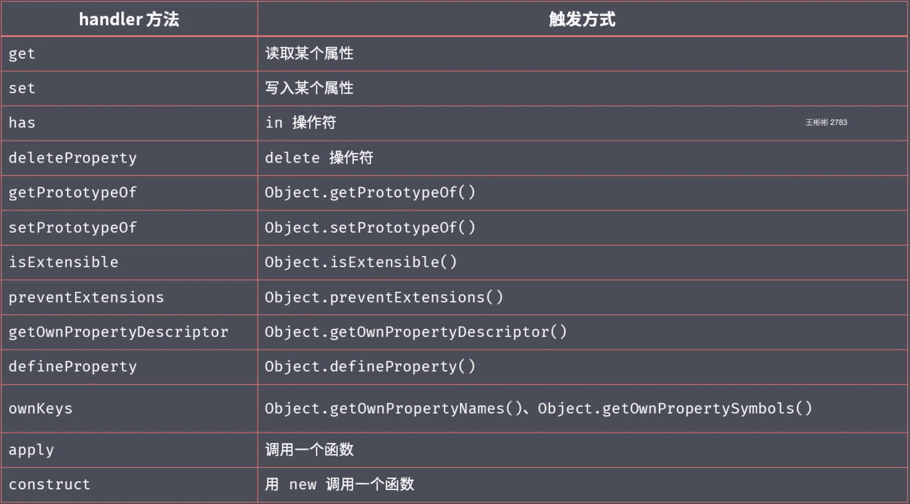

#### 1.ECMAScript概述

1. 浏览器环境javascript：ECMAScript+BOM+DOM
2. Node环境javascript：ECMAScript+Node APIs
3. 分辨资料中的ES6是特指还是泛指 
   - 泛指：ES2015开始往后的所有版本
   - 特指：ES2015
   - [ES2015标准文档](https://www.ecma-international.org/ecma-262/6.0/)
4. ES2015 分四类
   - 解决原有语法上的一些问题或者不足
   - 对原有语法进行增强
   - 全新的对象、全新的方法、全新的功能
   - 全新的数据类型和数据结构
5. Nodemon 启动node

#### 2.ES2015 let 与 块级作用域

- let 不会提升变量声明
- let 会产生块级作用域   调用栈

```javascript
//实例一
var elements = [{},{},{}]
for(let i=0; i< elements.length; i++){
  elements[i].onclick=function(){
    console.log(i)
  }
}
elements[0].onclick()

//实例二
for(let i=0; i<3; i++){
  let i = 'foo'
  console.log(i)
}
```

#### 3.ES2015 const

- `const`声明一个只读的常量。一旦声明，常量的值就不能改变。
- 基本类型、引用类型
  - JavaScript 不允许直接访问内存中的位置

```javascript
const obj = {}
obj.name = 'zce'  // 不会报错 因为obj 指向的内存地址没变
obj = {} //报错 因为obj指向的内存地址变了
```

#### 4.数组的解构

```javascript
const arr = [100,200,300]
const [,,bar] = arr
const [foo, ...rest] = arr
const [f1,b1,b2=123, more='default value']  = arr

console.log(bar)
console.log(foo)
console.log(rest)
console.log(f1, b1, b2, more)
```

#### 5.ES2015 对象的解构

```javascript
const obj = {name:'zce', age:18}
const {name } = obj
const age = 20
const {age:ageNew = 19} = obj
console.log(ageNew, age)
```

#### 6.ES2015 模板字符串

```javascript
const name = 'tom'
// const msg = `hey, ${name}`
const msg = `hey, ${1+1}`
log(msg)
```

#### 7.ES2015 带标签的模板字符串

​	处理模板字符串

```javascript
const name = 'tom'
const gender = true
function myTagFunc(strings, name , gender){
  console.log(strings)
  gender = gender ? 'man' : 'woman'
  return strings[0] + name + strings[1] + gender + strings[2]
}
const result = myTagFunc`hey, ${name} is a ${gender}.`
console.log(result)
```

#### 8.ES2015 字符串的扩展方法

- includes()
- startsWith()
- endsWith()

```javascript

const message = 'Error: foo is not defined'
console.log(
  message.startsWith('Error'),
  message.endsWith('defined'),
  message.includes('foo')
)
```

#### 9.ES2015 参数默认值

- 带有默认值的参数要放在最后面

```javascript
function foo (bar,enable=true){
  console.log('foo invoked - enable:')
  console.log(enable)
}
foo()
```

#### 10.ES2015剩余参数

- 剩余操作符要放在最后，且只可以出现一次
- 剩余参数 接受剩余的所有参数

```javascript

function foo(first,...args){
  console.log(args)
  console.log(first)
}
foo(1,2,3,4)

```

#### 11.ES2015 展开数组

```javascript
const arr = ['foo','bar','baz']
console.log(...arr)
```

#### 12.ES2015 箭头函数

```javascript
const inc = n => n +1
console.log(inc(10))
```

#### 13.ES2015 箭头函数与this

- 箭头函数不会改变this指向 ，相当于bind 方法绑定
- 箭头函数的this，一直指向当前作用域下的this

```javascript
const person  = {
  name: 'tom',
  sayHi:function(){
    console.log(`hi , my name is ${this.name}`)
  },
  sayHiAsync:function(){
    setTimeout(function(){
      console.log(this.name);
    }, 1000);
  },
  sayHiAsyncArrow: function () {
    setTimeout( () => {
      console.log(this.name);
    }, 1000);
  },
}

person.sayHi()
person.sayHiAsync()
person.sayHiAsyncArrow()
```

#### 14.ES2015 对象字面量增强

```javascript
const bar = '345'

const obj = {
  foo:123,
  bar,
  method1(){
    console.log('method 11')
    console.log(this)
  },
  [1+1]:123
}
console.log(obj)
```

#### 15.ES2015 Object.assign

- 将多个源对象中的属性复制到一个目标对象中

```javascript
 const source1 = {
  a:123,
  b:123
}
const target = {
  a: 456,
  c: 456
}
const result = Object.assign(target, source1)
console.log(target)
console.log(target === result)  // 如果两个操作数都是对象，则比较它们是不是同一个对象。如果两个操作数都指向同一个对象，则相同操作符返回true； 否则， 返回false
```

#### 16.ES2015 Object.is

```javascript
console.log(
  // 0 == false,
  // 0 === false ,
  // +0 === -0, // true
  // -1 === +1
  // NaN === NaN, // false
  Object.is(+0, -0), // false
  Object.is(NaN, NaN) //true
)
```

#### 17.ES2015 Proxy

- 代理对象

```javascript
const person = {
  name : 'zce',
  age : 20
}
const personProxy = new Proxy(person,{
  get(target, property){ // 接受两个参数
    // target 代理对象， property 访问的属性
    return property in target ? target[property] : 'default'
    // console.log(target, property)
    // return 
  },
  set(target, property, value ){
    // target 代理对象    property 写入的属性 value 属性值
    if(property === 'age'){
      if(!Number.isInteger(value)){
        throw new TypeError(`${value} is not an int` )
      }
    }
    target[property] = value 
    // console.log(target, property, value)
  }
})
personProxy.gender = true
personProxy.age = 18
console.log(personProxy.name)
console.log(personProxy.xxx)
console.log(personProxy)
```

#### 18.ES2015 Proxy 对比 defineProperty

- defineProperty 只能监视对象属性的读写 而 Proxy 能够监视到更多对象操作 如delete操作、方法调用等

  

  ```javascript
  const person = {
    name : 'zce',
    age: 20
  }
  const personProxy = new Proxy(person, {
    deleteProperty(target, property){
      console.log('delete', property)
      delete target[property]
    }
  })
  
  delete personProxy.age
  console.log(person)
  ```

  

- Proxy 更好的支持数组对象的监视

  - 重写数组的操作方法

```javascript
const list = []

const listProxy = new Proxy(list, {
  set(target, property, value){
    console.log(`set ${property} ${value}`)
    target[property] = value
    return true
  }
})

listProxy.push(100)
```

- Proxy 是以非侵入的方式监管了对象的读写

```

```

#### 19.ES2015 Reflect

- Reflect 属于静态类，不可以通过new 方式去构建 
- Reflect 内部封装了一系列对对象的底层操作
- Reflect 成员方法就是Proxy 处理对象的默认实现
- 统一提供一套用于操作对象的API

```javascript
// const obj = {
//   foo : '123',
//   bar : '456'
// }
// const proxy = new Proxy(obj,{
//   get(target, property){
//     console.log('watch logic~')
//     return Reflect.get(target, property)
//   }
// })
// console.log(proxy.foo)

const obj = {
  name:'zce',
  age: 18
}

// console.log('name' in obj)
// console.log(delete obj['age'])
// console.log(Object.keys(obj))
console.log(Reflect.has(obj, 'name'))
console.log(Reflect.deleteProperty(obj, 'age'))
console.log(Reflect.ownKeys(obj))
```

#### 20.ES2015 Promise

- 一种更优的异步编程解决方案
- 解决了传统异步编程中回调函数嵌套过深的问题

```javascript

```

#### 21.ES2015 class类

```javascript
class Person{
  constructor(name){
    this.name = name
  }
  say(){
    console.log(`hi, ${this.name}`)
  }
}
```

#### 22.ES2015 静态方法

```javascript
class Person{
  static of(name){
    return new Person(name)
  }
  constructor(name){
    this.name = name
  }
  say(){
    console.log(`hi, ${this.name}`)
  }
}
let person =  Person.of('wbb')
person.say()
```

#### 23.ES2015 类的继承

```javascript
class Student extends Person{
  constructor(name, number){
    super(name)
    this.number = number
  }
  hello(){
    super.say()
  }
}

let sd = new Student('wbb',20)
console.log(sd)
sd.hello()
```

#### 24.ES2015 Set

- 集合数据结构、成员不允许重复

```javascript
const s = new Set()

s.add(1).add(2).add(2)
console.log(s)
console.log(s.size)
console.log(s.has(100))
console.log(s.delete(2))
console.log(s)
console.log(s.clear())
console.log(s)
// 数组去重

const arr = [1,2,1,3,4,1]

// const result = Array.from(new Set(arr))
const result = [...new Set(arr)]

console.log(result)
```

#### 26.ES2015 Map

- 键值对集合，映射**任意类型**之间的数据
  - 与对象的区别，Map可以使用任意类型的数据作为key键，对象只能使用字符串作为key键

```javascript
const obj = {}
obj[true] = 'value'
obj[123] = 'value'
obj[{a:1}] = 'value'

console.log(Object.keys(obj))
// [ '123', 'true', '[object Object]' ]

const m = new Map()
const tom = {name:'tom'}
m.set(tom, 90)
console.log(m)
console.log(m.get(tom))
// m.has()
// m.delete()
// m.clear()
m.forEach((value, key)=>{
  console.log(value, key)
})
```

#### 27.ES2015 Symbol

- 一种全新的原始数据类型
- 符号 独一无二的值
- 最主要的作用就是为对象添加独一无二的属性名
- 为对象添加私有属性
- 到ES2019 一共定义了7中基础类型：`Sting` `Number` `Boolen` `Null` `Undefined` `Ojbect` `Symbol` 
  - 第八种基础类型：`bigInt` 安全存储、操作大整数

```javascript
// // a.js
// cache['foo'] = Math.random()

// // b.js

// cache['foo'] = '123'

// console.log(cache)

// const s = Symbol()
// console.log( s)
// console.log(typeof s)

// const obj = {}
// let a = Symbol()
// obj[Symbol()] = '123'
// obj[Symbol()] = '456'
// console.log(obj)

// a.js
const name = Symbol()
const person = {
  [name]:'zce',
  say(){
    console.log(this[name])
  }
}
person.say()

// b.js
// person[Symbol()] 访问不到name 属性，因为Symbol 创建的name 是独一无二的，所以不可能在b.js 中添加
```

#### 28.ES2015 Symbol 补充

- `Symbol.for` 方法接受相同值，返回结果也相同
  - `for` 方法维护的是 字符串 对应数值 的对应关系

```javascript
const s1 = Symbol.for('foo')
const s2 = Symbol.for('foo')
console.log(s1 === s2)


console.log(Symbol.for(true) === Symbol.for('true'))   
//for 方法维护的是 字符串 对应数值 的对应关系

const obj = {
  [Symbol.toStringTag]:'XObject'  // 重写toString 方法
}
console.log(obj.toString())


// 拿不到 Symbol 的值
for(var key in  obj){
  console.log(key)
}
console.log(Object.keys(obj))
console.log(JSON.stringify(obj))

//Object.getOwnPropertySymbols 能拿到Symbol 
console.log(Object.getOwnPropertySymbols(obj))  

```

#### 29.ES2015 for...of 循环

- 作为遍历所有数据结构的统一方式

```javascript
	const arr = [100, 200, 300 ,400]

// for of 能用 break 跳出循环
for(const item of arr){
  console.log(item)
  if(item > 100){
    break;
  }
}
// arr.forEach() // 不能跳出循环
// arr.some()  // 返回 ture 跳出循环
// arr.every()  //返回false 跳出循环
const s = new Set(['foo','bar'])
for(const item of s)[
  console.log(item)
]

const m = new Map()
m.set('foo','123')
m.set('bar','345')
for(const item of m){
  console.log(item)
}

for (const [key, value] of m) {
  console.log(key, value)
}


// 无法遍历普通的obj 对象，为什么呢，看下节
const obj = {foo:123, bar:456}
for(const item of obj){
  console.log(item)
}
```

#### 30.ES2015 可迭代接口

- 可迭代接口 `Iterable`  接口
- 实现`Iterable` 接口 就是 `for...of` 的前提 即能被`for...of`遍历的数据结构，其内部都实现了`Iterable`  接口

```javascript
const set = new Set(['foo','bar','baz'])

const iterator = set[Symbol.iterator]()

console.log(iterator.next())
console.log(iterator.next())
console.log(iterator.next())
console.log(iterator.next())
```

#### 31.ES2015 实现可迭代接口

```javascript
const obj = {
  store:['foo','bar','baz'],
  [Symbol.iterator]:function () {
    let index=0
    const self = this
    return {
      next:function () {

          let result =  {
            value: self.store[index],
            done: index >= self.store.length
          }
          index++
          return result
      }
    }
  }
}

for(const item of obj){
  console.log(item)
}
```

#### 32.ES2015 迭代器模式

```javascript
// 迭代器设计模式

// 场景：你我协同开发一个任务清单应用

// 我的代码*******

const todos = {
  life:['吃饭', '睡觉', '打豆豆'],
  learn:['语文', '数学', '外语'],
  work:['喝茶'],
  each:function(callback){
    const all = [].concat(this.life, this.learn, this.work)
    for(const item of all){
      callback(item)
    }
  },
  [Symbol.iterator]:function(){
    const all = [...this.life, ...this.learn, ...this.work]
    let index = 0
    return {
      next:function (){
        return {
          value:all[index],
          done:index++ >= all.length
        }
      }
    }
  }
}

// 你的代码*******


todos.each((item)=>{
  console.log(item)
})
```

#### 33.ES2015 生成器

- 惰性执行

```javascript
// function * foo(){
//   console.log('zce')
//   return 100
// }

// const result = foo()
// console.log(result.next())

function * bar(){
  console.log('1111')
  yield 100
  console.log('2222')
  yield 200
  console.log('3333')
  yield 300
}

const generator = bar()

console.log(generator.next())
```

#### 34.生成器应用

```javascript
// Generator 应用
// 案例1： 发号器
function * createIdMaker(){
  let id = 1
  while(true){
    yield id++
  }
}
const idMaker = createIdMaker()
console.log(idMaker.next().value)
console.log(idMaker.next().value)
console.log(idMaker.next().value)

// 使用generator 函数实现 iterator 方法


const todos = {
  life:['吃饭', '睡觉', '打豆豆'],
  learn:['语文', '数学', '外语'],
  work:['喝茶'],
  each:function(callback){
    const all = [].concat(this.life, this.learn, this.work)
    for(const item of all){
      callback(item)
    }
  },
  [Symbol.iterator]:function * (){
    const all = [...this.life, ...this.learn, ...this.work]
    for(const item of all){
      yield item
    }
  }
}

for(let item of todos){
  console.log(item)
}
```

#### 35.ES2015 Modules

- 语言层面的模块化标准

```javascript

```

#### 36.ES2016 概述

- Array.prototype.includes
  - indexOf 方法不能查找数组中的NaN
- 指数运算符

```javascript
// Array.prototype.includes
const arr = ['foo', 1, NaN, false]
console.log(arr.indexOf('foo'))
console.log(arr.indexOf('bar'))
console.log(arr.indexOf(NaN))  //indexOf 方法不能查找数组中的NaN
console.log(arr.includes(NaN))
// 指数运算符
console.log(Math.pow(2,10))
console.log(2 ** 10)

```

#### 37.ES2017概述

- Object.values
- Object.entries
- Object.getOwnPropertyDescriptors
- String.prototype.padStart / String.prototype.padEnd
- 在函数参数中添加尾逗号
- Async/Await

```javascript
// values entries
const obj = {
  foo:'value1',
  bar:'value2'
}

console.log(Object.values(obj))
console.log(Object.entries(obj))

for(const [key, value] of Object.entries(obj)){
  console.log(key, value)
}

console.log(new Map(Object.entries(obj)))


// Object.getOwnPropertyDescriptors
const p1 = {
  firstName:'lei',
  lastName: 'Wang',
  get fullname(){
    return this.firstName + ' ' + this.lastName
  }
}

// 不能复制p2
// const p2 = Object.assign({},p1)
// p2.firstName = 'zce'
// console.log(p2.fullname) //p2 拿到的时p1 的name

const descriptors = Object.getOwnPropertyDescriptors(p1)
console.log(descriptors)
const p2 = Object.defineProperties({}, descriptors)
p2.firstName = 'zce'
console.log(p2.fullname) //p2 拿到的时p1 的name

// String.prototype.padStart / String.prototype.padEnd
const books = {
  html:5,
  css:16,
  javascript:128
}

for (const [name, count] of Object.entries(books)){
  console.log(name,count)
}
for (const [name, count] of Object.entries(books)) {
 console.log(`${name.padEnd(16, '-')} | ${count.toString().padStart('3',0)}`)
}

// 在函数参数中添加尾逗号

function foo(
  bar,
  baz,
){

}

const arr = [100, 200, 300,]
```


