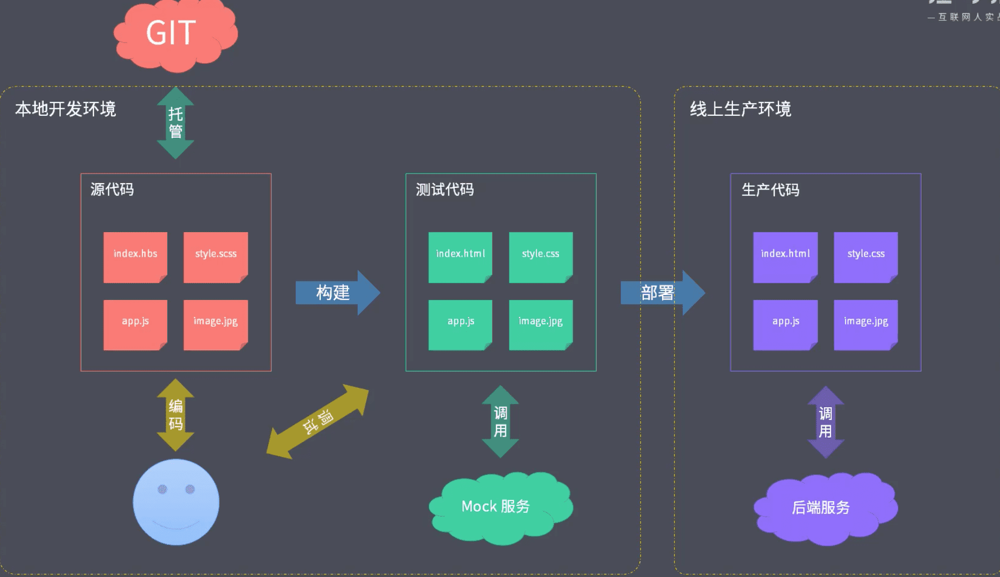

#### 1.工程化的定义和主要解决的问题

- 主要解决的问题
  - 传统语言或语法的弊端
  - 无法使用模块化/组件化
  - 重复的机械式工作
  - 代码风格统一、质量保证
  - 依赖后端服务接口支持
  - 整体依赖后端项目

#### 2.一个项目过程中工程化的表现

#### 3.工程化不等于工具

#### 4.工程化与Node.js

- 脚手架工具开发
- 自动化构建系统
- 模块化打包
- 项目代码规范化
- 自动化部署