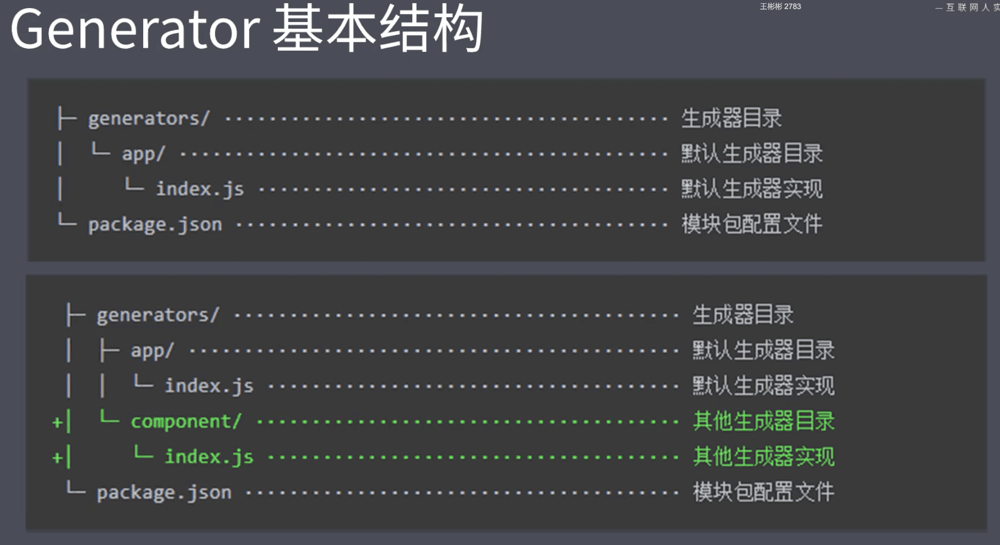

#### 1.脚手架工具概要

- 脚手架的本质作用
  - 创建项目基础结构、提供项目规范和约定
  - 相同的组织结构
  - 相同的开发范式
  - 相同的模块依赖
  - 相同的工具配置
  - 相同的基础代码
- IED创建项目的过程就是一个脚手架的工作流程
- 内容概要
  - 脚手架的作用
  - 常用的脚手架工具
  - 通用脚手架工具剖析
  - 开发一款脚手架

#### 2.常用的脚手架工具

- Yeoman
- Plop 

#### 3.Yeoman 简介

Yeoman 是一种高效、开源的 Web 应用脚手架搭建系统，意在精简开发过程。Yeoman 因其专注于提供脚手架功能而声誉鹊起，它支持使用各种不同的工具和接口协同优化项目的生成。

优点：

- 该软件还提供了一些构建应用的自动化流程。
- Yeoman 可用于开发任何类型的 Web 应用
- Yeoman 集成了多种生成器。

缺点：

- 太过于通用化
- 生成器编写耗费时间
- 更新迭代快，需要紧跟发展

> 就是自动创建项目 ，用node cli 实现也行

#### 4.Yeoman 基础使用

- `npm install -g yo `  在全局范围安装Yeoman
- `npm install --global generator-node` 安装对应的 generator 
-  `yo node` 通过 yo 运用generator
  - `generator-node` 除去 ``generator-` 的部分

#### 5.Sub Generator

- `yo node:cli` 生成Sub Generator
  - 并不是每个Generator 都提供Sub Generator，看具体Generator官方文档说明

#### 6.Yeoman 使用步骤总结

- 明确你的需求；
- 找到合适的Generator；
- 全局范围安装找到的Generator；
- 通过Yo 运行对应的Generator；
- 通过命令行交互填写选项；
- 生成你所需要的项目结构；

#### 7.自定义Generator

#### 8.创建Generator模块

- 目录结构



- 模块名称 `generator-<name>`
- `npm init`
- `npm add yeoman-generator`

```javascript
// 此文件为 Generator 的核心入口
// 需要导出一个集成自Yeoman Generator 的类型
// Yeoman Generator 在工作时会自动调用我们在此类型汇总定义的一些生命周期方法
// 我们在这些方法中可以通过调用父类提供的一些工具方法实现一些功能，
const Generator = require('yeoman-generator')

module.exports = class extends Generator {
  writing(){
     this.fs.write(
       this.destinationPath('temp.text'),
       Math.random().toString()
     )
  }
}
```


#### 9.根据模板创建文件

```javascript
// 此文件为 Generator 的核心入口
// 需要导出一个集成自Yeoman Generator 的类型
// Yeoman Generator 在工作时会自动调用我们在此类型汇总定义的一些生命周期方法
// 我们在这些方法中可以通过调用父类提供的一些工具方法实现一些功能，
const Generator = require('yeoman-generator')

module.exports = class extends Generator {
  writing(){
    const tmpl =  this.templatePath('foo.txt')
    const output = this.destinationPath('foo.txt')
    const context = {title:'hello,world', success:false}
    this.fs.copyTpl(tmpl, output, context)
  }
}
```

#### 10.接受用户输入数据

```javascript
const Generator = require('yeoman-generator')

module.exports = class extends Generator {
  prompting(){
    return this.prompt([
      {
        type:'input',
        name:'name',
        measage:'Your project name',
        default: this.appname
      }
    ]).then(answers=>{
      // answers => {name:'user input value'}
      this.answers = answers
    })
  }
  writing(){
    const tmpl =  this.templatePath('foo.txt')
    const output = this.destinationPath('foo.txt')
    const context = {title:'hello,world', success:false}
    this.fs.copyTpl(tmpl, output, context)
  }
}
```

#### 11.Vue Generator 案例

#### 12.发布Generator

#### 13.Plop简介

- 帮助team 创建项目文件

#### 14.Plop 的基本使用

- 将plop 模块作为项目开发依赖安装
- 在项目根目录下创建一个plopfile.js 文件
- 在plopfile.js 文件中定义脚手架任务
- 编写用于生成特定类型文件的模板
- 通过Plop提供的CLI运行脚手架任务

#### 15.脚手架的工作原理

1. `npm init` 创建文件

2. 指定入口文件

   ```json
   "bin":"cli.js"
   ```

3. cli.js 要有特定的文件头 `#!/usr/bin/env node`