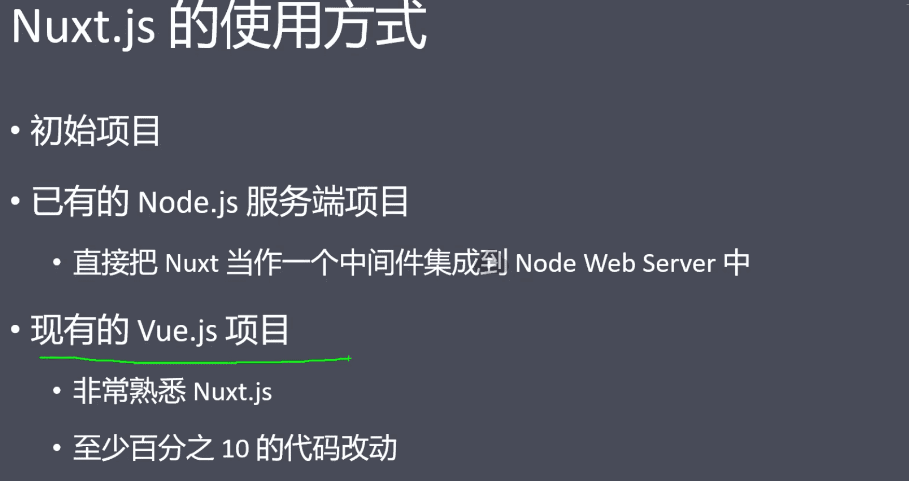

#### 1.初始化NuxtJS项目

#### 2.路由导航


- 动态路由  

  user/_id.vue  匹配 user/1等

- 嵌套路由 

  在 Nuxt.js 里面定义带参数的动态路由，需要创建对应的**以下划线作为前缀**的 Vue 文件 或 目录。

  创建内嵌子路由，你需要添加一个 Vue 文件，同时添加一个**与该文件同名**的目录用来存放子视图组件。

- 配置路由，在`nuxt.config.js` 文件中配置

#### 3.视图


- 定制化默认的 html 模板，只需要在 src 文件夹下（默认是应用根目录）创建一个 `app.html` 的文件。

- layouts 模板 

  `layouts` 目录中的每个文件 (*顶级*) 都将创建一个可通过页面组件中的 `layout` 属性访问的自定义布局。

#### 4.异步数据

- asyncData 
  - `asyncData`方法会在组件（**限于页面组件**）每次加载之前被调用。它可以在服务端或路由更新之前被调用。
  - 由于`asyncData`方法是在组件 **初始化** 前被调用的，所以在方法内是没有办法通过 `this` 来引用组件的实例对象。

- 什么时候用asyncData

  - 当你想要动态页面内容有利于SEO 或者 是提升 首屏渲染速度的时候， 就在asyncData  中发请求拿数据
  - 如果是非异步数据或普通数据，则正常的初始化到data 中即可

- 上下文对象

  ```javascript
  export default {
    async asyncData({ req, res }) {
      // 请检查您是否在服务器端
      // 使用 req 和 res
      if (process.server) {
        return { host: req.headers.host }
      }
  
      return {}
    }
  }
  ```

#### 5.资源文件

1. 静态文件

   如果你的静态资源文件需要 Webpack 做构建编译处理，可以放到 `assets` 目录，否则可以放到 `static` 目录中去。

   Nuxt 服务器启动的时候，该目录下的文件会映射至应用的根路径 `/` 下，像 `robots.txt` 或 `sitemap.xml` 这种类型的文件就很适合放到 `static` 目录中。

2. 

