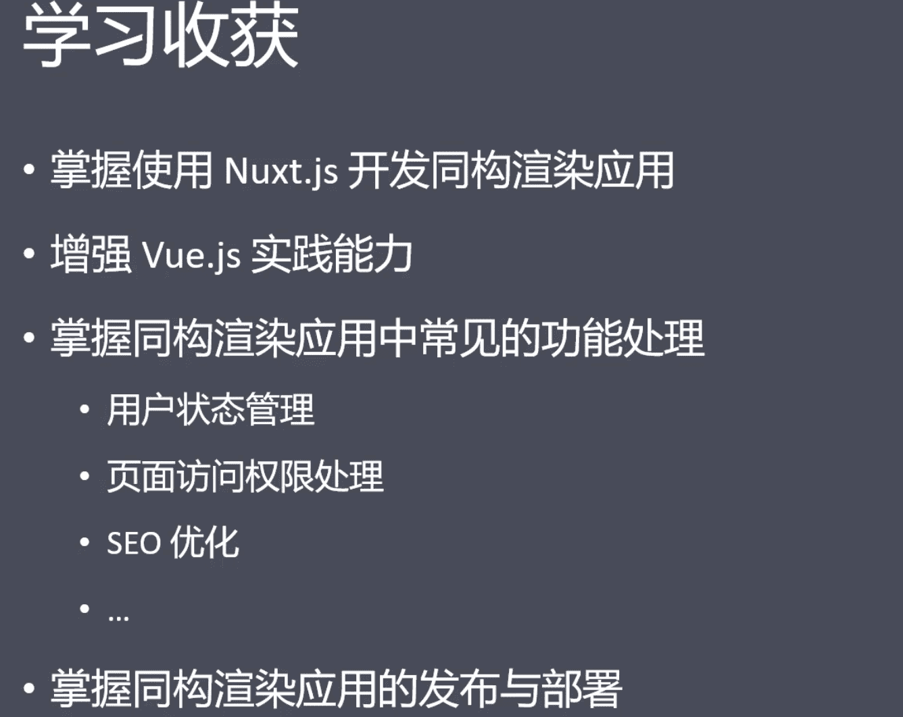
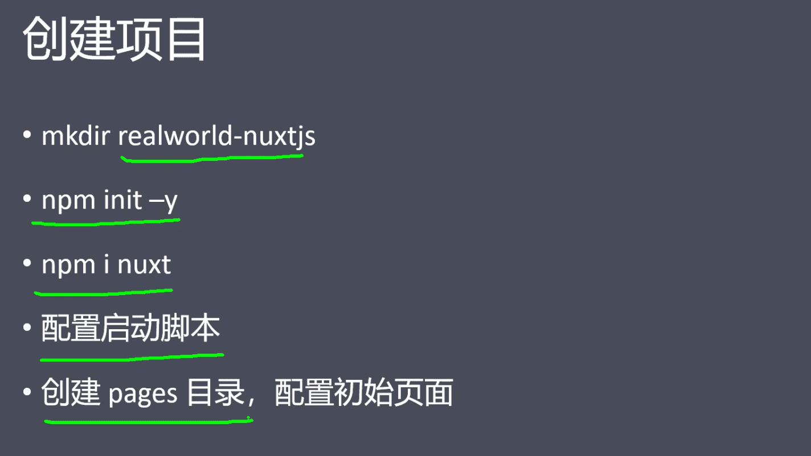
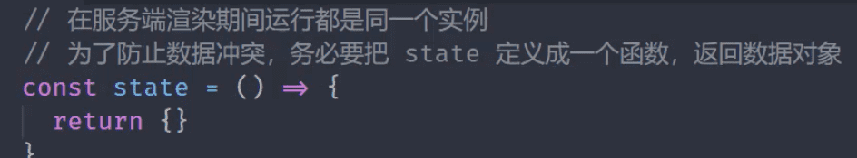
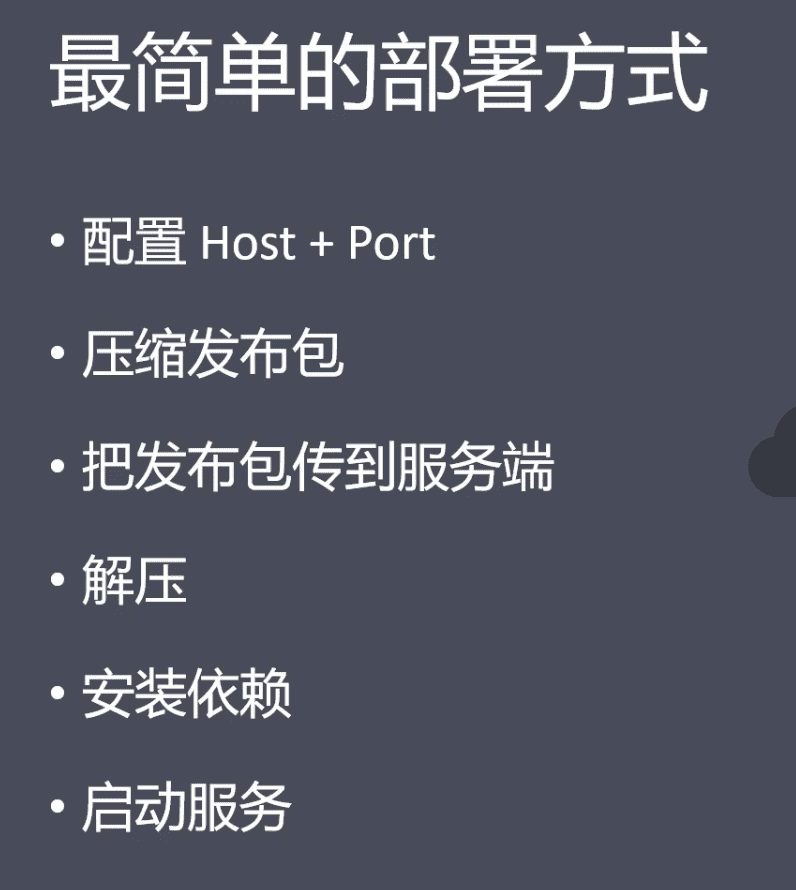
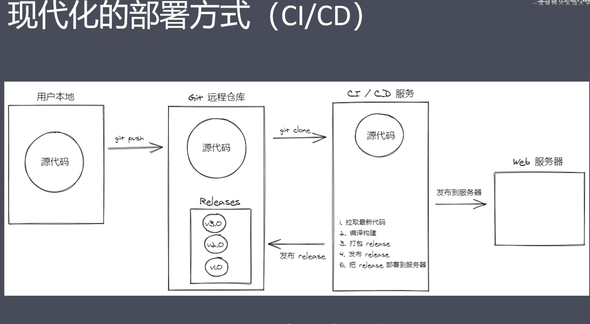
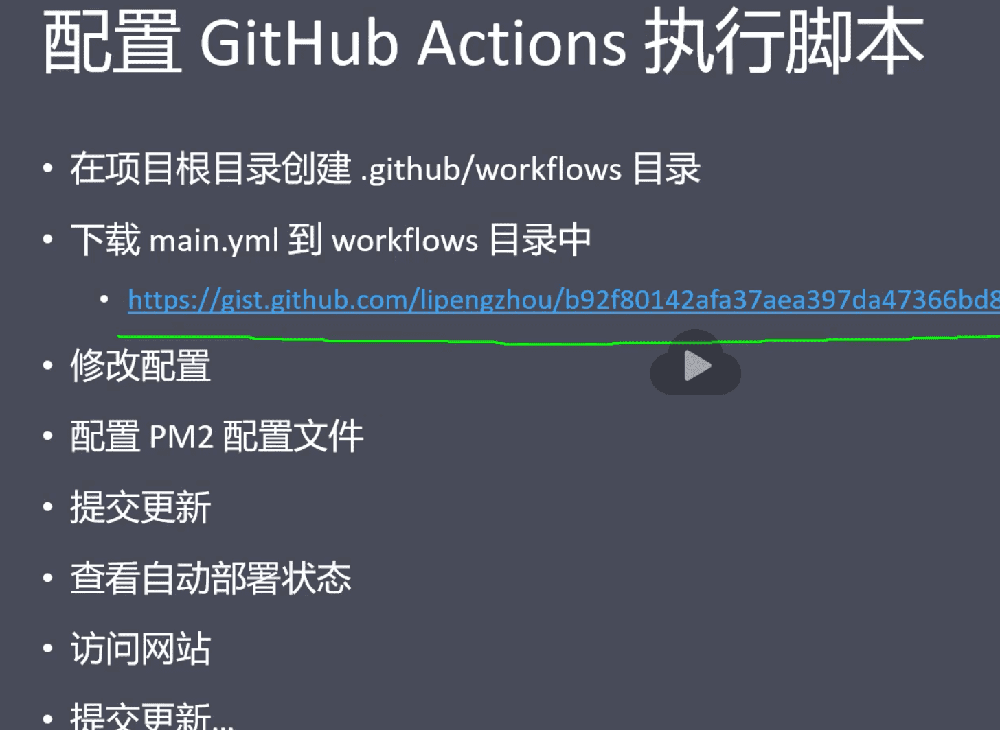

#### 1.介绍



- https://github.com/wbbhacker/realworld/  github 库

#### 2.项目初始化-创建项目



#### 3.项目初始化-导入样式资源

- app.html 全局模板
- jsdelivr 国内cdn节点
- googleapis 在国内是支持的

#### 4.项目初始化-布局组件

- ​	next.config.js 清空默认路由，自定义自己的路由。把页面组件都放在pages 里面方便管理，比用默认的方便，且容易维护。

#### 5.项目初始化-导入登录注册页面及其他页面

- 根据 `this.$route.name` 判断是登录页面还是注册页面

#### 6.处理导航链接高亮

```javascript
//nuxt.config.js
module.exports = {
  router: {
    linkActiveClass: 'active-link'
  }
}
```

- `<nuxt-link>` 添加 `exact` 属性开启精确匹配。同vue-router

#### 7.封装请求模块

- axios

#### 8.表单验证

- `<input type="email" required>`

#### 9.登录状态保存、及持久化



- 状态保存要在浏览器端和服务器端都能拿到 ，所以cookie最合适
- 页面访问权限也要在服务器跟浏览器中都处理
- nuxtServerInit 
- 

登录状态持久化 http://auan.cn/front/2075.html

如果cookie 被禁用怎么保持用户登录状态

后端session 

#### 10.处理页面访问权限 

中间件 middleware


#### 11.分页

监听 query 参数改变

默认情况下，query 的改变不会调用`asyncData`方法。如果要监听这个行为，例如，在构建分页组件时，您可以设置应通过页面组件的`watchQuery`属性监听参数

https://www.nuxtjs.cn/guide/async-data

vue-router 也是这样的

响应路由的参数变化

https://router.vuejs.org/zh/guide/essentials/dynamic-matching.html#%E5%93%8D%E5%BA%94%E8%B7%AF%E7%94%B1%E5%8F%82%E6%95%B0%E7%9A%84%E5%8F%98%E5%8C%96

`let {data:dataNmae}` 对象解构别名

Promise.all 异步执行两个任务

- nuxt-link to 的路径


- `/` `/` 两个路径默认也是包含关系，要加精确匹配 `exact`,会按照严格来进行匹配，不然会给两个都添加`active` 类
- `watchQuery`去监听 参数，变化

#### 12.设置用户Token  在插件里面

需要注意的是，在任何 Vue 组件的[生命周期](https://vuejs.org/v2/guide/instance.html#Lifecycle-Diagram)内， 只有 `beforeCreate` 和 `created` 这两个方法会在 **客户端和服务端**被调用。其他生命周期函数仅在客户端被调用

#### 13.对时间的封装，在vue 里面如果对时间、日期等的封装，用vue的过滤器，最大程度复用代码

#### 14.nuxt.js声明周期

https://zh.nuxtjs.org/docs/2.x/concepts/nuxt-lifecycle/#server

#### 15.meta 标签

注意：为了避免子组件中的 meta 标签不能正确覆盖父组件中相同的标签而产生重复的现象，建议利用 `hid` 键为 meta 标签配一个唯一的标识编号。请阅读[关于 `vue-meta` 的更多信息](https://vue-meta.nuxtjs.org/api/#tagidkeyname)。

#### 16.路由 `$route` `$router`

#### 17.服务器部署

`nuxt.config.js`

```
server{
	host:'0.0.0.0',
	port:'3000'
}
```

`.nuxt` `static` `package.json` `package-lock.json` `nuxt-config.js` 文件要传到服务器上



1. Pm2  后台启动node服务

`pm2 start npm -- start`

pm2常用命令


2. 自动化部署

   

CI/CD 服务

Jenkins、Gitlab CI、 GitHub Actions、 Trais CI、 Circle CI

GitHub Actions 

1. 生成Token
2. 生成Secrets
3. 