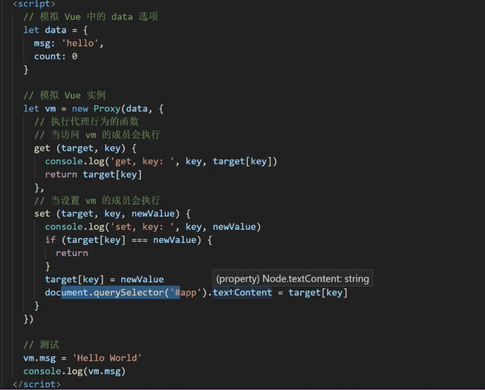
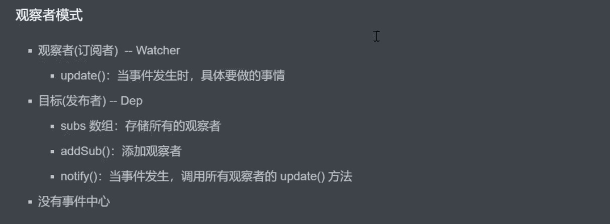
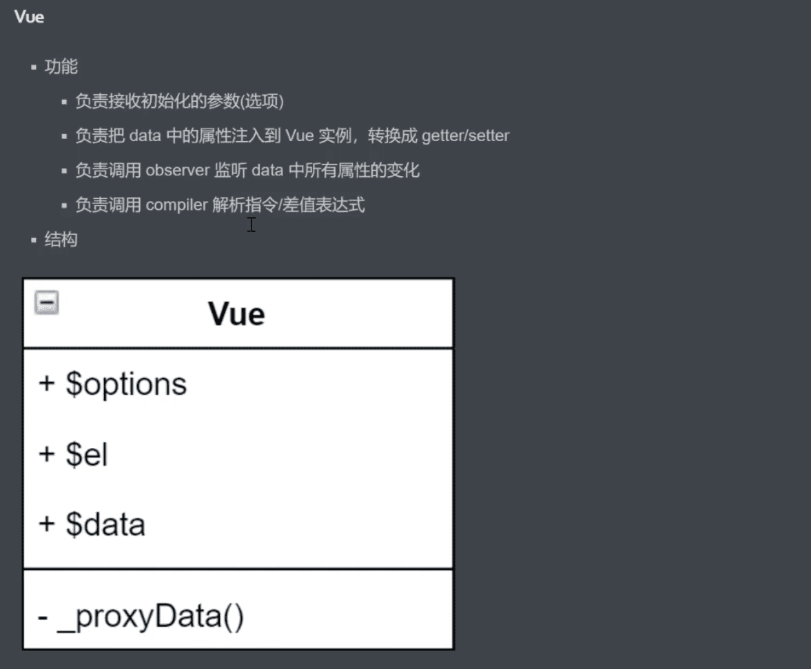
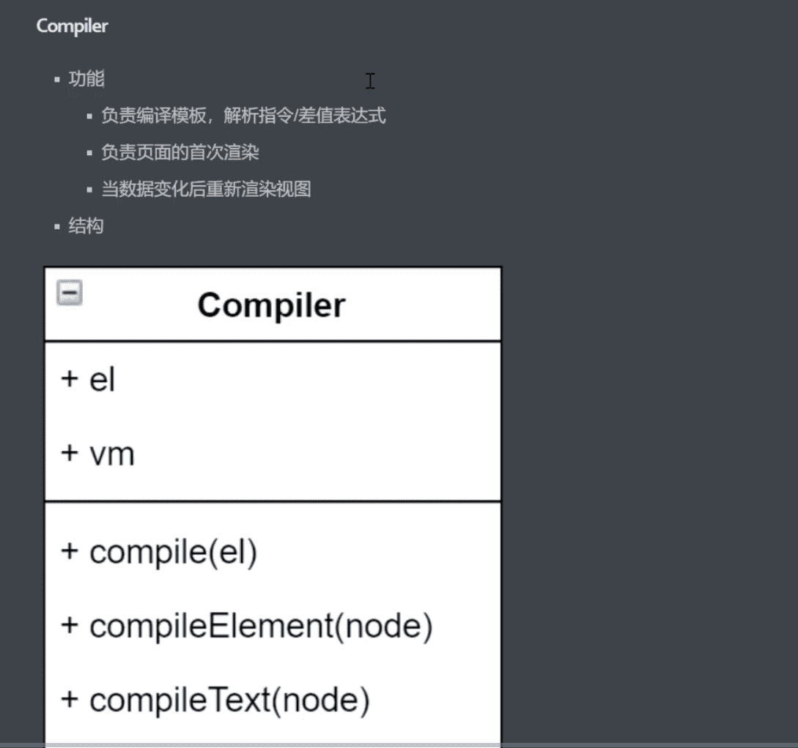
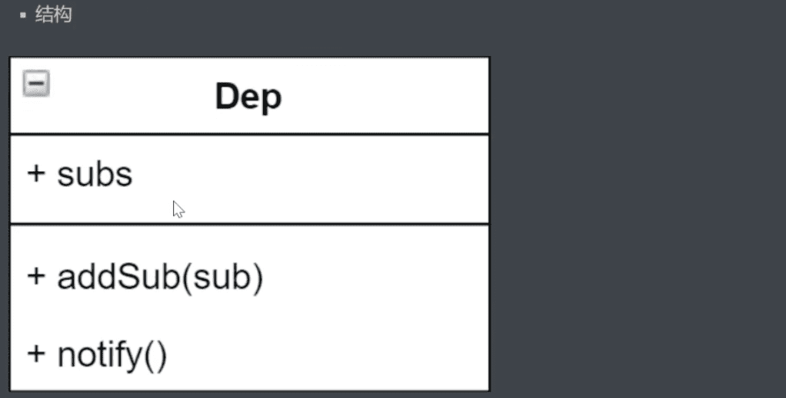

#### 1.课程目标


#### 2.数据驱动


#### 3.数据响应式核心原理-Vue2

- [Vue2.x深入响应式原理](https://cn.vuejs.org/v2/guide/reactivity.html)

- [MDN-Object.defineProperty](https://developer.mozilla.org/en-US/docs/Web/JavaScript/Reference/Global_Objects/Object/defineProperty)

- 浏览器兼容IE8 以上（不兼容IE8）

  

> Object.defineProperty 是ES5 中一个无法shim 的特性
>
> shim 就是 降级处理

#### 4.数据响应式核心原理-Vue3

- ​	[MDN-proxy](https://developer.mozilla.org/en-US/docs/Web/JavaScript/Reference/Global_Objects/Proxy)

-  直接监听对象，而非属性

- ES6 中新增，IE不支持，性能由浏览器优化

  

#### 5.发布订阅模式

- ​	发布/订阅模式

  - 订阅者
  - 发布者
  - 信号中心

  > 我们假定，存在一个”信号中心“，某个人物执行完成，就向信号中心”发布“(publish) 一个信号，其他人物可以向信号中心”订阅“(subscribe)这个信号，从而知道什么时候自己可以开始执行。这就叫做”发布/订阅模式“(publish-subscribe pattern)

- [Vue的自定义事件](https://cn.vuejs.org/v2/guide/components-custom-events.html)

- 

- 兄弟组件通信过程

  

- 模拟vue自定义事件的实现

  > Object.create(null) 可以提供性能，如果只是用来存储键值对的话

#### 6.观察者模式



```javascript
  // 发布者-目标
    class Dep{
      constructor(){
        this.subs = []
      }

      // 添加订阅者
      addSub(sub){
        if(sub && sub.update){
          this.subs.push(sub)
        }
      }
      notify(){
        this.subs.forEach(sub=>{
          sub.update()
        })
      }
    }
    // 订阅者-观察者

    class Watcher {
      update(){
        console.log('update')
      }
    }

    // 测试-
    let dep = new Dep()
    let watcher = new Watcher()

    dep.addSub(watcher)

    dep.notify()
```


> 观察者和发布订阅模式的区别是 观察者没有订阅中心

#### 7.模拟Vue响应式原理-分析

​	

#### 8.Vue



#### 9.Observer


#### 10.Observer-defineReactive1

​	  如果对象的属性值为对象的话，继续调用walk 方法，把属性转换成响应数据

#### 11.Observer-defineReactive2

​	 重新赋值为对象化的，在set 里面 调用walk 方法，把属性转换成响应数据

#### 12.Compiler

​	

#### 13.Compiler-compile

```javascript
class Compiler{
  constructor (vm) s{
    this.el = vm.$el
    this.vm = vm
  }
  // 编译模板，处理文本节点和元素节点
  compile (el) {

  }
  // 编译元素节点，处理指令
  compileElement (node) {

  }

  // 编译文本节点, 处理差值表达式
  compileText (node) {
    
  }
  // 判断元素属性是否是指令
  isDirective (attrName) {
    return attrName.startsWith('v-')
  }

  // 判断节点是否是文本节点
  isTextNode (node) {
    return node.nodeType === 3
  }

  // 判断节点是否是元素节点
  isElementNode (node) {
    retrun node.nodeType === 1
  }

}
```

#### 14.Compiler-compileText

```javascript
 // 编译模板，处理文本节点和元素节点
  compile (el) {
    let  childNodes = el.childNodes
    Array.from(childNodes).forEach(node => {
      // 处理文本节点
      if(this.isTextNode(node)) {
        this.compileText(node)
      }else if( this.isElementNode(node) ){
        // 处理元素节点
        this.compileElement(node)
      }
      // 判断node 节点， 是否有子节点， 如果有子节点，要递归调用compile
      if(node.childNodes && node.childNodes.length){
        this.compile(node)
      }
    })
  }

// 编译文本节点, 处理差值表达式
  compileText (node) {
    let reg = /\{\{（.+?）\}\}/
    let value = node.textContent
    if(reg.text(value)){
      let key = RegExp.$1.trim()
      node.textContent = value.replace(reg, this.vm[key])
    }
  }
```

> 正则表达式 `/.*?/` ? 是尽可能早的结束匹配的正则表达式

#### 15.Compiler-compileElement

```javascript
  // 编译元素节点，处理指令
  compileElement (node) {
    // 遍历所有的属性节点
    Array.from(node.attributes).forEach(attr => {
      let attrName = attr.nodeName
      if(this.isDirective(attrName)){
        // v-text --> text
        attrName = attrName.substr(2)
        let key = attr.value
        this.update(node, key, attrName)
      }
    })
    // 判断是否是指令

  }
  // 

  update(node, key, attrName){
    let updateFn = this[attrName + 'Updater']
    console.log(updateFn)
    updateFn && updateFn(node, this.vm[key])
  }

  // 处理v-text 指令
  textUpdater(node, value){
    console.log(node)
    console.log(value)
    node.textContent = value
  }

  // 处理v-model 指令
  modelUpdater(node, value){
    node.value = value
  }
```

#### 16.Compiler复习

#### 17.Dep

​	



#### 18.Watcher

#### 19.创建watcher对象1

#### 20.创建watcher对象2

#### 21.双向绑定

#### 22.调试-首次渲染

#### 23.调试-数据改变

#### 24.总结-问题

#### 25.总结-整体流程

F8 调到下一个断点处