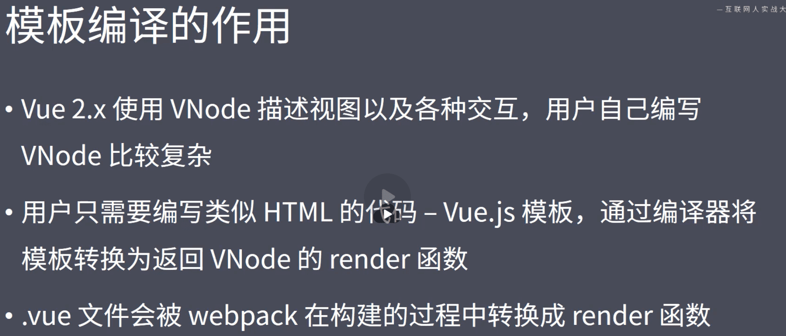
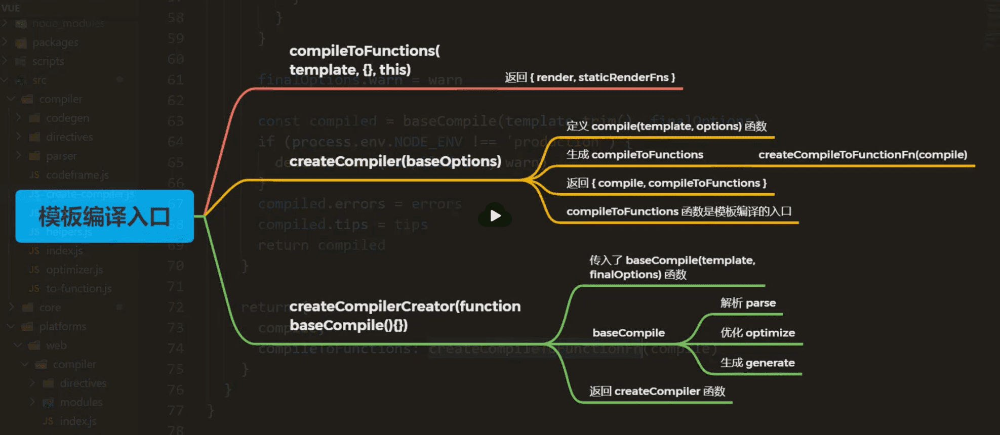
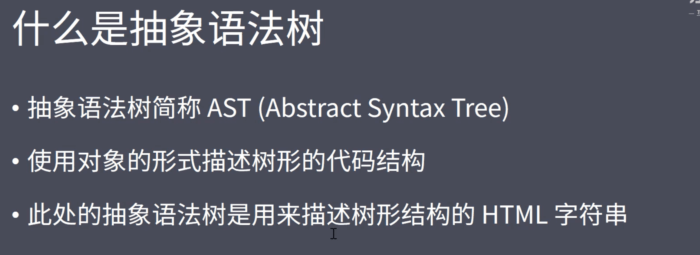
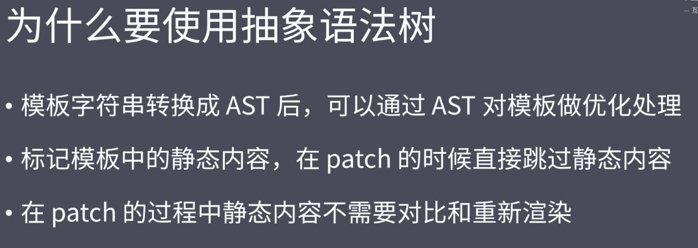

#### 1.模板编译介绍



- webpack 中 通过vue-loader 编译vue 中的 template 模板 为render 函数

#### 2.体验模板编译的结果-上

#### 3.体验模板编译的结果-下

#### 4.vue Template Explorer

https://template-explorer.vuejs.org 网站可以把 template 转换成render 函数

```javascript
with(this){
	
}
```

通过with 简化里面代码调用this，延长作用域链

#### 5.模板编译的入口



#### 6.模板编译过程-compileToFunctions

#### 7.模板编译过程-compile

#### 8.模板编译过程-baseCompile-AST





https://astexplorer.net/查看AST 树网站

#### 9.模板编译过程-baseCompile-parse

#### 10.模板编译过程-baseCompile-optimize

#### 12.模板编译过程-generate-上

#### 13.模板编译过程-generate-下

#### 1.模板编译过程-调试

#### 15.模板编译过程-总结

#### 16.组件化回顾

#### 17.组件注册

#### 18.Vue.extend

#### 19.调试组件注册过程

#### 20.组件的创建过程

#### 21.组件的patch过程


