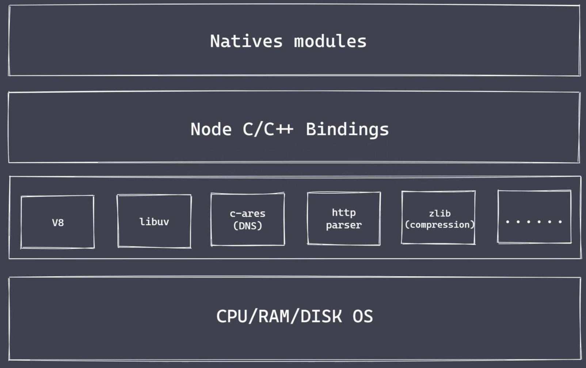
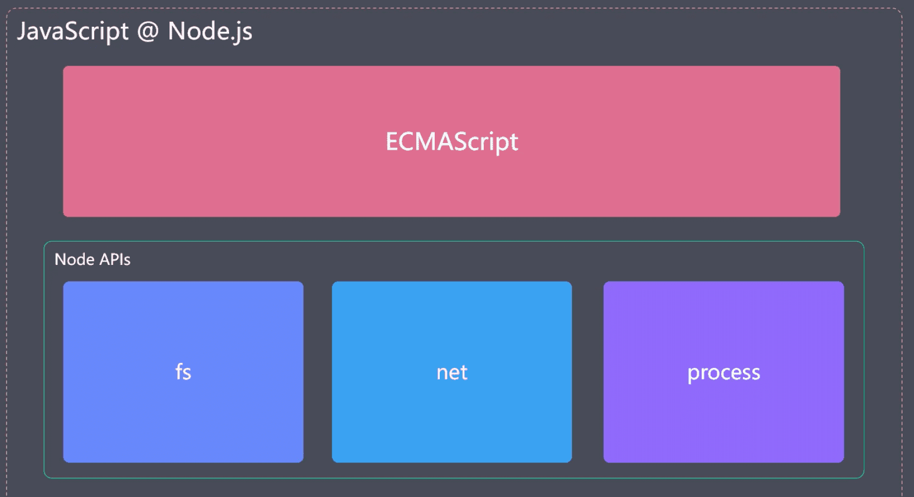
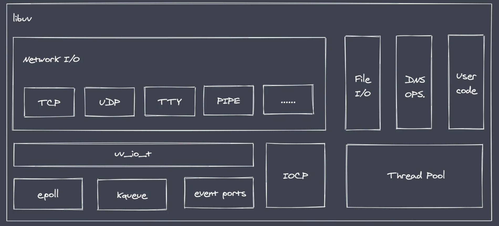
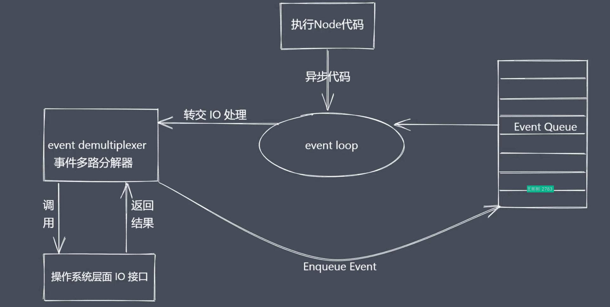
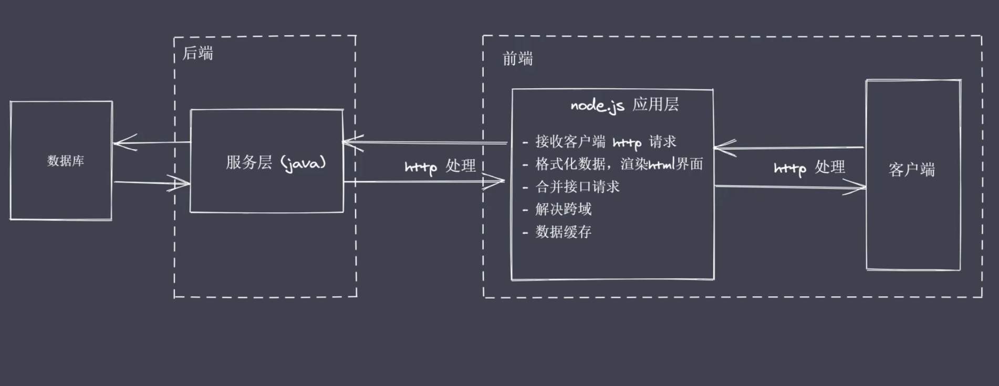

### 1.nodejs 架构



#### 1.Natvies modules

1. 当前层内容由JS实现
2. 提供应用程序可直接调用库，例如fs、path、http等
3. JS语言无法直接操作底层硬件设置

#### 2.Builtin modules 胶水层

#### 3.底层

1. V8：执行JS代码，提供桥梁接口
   1. 执行js代码虚拟机：自己编写的代码、内置的代码、第三方代码
   2. v8是js与c/c++ 的转化功能，v8为js 提供初始化操作，创建了执行环境与作用域
2. Libuv：事件循环、事件队列、异步IO
3. 第三方模块：zlib、http、c-ares等



### 2.为什么是node

node 运行时语言

Reactor 模式，单线程完成多线程工作

Nodejs 更适用于IO密集型高并发请求

### 3.Nodejs 异步IO

常见的轮询技术：

read、select、poll、kquenue、evetn ports

libuv库：



#### 异步IO总结

- IO是应用程序的瓶颈所在
- 异步IO提供性能无采原地等待结果返回
- IO操作属于操作系统界别，平台都有对应的实现
- Nodejs 单线程配合事件驱动架构及libuv实现异步IO

### 4.事件驱动架构

### 5.Nodejs单线程

Nodejs 主线程是单线程

```
// 睡眠函数
function sleepTime(time){
	const sleep = Date.now() + time*1000
	while(Date.now() < sleep ){}
	return
}
```

1. 在V8 里面是单线程执行js
2. 在libuv 库里面是多线程执行IO操作
3. 不适合处理CPU密集型任务

### 6.Nodejs应用场景

1. IO密集型高并发请求

   Nodejs 作为中间层

   

2. 操作数据库提供API服务

   不关注大量业务逻辑的前提下

3. 实时聊天应用程序

总结：Nodejs 更加适合IO密集型任务、高并发请求

不适合大量的业务逻辑处理

### 7.Nodejs 实现API服务