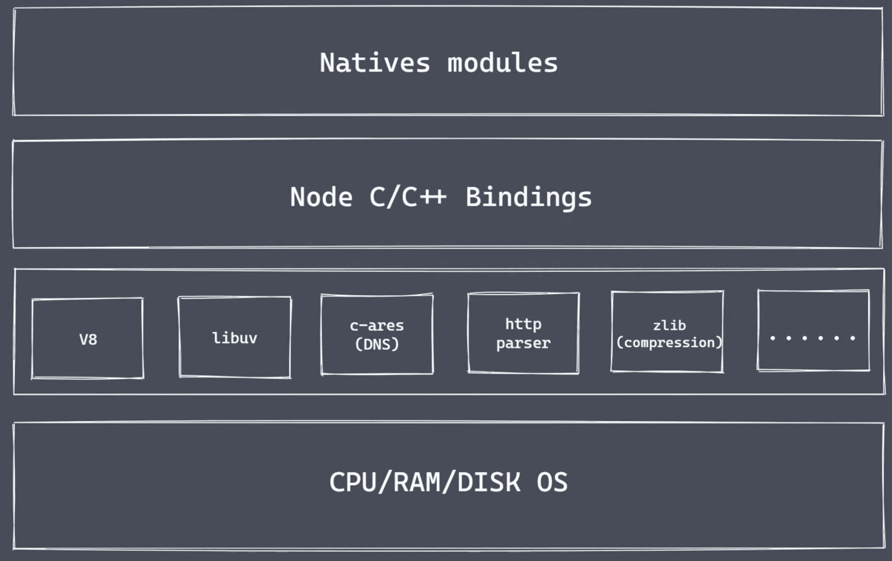

###  

1.nodejs 架构



#### 1.Natvies modules

1. 当前层内容由JS实现
2. 提供应用程序可直接调用库，例如fs、path、http等
3. JS语言无法直接操作底层硬件设置

#### 2.Builtin modules 胶水层

#### 3.底层

1. V8：执行JS代码，提供桥梁接口
   1. 执行js代码虚拟机：自己编写的代码、内置的代码、第三方代码
   2. v8是js与c/c++ 的转化功能，v8为js 提供初始化操作，创建了执行环境与作用域
2. Libuv：事件循环、事件队列、异步IO
3. 第三方模块：zlib、http、c-ares等


### 2.为什么是node

node 运行时语言

Reactor 模式，单线程完成多线程工作

Nodejs 更适用于IO密集型高并发请求

### 3.Nodejs 异步IO

常见的轮询技术：

read、select、poll、kquenue、evetn ports

libuv库：


#### 异步IO总结

- IO是应用程序的瓶颈所在
- 异步IO提供性能无采原地等待结果返回
- IO操作属于操作系统界别，平台都有对应的实现
- Nodejs 单线程配合事件驱动架构及libuv实现异步IO

### 4.事件驱动架构

### 5.Nodejs单线程

Nodejs 主线程是单线程

```
// 睡眠函数
function sleepTime(time){
	const sleep = Date.now() + time*1000
	while(Date.now() < sleep ){}
	return
}
```

1. 在V8 里面是单线程执行js
2. 在libuv 库里面是多线程执行IO操作
3. 不适合处理CPU密集型任务

### 6.Nodejs应用场景

1. IO密集型高并发请求

   Nodejs 作为中间层

   

2. 操作数据库提供API服务

   不关注大量业务逻辑的前提下

3. 实时聊天应用程序

总结：Nodejs 更加适合IO密集型任务、高并发请求

不适合大量的业务逻辑处理

### 7.Nodejs 实现API服务

`npm i typescript -g` 

`npm i ts-node -D`

安装express 之后，ts不可以直接导入，因为express 是js模块，需要导入expres声明才行

`npm i @types/express -D`

### 8.nodejs 全局对象

global 全局对象

`__filename`:返回正在执行脚本文件的绝对路径

`__dirname`:返回正在执行脚本所在目录

`timer`类函数：执行书序与事件循环间的关系

`process`: 提供与当前进程互动的接口

`requrie`: 实现模块的加载

`module`、`exports` ： 处理模块的导出

> 全局作用域下打印`this` ，输出：`{}`，和`global` 并不是一样的，与浏览器有区别的

```javascript
console.log(this === global);  // false
(function (){
	console.log(this === global)  // true
})()

require
__dirname
__filename
module
exports
```

### 9.process 模块

```javascript
//1,
// Buffer.alloc(1000)
// Buffer.alloc(1001)
// 获取内存 cpu 信息
console.log(process.memoryUsage())
console.log(process.cpuUsage())

{
  rss: 19488768,  // 常驻内存
  heapTotal: 4333568, // 申请的总的内存大小
  heapUsed: 2391648,  // 实际使用内存大小
  external: 800217,   // 底层c/c++ 内存的大小
  arrayBuffers: 9386  // 独立的内存大小  缓冲区的大小
}

//2.
// 运行环境： 运行目录、node环境、cpu 架构、用户环境、系统平台
console.log(process.cwd())
console.log(process.version)
console.log(process.versions)
console.log(process.arch)
console.log(process.env)
console.log(process.platform)

//3.运行状态： 启动参数、PID、运行时间
console.log(process.argv)
console.log(process.argv0)
console.log(process.pid)
console.log(process.ppid)
console.log(process.uptime())
// 4.事件
process.on('exit',(code)=>{
    console.log('exit'+code)
    setTimeout(()=>{
        console.log(456)
    },1000)
    // 只能执行同步代码 exit 事件里面
})

process.on('beforeExit',(code)=>{
    console.log('beforeExit'+code)
    setTimeout(()=>{
        console.log(123)
    },1000)
    // 看下区别于exit 的
})

console.log('代码执行完了')

process.exit()  // 主动退出


// 5.标准输出、输入 错误
// 输出

console.log = function(data){
    process.stdout.write('---' + data + '\n')
}

console.log(11)
console.log(22)
const fs = require('fs')

fs.createReadStream('test.txt')
    .pipe(process.stdout)

//输入

process.stdin.pipe(process.stdout)


process.stdin.setEncoding('utf-8')
process.stdin.on('readable',()=>{
    let chunk  = process.stdin.read()
    if(chunk !== null){
        process.stdout.write('data'+chunk)
    }
})

```

