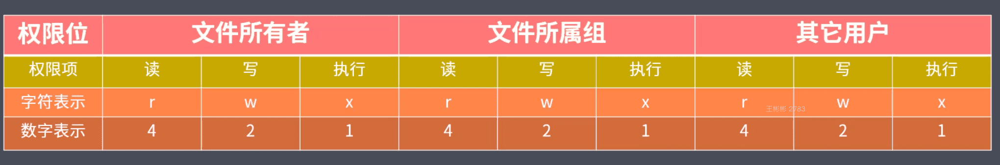

### 1.path 模块

1. `basename()` 获取路径中基础名称
2. `dirname()` 获取路径中目录名称
3. `extname()` 获取路径中扩展名称
4. `isAbsolute()` 判断路径是否为绝对路径
5. `join()`拼接多个路径片段
6. `resolve()` 返回绝对路径
7. `parse()`解析路径
8. `format()` 序列化路径
9. `normolize()` 规范化路径

#### 1.basename()

返回的就是接受路径当中的最后一部分

第二个参数表示扩展名，如果说没有设置则返回完整的文件名称后缀

第二个参数座位后缀时，如果没有在当前路径中被匹配到，那么就会忽略

处理目录路径的时候如果说，结尾处有路径分隔符，则也会被忽略掉

```javascript
// 1.获取路径中的基础名称
console.log(__filename)
console.log(path.basename(__filename))
console.log(path.basename(__filename,'.js'))
console.log(path.basename(__filename,'.css'))
console.log(path.basename('/a/b/c'))
console.log(path.basename('/a/b/c/'))
```

#### 2.dirname()

返回路径中最后一个部分的上一层目录所在路径

```javascript
// 获取路径目录名(路径)

console.log(path.dirname(__filename))
console.log(path.dirname('/a/b/c'))
console.log(path.dirname('/a/b/c/'))
```

#### 3.extname()

返回path 路径中相应文件的后缀名

如果path路径当中存在多个点，它匹配的是最后一个点，到结尾的内容

```javascript
// 获取路径的扩展名
console.log(path.extname(__filename))
console.log(path.extname('/a/b'))
console.log(path.extname('/a/b/'))
console.log(path.extname('/a/b/index.html.js.css'))
```

#### 4.parse()

接受一个路径，返回一个对象，包含不同的信息

root、dir、base、ext、name

```javascript
// 解析路径

const obj = path.parse('/a/b/c/index.html')
const obj1 = path.parse('/a/b/c') // root 为'/'
const obj2= path.parse('./a/b/c') // root 为''
console.log(obj2)
```

#### 5.format()

```javascript
// 序列化路径
const obj2= path.parse('./a/b/c') // root 为''
console.log(path.format(obj2))
```

#### 6.isAbsolute()

```javascript
// 判断当前路径是否为绝对路径

console.log(path.isAbsolute('foo'))
console.log(path.isAbsolute('/foo'))
console.log(path.isAbsolute('///foo'))
console.log(path.isAbsolute(''))
console.log(path.isAbsolute('.'))
console.log(path.isAbsolute('../bar'))
```

#### 7.join()

```javascript
// 拼接路径
console.log(path.join('a/b','c','index.html'))
console.log(path.join('/a/b','c','index.html'))
console.log(path.join('/a/b','c','../','index.html'))
console.log(path.join('/a/b','c','./','index.html'))
console.log(path.join('/a/b','c','','index.html'))
console.log(path.join(''))
```

#### 8.normalize()

```
// 规范化路径
console.log(path.normalize('a/b/c/d'))
console.log(path.normalize('a//b/c../d'))
console.log(path.normalize('a//\\b/c..\\/d'))
console.log(path.normalize('a//\b/c..\\/d'))
```

#### 9.resovle()

resolve([from],to)

```javascript
// 绝对路径
console.log(path.resolve())
console.log(path.resolve('a','b'))
console.log(path.resolve('a','/b'))
console.log(path.resolve('/a','/b'))
console.log(path.resolve('/a','b'))
```

### 2.Buffer

Buffer 缓冲区，nodejs的全局变量

Buffer 让javascript 可以操作二进制

二进制数据、流操作、Buffer

IO行为操作的就是二进制数据

Stream流操作并非Nodejs 独创

流操作配合管道实现数据分段传输

Nodejs 中Buffer是一片内存空间，不占据V8堆内存大小的内存空间，

内存的使用由Node来控制，由V8的GC回收

一般配合Stream 流使用，充当数据缓冲区

Buffer实例的`toString ` 是转化成utf-8

utf-8中一个汉字占三个字节

#### 1.创建Buffer实例

1. alloc：创建指定字节大小的buffer
2. allocUnsafe：创建指定大小的buffer（不安全）
3. from：接受数据(字符串、数组、Buffer)，创建buffer

```javascript
// const b1 = Buffer.alloc(10)
// const b2 = Buffer.allocUnsafe(10)

// console.log(b1)
// console.log(b2)

//from 可传参  字符串、数组、Buffer

const b3 = Buffer.from('1','utf-8',)
console.log(b3)

const b4 = Buffer.from([10,2,3])
console.log(b4)
// <Buffer 0a 02 03>  十六进制
// utf-8中一个汉字占三个字节

const b5 = Buffer.from([10,2,'中'], 'utf-8')
console.log(b5)
//’ 中‘没有存进来
// utf-8中一个汉字占三个字节


const b6 = Buffer.from('中')
console.log(b6)
console.log(b6.toString())

const b7 = Buffer.from([0xe4,0xb8,0xad])
console.log(b7)
console.log(b7.toString())


console.log(Buffer.from('我爱你'))


const b8 = Buffer.alloc(3)
const b9 = Buffer.from(b8)
// 对新空间的拷贝
console.log(b8)
console.log(b9)

b8[0] = 1


console.log(b8)
console.log(b9)

```

#### 2.Buffer实例方法

1. fill：使用数据填充Buffer
2. write：向buffer中写入护具
3. toString： 从buffer 中提取数据
4. slice：截取buffer
5. indexOf：在buffer中查找数据
6. copy：拷贝buffer中的数据

##### 1.fill()

```javascript
// fill 方法
buf.fill('abc')
console.log(buf)
console.log(buf.toString())


buf.fill('123',1)
console.log(buf)
console.log(buf.toString())

buf.fill('123',1,3)
console.log(buf)
console.log(buf.toString())


buf.fill(123)
console.log(buf)
console.log(buf.toString())  //{{{{{{

```

##### 2.write()

```javascript
// write

buf.write('123')
console.log(buf)
console.log(buf.toString())


buf.write('123',1)
console.log(buf)
console.log(buf.toString())

buf.write('123',1,2)
console.log(buf)
console.log(buf.toString())
```

##### 3.toString()

```javascript
// toString

buf = Buffer.from('我爱你')
console.log(buf)
console.log(buf.toString())
console.log(buf.toString('utf-8',3,9))
```

##### 4.slice()

```javascript
// slice

buf = Buffer.from('我爱你')
let b1 = buf.slice()
console.log(b1)
console.log(b1.toString())

let b2 = buf.slice(3,9)
console.log(b2)
console.log(b2.toString())
```

##### 5.indexOf()

```
// indexOf
buf = Buffer.from('我爱你，都爱你')
console.log(buf)
console.log(buf.indexOf('爱'))
console.log(buf.indexOf('爱', 4)) // 第二个参数为便宜量
```

##### 6.copy()

```javascript

let b1 = Buffer.alloc(6)
let b2 = Buffer.from('中国')

// b2.copy(b1)
// console.log(b1.toString())
// console.log(b2.toString())


b2.copy(b1,3,3)
console.log(b1.toString())
console.log(b2.toString())
```

#### 3.Buffer 静态方法

1. concat：将多个buffer拼接成一个新的buffer
2. isBuffer： 判断当前数据是否为buffer

##### 1.concat

```javascript
let b1 = Buffer.from('我爱')
let b2 = Buffer.from('中国')
let b = Buffer.concat([b1,b2])
console.log(b)
console.log(b.toString())
```

##### 2.isBuffer

```javascript
let b1 = Buffer.alloc(3)
console.log(Buffer.isBuffer(b1))
```

#### 4.自定义Buffer之split

```javascript
Buffer.prototype.split = function(sep){
    let  len  = Buffer.from(sep).length
    let ret = []
    let start = 0
    let offset = 0

    while( (offset = this.indexOf(sep,start)) !== -1){
        console.log(offset)
        ret.push(this.slice(start, offset))
        start = offset + len
    }
    ret.push(this.slice(start))
    return ret
}

let buf = Buffer.from('我爱你中国，中国')
console.log(buf)
let bufArr = buf.split('中')
console.log(bufArr)

bufArr.forEach((v)=>{
    console.log(v.toString()+'|')
})
```

### 3.FS 模块

权限位、标识符、文件描述符

r读4、w写2、x可执行1、 不具备权限为0



常见flag 操作符

r： 表示可读

w：表示可写

s:   表示同步

+：表示执行相反操作

x:   表示排它操作

a:  表示追加操作

文件描述符:

fd就是操作系统分配给被打开文件的标识

#### 1.FS 基本操作类

#### 2.FS常用API

1. readFile：从指定文件中读取数据
2. writeFile：向指定文件中写入数据
3. appendFile：追加的方式向指定文件中写入数据
4. copyFile：将某个文件中的数据拷贝至另一文件
5. watchFile：对指定文件进行监控

##### 1.readFile()

异步

```javascript
 // "type":"module",
const fs = require('fs')
const path = require('path')

// readfile

fs.readFile(path.resolve('data.txt'),'utf-8',(err,data)=>{
  console.log(err)
  if(!err){
    console.log(data)
  }
})
```

##### 2.wireteFile()

异步

```javascript
// writeFile

fs.writeFile(path.resolve('data.txt'),'hello, node.js',{
  mode:438,
  flag:'w+',
  encoding:'utf-8'
}(err,data)=>{
  console.log(err)
  if(!err){
    fs.readFile(path.resolve('data.txt'),'utf-8',(err,data)=>{
      if(!err){
        console.log(data)
      }
    })
  }
})
```

##### 3.appendFile()

```javascript
// appendFile()

fs.appendFile('data.txt','中国',(err)=>{
  console.log('写入成功')
})
```

##### 4.copyFile()

一次性拷贝，不是适合大文件拷贝，因为是一次性把所有文件拿到内存中进行拷贝。

```javascript
// copyFile()

fs.copyFile('data.txt','text.txt',()=>{
  console.log('拷贝成功')
})
```

##### 5.watchFile()

```

```

#### 3.md转HTML实现

```javascript
const fs = require('fs')
const path = require('path')
const marked = require('marked')
const browserSync = require('browser-sync')

// 1.读取md 和 css 内容
// 2.将上述读取出来的内容替换占位符，生成一个最终需要展示的html字符串
// 3.将上述html 字符写入到指定的html 文件中
// 4.监听md 文件内容的变化，然后更新html 内容
// 5.使用browser-sync 来实时显示html 内容

console.log('ss')
let mdPath = path.join(__dirname, process.argv[2])
let cssPath = path.resolve('github.css')
let htmlPath = mdPath.replace(path.extname(mdPath),'.html')

console.log(mdPath)
console.log(cssPath)
console.log(htmlPath)

fs.watchFile(mdPath,(curr, prev)=>{
    if(curr.mtime !== prev.mtime ){
        fs.readFile(mdPath,'utf-8',(err,data)=>{
            // 将md --》 html 
            let htmlStr = marked(data)
            console.log(marked)
            console.log(htmlStr)
            fs.readFile(cssPath,'utf-8',(err,data)=>{
                let retHtml = temp.replace('{{content}}',htmlStr).replace('{{style}}',data)
                // 将上述的内容写入到指定的html 文件中，用于浏览器里进行展示
        
                fs.writeFile(htmlPath,retHtml,()=>{
                    console.log('生成成功了')
                })
            })
        })
        
    }
})

browserSync.init({
    broswer:'',
    server:__dirname,
    watch:true,
    index:path.basename(htmlPath)
})

const temp = `
<!DOCTYPE html>
<html lang="en">
<head>
    <meta charset="UTF-8">
    <meta http-equiv="X-UA-Compatible" content="IE=edge">
    <meta name="viewport" content="width=device-width, initial-scale=1.0">
    <title>Document</title>
    <style>
        {{style}}
    </style>
</head>
<body>
    {{content}}
</body>
</html>
`


```

#### 4.文件打开与关闭

```javascript
fs.open(path.resolve('test.txt'),'r',(err, fd)=>{
    console.log(fd)
    fs.close(fd,err=>{
        console.log('关闭成功')
    })
})  

```

#### 5.大文件读写操作


```javascript
let buf = Buffer.alloc(10)

// read
// fd 定位当前被打开的文件
// buf 用于表示当前缓冲区
// offset 表示当前buf 的哪个位置开始执行写入
// lenth 表示当前次写入的长度
// position 表示当前从文件的哪个文职开始读取

// fs.open('test.txt','r',(err, rfd)=>{
//     console.log(rfd)
//     // 1 是从buf 的第一位开始写
//     // 2 是从磁盘的文件中那个文件去读
//     fs.read(rfd,buf,1,4,2,(err, readBytes, data)=>{
//         console.log(readBytes)
//         console.log(data)
//         console.log(data.toString())
//     })
// })


// write 将缓冲区的内容写入磁盘文件中

buf  =  Buffer.from('1234567890')

fs.open('b.txt','w',(err, wfd)=>{
    fs.write(wfd, buf,0,3,0,(err, written, buffer)=>{
        console.log(written)
        console.log(buffer)
        fs.close(wfd)
    })
})
```


