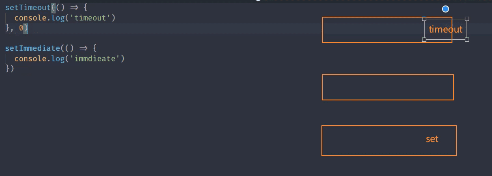

### 1.path 模块

1. `basename()` 获取路径中基础名称
2. `dirname()` 获取路径中目录名称
3. `extname()` 获取路径中扩展名称
4. `isAbsolute()` 判断路径是否为绝对路径
5. `join()`拼接多个路径片段
6. `resolve()` 返回绝对路径
7. `parse()`解析路径
8. `format()` 序列化路径
9. `normolize()` 规范化路径

#### 1.basename()

返回的就是接受路径当中的最后一部分

第二个参数表示扩展名，如果说没有设置则返回完整的文件名称后缀

第二个参数座位后缀时，如果没有在当前路径中被匹配到，那么就会忽略

处理目录路径的时候如果说，结尾处有路径分隔符，则也会被忽略掉

```javascript
// 1.获取路径中的基础名称
console.log(__filename)
console.log(path.basename(__filename))
console.log(path.basename(__filename,'.js'))
console.log(path.basename(__filename,'.css'))
console.log(path.basename('/a/b/c'))
console.log(path.basename('/a/b/c/'))
```

#### 2.dirname()

返回路径中最后一个部分的上一层目录所在路径

```javascript
// 获取路径目录名(路径)

console.log(path.dirname(__filename))
console.log(path.dirname('/a/b/c'))
console.log(path.dirname('/a/b/c/'))
```

#### 3.extname()

返回path 路径中相应文件的后缀名

如果path路径当中存在多个点，它匹配的是最后一个点，到结尾的内容

```javascript
// 获取路径的扩展名
console.log(path.extname(__filename))
console.log(path.extname('/a/b'))
console.log(path.extname('/a/b/'))
console.log(path.extname('/a/b/index.html.js.css'))
```

#### 4.parse()

接受一个路径，返回一个对象，包含不同的信息

root、dir、base、ext、name

```javascript
// 解析路径

const obj = path.parse('/a/b/c/index.html')
const obj1 = path.parse('/a/b/c') // root 为'/'
const obj2= path.parse('./a/b/c') // root 为''
console.log(obj2)
```

#### 5.format()

```javascript
// 序列化路径
const obj2= path.parse('./a/b/c') // root 为''
console.log(path.format(obj2))
```

#### 6.isAbsolute()

```javascript
// 判断当前路径是否为绝对路径

console.log(path.isAbsolute('foo'))
console.log(path.isAbsolute('/foo'))
console.log(path.isAbsolute('///foo'))
console.log(path.isAbsolute(''))
console.log(path.isAbsolute('.'))
console.log(path.isAbsolute('../bar'))
```

#### 7.join()

```javascript
// 拼接路径
console.log(path.join('a/b','c','index.html'))
console.log(path.join('/a/b','c','index.html'))
console.log(path.join('/a/b','c','../','index.html'))
console.log(path.join('/a/b','c','./','index.html'))
console.log(path.join('/a/b','c','','index.html'))
console.log(path.join(''))
```

#### 8.normalize()

```
// 规范化路径
console.log(path.normalize('a/b/c/d'))
console.log(path.normalize('a//b/c../d'))
console.log(path.normalize('a//\\b/c..\\/d'))
console.log(path.normalize('a//\b/c..\\/d'))
```

#### 9.resovle()

resolve([from],to)

```javascript
// 绝对路径
console.log(path.resolve())
console.log(path.resolve('a','b'))
console.log(path.resolve('a','/b'))
console.log(path.resolve('/a','/b'))
console.log(path.resolve('/a','b'))
```

### 2.Buffer

Buffer 缓冲区，nodejs的全局变量

Buffer 让javascript 可以操作二进制

二进制数据、流操作、Buffer

IO行为操作的就是二进制数据

Stream流操作并非Nodejs 独创

流操作配合管道实现数据分段传输

Nodejs 中Buffer是一片内存空间，不占据V8堆内存大小的内存空间，

内存的使用由Node来控制，由V8的GC回收

一般配合Stream 流使用，充当数据缓冲区

Buffer实例的`toString ` 是转化成utf-8

utf-8中一个汉字占三个字节

#### 1.创建Buffer实例

1. alloc：创建指定字节大小的buffer
2. allocUnsafe：创建指定大小的buffer（不安全）
3. from：接受数据(字符串、数组、Buffer)，创建buffer

```javascript
// const b1 = Buffer.alloc(10)
// const b2 = Buffer.allocUnsafe(10)

// console.log(b1)
// console.log(b2)

//from 可传参  字符串、数组、Buffer

const b3 = Buffer.from('1','utf-8',)
console.log(b3)

const b4 = Buffer.from([10,2,3])
console.log(b4)
// <Buffer 0a 02 03>  十六进制
// utf-8中一个汉字占三个字节

const b5 = Buffer.from([10,2,'中'], 'utf-8')
console.log(b5)
//’ 中‘没有存进来
// utf-8中一个汉字占三个字节


const b6 = Buffer.from('中')
console.log(b6)
console.log(b6.toString())

const b7 = Buffer.from([0xe4,0xb8,0xad])
console.log(b7)
console.log(b7.toString())


console.log(Buffer.from('我爱你'))


const b8 = Buffer.alloc(3)
const b9 = Buffer.from(b8)
// 对新空间的拷贝
console.log(b8)
console.log(b9)

b8[0] = 1


console.log(b8)
console.log(b9)

```

#### 2.Buffer实例方法

1. fill：使用数据填充Buffer
2. write：向buffer中写入护具
3. toString： 从buffer 中提取数据
4. slice：截取buffer
5. indexOf：在buffer中查找数据
6. copy：拷贝buffer中的数据

##### 1.fill()

```javascript
// fill 方法
buf.fill('abc')
console.log(buf)
console.log(buf.toString())


buf.fill('123',1)
console.log(buf)
console.log(buf.toString())

buf.fill('123',1,3)
console.log(buf)
console.log(buf.toString())


buf.fill(123)
console.log(buf)
console.log(buf.toString())  //{{{{{{

```

##### 2.write()

```javascript
// write

buf.write('123')
console.log(buf)
console.log(buf.toString())


buf.write('123',1)
console.log(buf)
console.log(buf.toString())

buf.write('123',1,2)
console.log(buf)
console.log(buf.toString())
```

##### 3.toString()

```javascript
// toString

buf = Buffer.from('我爱你')
console.log(buf)
console.log(buf.toString())
console.log(buf.toString('utf-8',3,9))
```

##### 4.slice()

```javascript
// slice

buf = Buffer.from('我爱你')
let b1 = buf.slice()
console.log(b1)
console.log(b1.toString())

let b2 = buf.slice(3,9)
console.log(b2)
console.log(b2.toString())
```

##### 5.indexOf()

```
// indexOf
buf = Buffer.from('我爱你，都爱你')
console.log(buf)
console.log(buf.indexOf('爱'))
console.log(buf.indexOf('爱', 4)) // 第二个参数为便宜量
```

##### 6.copy()

```javascript

let b1 = Buffer.alloc(6)
let b2 = Buffer.from('中国')

// b2.copy(b1)
// console.log(b1.toString())
// console.log(b2.toString())


b2.copy(b1,3,3)
console.log(b1.toString())
console.log(b2.toString())
```

#### 3.Buffer 静态方法

1. concat：将多个buffer拼接成一个新的buffer
2. isBuffer： 判断当前数据是否为buffer

##### 1.concat

```javascript
let b1 = Buffer.from('我爱')
let b2 = Buffer.from('中国')
let b = Buffer.concat([b1,b2])
console.log(b)
console.log(b.toString())
```

##### 2.isBuffer

```javascript
let b1 = Buffer.alloc(3)
console.log(Buffer.isBuffer(b1))
```

#### 4.自定义Buffer之split

```javascript
Buffer.prototype.split = function(sep){
    let  len  = Buffer.from(sep).length
    let ret = []
    let start = 0
    let offset = 0

    while( (offset = this.indexOf(sep,start)) !== -1){
        console.log(offset)
        ret.push(this.slice(start, offset))
        start = offset + len
    }
    ret.push(this.slice(start))
    return ret
}

let buf = Buffer.from('我爱你中国，中国')
console.log(buf)
let bufArr = buf.split('中')
console.log(bufArr)

bufArr.forEach((v)=>{
    console.log(v.toString()+'|')
})
```

### 3.FS 模块

权限位、标识符、文件描述符

r读4、w写2、x可执行1、 不具备权限为0


常见flag 操作符

r： 表示可读

w：表示可写

s:   表示同步

+：表示执行相反操作

x:   表示排它操作

a:  表示追加操作

文件描述符:

fd就是操作系统分配给被打开文件的标识

#### 1.FS 基本操作类

#### 2.FS常用API

1. readFile：从指定文件中读取数据
2. writeFile：向指定文件中写入数据
3. appendFile：追加的方式向指定文件中写入数据
4. copyFile：将某个文件中的数据拷贝至另一文件
5. watchFile：对指定文件进行监控

##### 1.readFile()

异步

```javascript
 // "type":"module",
const fs = require('fs')
const path = require('path')

// readfile

fs.readFile(path.resolve('data.txt'),'utf-8',(err,data)=>{
  console.log(err)
  if(!err){
    console.log(data)
  }
})
```

##### 2.wireteFile()

异步

```javascript
// writeFile

fs.writeFile(path.resolve('data.txt'),'hello, node.js',{
  mode:438,
  flag:'w+',
  encoding:'utf-8'
}(err,data)=>{
  console.log(err)
  if(!err){
    fs.readFile(path.resolve('data.txt'),'utf-8',(err,data)=>{
      if(!err){
        console.log(data)
      }
    })
  }
})
```

##### 3.appendFile()

```javascript
// appendFile()

fs.appendFile('data.txt','中国',(err)=>{
  console.log('写入成功')
})
```

##### 4.copyFile()

一次性拷贝，不是适合大文件拷贝，因为是一次性把所有文件拿到内存中进行拷贝。

```javascript
// copyFile()

fs.copyFile('data.txt','text.txt',()=>{
  console.log('拷贝成功')
})
```

##### 5.watchFile()

```

```


#### 3.md转HTML实现


```javascript
const fs = require('fs')
const path = require('path')
const marked = require('marked')
const browserSync = require('browser-sync')

// 1.读取md 和 css 内容
// 2.将上述读取出来的内容替换占位符，生成一个最终需要展示的html字符串
// 3.将上述html 字符写入到指定的html 文件中
// 4.监听md 文件内容的变化，然后更新html 内容
// 5.使用browser-sync 来实时显示html 内容

console.log('ss')
let mdPath = path.join(__dirname, process.argv[2])
let cssPath = path.resolve('github.css')
let htmlPath = mdPath.replace(path.extname(mdPath),'.html')

console.log(mdPath)
console.log(cssPath)
console.log(htmlPath)

fs.watchFile(mdPath,(curr, prev)=>{
    if(curr.mtime !== prev.mtime ){
        fs.readFile(mdPath,'utf-8',(err,data)=>{
            // 将md --》 html 
            let htmlStr = marked(data)
            console.log(marked)
            console.log(htmlStr)
            fs.readFile(cssPath,'utf-8',(err,data)=>{
                let retHtml = temp.replace('{{content}}',htmlStr).replace('{{style}}',data)
                // 将上述的内容写入到指定的html 文件中，用于浏览器里进行展示
        
                fs.writeFile(htmlPath,retHtml,()=>{
                    console.log('生成成功了')
                })
            })
        })
        
    }
})

browserSync.init({
    broswer:'',
    server:__dirname,
    watch:true,
    index:path.basename(htmlPath)
})

const temp = `
<!DOCTYPE html>
<html lang="en">
<head>
    <meta charset="UTF-8">
    <meta http-equiv="X-UA-Compatible" content="IE=edge">
    <meta name="viewport" content="width=device-width, initial-scale=1.0">
    <title>Document</title>
    <style>
        {{style}}
    </style>
</head>
<body>
    {{content}}
</body>
</html>
`


```

#### 4.文件打开与关闭

```javascript
fs.open(path.resolve('test.txt'),'r',(err, fd)=>{
    console.log(fd)
    fs.close(fd,err=>{
        console.log('关闭成功')
    })
})  

```

#### 5.大文件读写操作


```javascript
let buf = Buffer.alloc(10)

// read
// fd 定位当前被打开的文件
// buf 用于表示当前缓冲区
// offset 表示当前buf 的哪个位置开始执行写入
// lenth 表示当前次写入的长度
// position 表示当前从文件的哪个文职开始读取

// fs.open('test.txt','r',(err, rfd)=>{
//     console.log(rfd)
//     // 1 是从buf 的第一位开始写
//     // 2 是从磁盘的文件中那个文件去读
//     fs.read(rfd,buf,1,4,2,(err, readBytes, data)=>{
//         console.log(readBytes)
//         console.log(data)
//         console.log(data.toString())
//     })
// })


// write 将缓冲区的内容写入磁盘文件中

buf  =  Buffer.from('1234567890')

fs.open('b.txt','w',(err, wfd)=>{
    fs.write(wfd, buf,0,3,0,(err, written, buffer)=>{
        console.log(written)
        console.log(buffer)
        fs.close(wfd)
    })
})
```


#### 6.文件拷贝自定义实现

```javascript
const fs = require('fs')
// 1.打开a文件，利用read 将数据保存到buffer 暂存起来
// 2.打开b 文件，利用write 将buffer中数据写入到b文件中

let buf = Buffer.alloc(10)

const BUFFER_SIZE = buf.length
let readOffset = 0


fs.open('a1.txt', 'r', (err, rfd) => {
  fs.open('b1.txt', 'w', (err, wfd) => {
    function next() {
        fs.read(rfd, buf, 0, BUFFER_SIZE, readOffset, (err, readBytes, buffer) => {
          // 打开b文件写入数据
          console.log(readBytes)
          if (!readBytes) {
            // 如果条件成立，说明内容已经读取完毕
            fs.close(rfd, () => { })
            fs.close(wfd, () => { })
            console.log('拷贝完成')
            return
          }
          console.log(readBytes)
          readOffset += readBytes
          fs.write(wfd, buf, 0, readBytes, (err, written) => {
            console.log('写入成功')
            next()
          })
        })
    }
    next()
  })
})

```

#### 7.目录操作API

1. access：判断文件或目录是否具有操作权限
2. stat：获取目录及文件信息
3. mkdir：创建目录
4. rmdir：删除目录
5. readdir：读取目录中内容
6. unlink：删除指定文件

##### 1.access()

```javascript
fs.access('a1.txt',(err)=>{
  if(err){
    console.log(err)
  }else{
    console.log('有操作权限')
  }
})

```

##### 2.stat()

```javascript
fs.stat('a1.txt',(err, statObj)=>{
  console.log(statObj.size)
  console.log(statObj.isFile())
  console.log(statObj.isDirectory())
})

```

##### 3.mkdir()

```javascript
fs.mkdir('a/b/c',{recursive:true},(err)=>{
  if(!err){
    console.log('创建成功')
  }else{
    console.log(err)
  }
})
// recursive 递归去创建文件夹. 为false 则只创建c
```

##### 4.rmdir()

默认情况下只能删除空目录，且非递归

recursive：true ，则删除所有

```javascript
fs.rmdir('a',{recursive:true},(err)=>{
  if(!err){
    console.log('删除成功')
  }else{
    console.log(err)
  }
})
```

##### 5.readdir()

```javascript
fs.readdir('a',(err,files)=>{
  console.log(files)
})
```

##### 6.unlink()

```javascript
fs.unlink('a/a.txt',(err)=>{
  if(!err){
    console.log('删除成功')
  }
})
```

#### 8.目录创建之同步实现

```javascript
const fs = require('fs')
const path = require('path')
/*
*
*/ 
// 1. 将来调用时接受路径：a/b/c   用/ 链接
// 2.利用分隔符进行拆分，将每一项放入一个数组中进行管理['a','b','c']
// 3.对上述数组进行遍历，需要拿到每项与前一项进行拼接
// 4 判断一个当前拼接之后的路径是否具有可操作性的权限，如果有，则证明其存在

function makDirSync(dirPath){
  let items = dirPath.split(path.sep)
  console.log(path.sep)
  console.log(items)
  for(let i=1; i<=items.length; i++){
    let dir = items.slice(0,i).join(path.sep)
    try{
      fs.accessSync(dir)
    }catch(err){
      fs.mkdirSync(dir)
    }
  }
}

makDirSync('a\\b\\c')
```

#### 9.目录创建之异步实现

```javascript
const fs = require('fs')
const path = require('path')
// 递归
function mkDir(dirPath, cb ){
  let parts = dirPath.split('/')
  let index = 1
  console.log(parts)
  function next(){
    if( index > parts.length) return cb && cb()
    let current = parts.slice(0,index++).join('/')
    fs.access(current , (err)=>{
      if(err){
        fs.mkdir(current,next)
      }else{
        next()
      }
    })
  }
  next()

}
mkDir('a/b/c',()=>{
  console.log('创建成功')
})

// promise 
const access = promisify(fs.access)
const mkdir = promisify(fs.mkdir)

async function mkDir(dirPath,cb){
  let parts = dirPath.split('/')
  for(let index = 1; index <=parts.length; index++){
    let current = parts.slice(0,index).join('/')
    try{
      await access(current)
    }catch(err){
      await mkdir(current)
    }
  }
  cb && cb()
}

mkDir('a/b/c',()=>{
  console.log('创建成功')
})
```

#### 10.递归删除之异步实现

```
//需求：自定义一个函数 ，接受一个路径，然后执行删除
// 1.判断当前出入的路径是否为一个文件，直接删除当前文件即可
// 2.如果当前出入的是一个目录，我们需要继续读取目录中的内容，然后再执行删除操作
// 3.将删除行为定义成一个函数，然后通过递归的方式进行复用
// 4.将当前名称拼接成在删除时可使用的路径

function myRmDir(dirPath, cb){
  fs.stat(dirPath,(err ,statObj)=>{
    if(statObj.isDirectory()){
      fs.readdir(dirPath,(err,files)=>{
        console.log(files)
        let dirs = files.map(item=>{
          return path.join(dirPath, item)
        })
        let index = 0
        function next(){
          if(index === dirs.length) return fs.rmdir(dirPath,cb)
          let current = dirs[index++]
          myRmDir(current, next)
        }
        next()
      })
    }else{
      fs.unlink(dirPath, cb)
    }
  })
}
myRmDir('a/b',()=>{
  console.log('删除成功了')
})


```

### 4.node 模块化

1. commonjs规范
2. AMD 规范
3. CMD 规范
4. ES modules 规范	

#### 1.CommonJS 规范

模块引用

模块定义

模块标识

##### 1.module 属性

- 任意js文件就是一个模块，可以直接使用module属性
- id：返回模块标识符，一般是一个绝对路径
- filename：返回文件模块的绝对路径
- loaded：返回布尔值，标识模块是否完成加载
- parent：返回对象存放调用当前模块的模块
- children：返回数组，存放当前模块调用的其它模块
- exports：返回当前模块需要暴露的内容
- paths：返回数组，存放不同目录下的node_modules 位置

##### 2.module.exports 与 exports 的区别？

都是指向同一个内存地址

###### 3.requrie属性

- 基本功能是读入并且执行一个模块文件
- resvole：返回模块文件绝对路径
- extensions：依据不同后缀名执行解析操作
- main：返回主模块对象

#### 2.模块的分类

- 内置模块
- 文件模块

##### 模块加载速度

核心模块：Node 源码编译时写入到二进制文件中

文件模块：代码运行时，动态加载

##### 加载流程

- 路径分析：依据标识符确定模块位置

  路径标识符、非路径标识符

  `console.log(module.paths)`

  遍历module.paths 中所有目录去找模块，如果都没找到则报错

- 文件定位：确定目标模块中具体的文件及文件类型

  - 项目下存在m1.js 模块，导入时使用require('m1' )语法
  - m1.js-> m1.json->m1.node
  - 如果上述没找到，则把m1 看成一个目录处理
  - 查找package.json 文件，使用JSON.parse() 解析
  - main.js->main.json->main.node
  - 将index做为目标模块中的具体文件名称
  - 如果在当前文件没找到则，往上层目录重复上述步骤查找
  - 都没查找到则报错

- 编译执行：采用对应的方式完成文件的编译执行

  - 使用fs模块同步读入目标文件内容
  - 对内容进行语法包装，生成可执行js函数
  - 调用函数时传入exports、module、require等属性值 

JSON 文件编译执行

- 将读取到的内容通过JSON.parse()进行解析

缓存优先原则

- 提高模块加载速度
- 当前模块不存在，则经理一次完整加载流程
- 模块加载完成后，使用路径做为索引进行缓存

#### 3.模块加载源码分析

>vscode 调试 : launch.json 中 `cconfigurations.skipFiles` 跳过源码调试，注释掉即可


#### 4.VM 模块的使用

```javascript
const fs = require('fs')
const { monitorEventLoopDelay } = require('perf_hooks')
const vm = require('vm')

let content = fs.readFileSync('test.txt', 'utf-8')
console.log(content)

// let age = 33
// 1：eval
// console.log(content)
// eval(content)


//2:new Function
// console.log(age)
// let fn = new Function('age', 'return age + 1')
// console.log(fn(age))

//3. vm
vm.runInThisContext(content)

console.log(age)

```

#### 5.模块加载模拟实现

1. 核心逻辑
   - 路径分析
   - 缓存优先
   - 文件定位
   - 编译执行

```javascript
const fs = require('fs')
const path = require('path')
const vm = require('vm')


function Module(id) {
  this.id = id
  this.exports = {}
}

Module._extenstions = {
  '.js'(module) {
    // 读取
    let content = fs.readFileSync(module.id, 'utf-8')

    // 包装
    content = Module.wrapper[0] + content + Module.wrapper[1]


    // vm
    let compileFn = vm.runInThisContext(content)


    // 准备参数值

    let exports = module.exports

    let dirname = path.dirname(module.id)
    let filename = module.id

    compileFn.call(exports, exports, myRequire, module, filename, dirname)

  },
  '.json'(module) {
    let content = JSON.parse(fs.readFileSync(module.id, 'utf-8'))
    module.exports = content
  }
}

Module.wrapper = [
  '(function(exports, requrie, module, __filename, __dirname){',
  '})'
]

Module._cache = {}

Module._resolveFilename = function (filename) {
  // 利用 path 将 filename 转化为 绝对路径
  const absPath = path.resolve(__dirname, filename)
  // 判断路径是否存在

  if (fs.existsSync(absPath)) {
    return absPath
  } else {
    // 文件定位
    const suffix = Object.keys(Module._extenstions)
    for (let i = 0; i < suffix.length; i++) {
      const newPath = filename + suffix[i]
      if (fs.existsSync(newPath)) {
        return newPath
      }
    }
  }

  throw new Error(`${filename} is not exists!`)

}

Module.prototype.load = function () {
  let extname = path.extname(this.id)
  Module._extenstions[extname](this)


}

function myRequire(filename) {
  // 1.绝对路径
  const mPath = Module._resolveFilename(filename)
  // 2.优先缓存
  const cacheModule = Module._cache[mPath]
  if (cacheModule) return cacheModule.exports

  // 3.创建空对象加载目标模块

  let module = new Module(mPath)

  // 4.缓存已加载过的模块
  Module._cache[mPath] = module

  // 5.执行加载(编译执行)

  module.load()


  // 6. 返回数据
  return module.exports

}


let obj = myRequire('./v')
console.log(obj)
```

### 5.事件模块

#### 1.通过EventVmitter 类实现事件统一管理

events 与 EventEmitter

- Node.js 是基于事件驱动的异步操作架构，内置events模块
- event是模块提供了EventEmitter 类
- node.js 中很多内置核心模块继承EventEmitter

#### 2.EventEmitter 常见API

- on:添加当事件被触发时回调用的函数

- emit:触发事件，按照注册的序同步调用每个事件监听器

  > Ev.emit('事件1',1,2) 事件传参

- once：添加当事件在注册之后首次被触发调用的回调函数

- off: 移除特定的监听器

#### 3.发布订阅

#### 4.EventEmitter 源码调试

### 6.事件循环

#### 1.浏览器中的事件循环

- 从上至下执行所有的同步代码

- 执行过程中将遇到的宏任务与微任务添加至相应的队列

- 同步代码执行完毕后，执行满足条件的微任务回调

- 微任务队列执行完毕后执行所有满足需求的宏任务回调

- 循环事件操作

  > 注意：每执行一个宏任务之后就会立刻检查微任务队列

#### 2.Nodejs 中的事件循环

- `Timers`: 执行setTimeout 与setInterval 的回调

- `pending callbacks`: 执行系统操作的回调，例如tcp udp
- `idle，prepare`： 只在系统内部进行使用
- `poll`：执行与I/O相关的回调
- `check`: 执行setImmediate 中的回调
- `close callbacks`： 执行close 事件的回调

> nodejs 中 `process.nextTick `先于`promise.then`

```javascript
setTimeout(() => {
  console.log('s1')
  Promise.resolve().then(() => {
    console.log('p1')
  })
  process.nextTick(() => {
    console.log('t1')
  })
  setTimeout(() => {
    console.log('ssss')
  });
})


Promise.resolve().then(() => {
  console.log('p2')
})
console.log('start')

setTimeout(() => {
  console.log('s2')
  Promise.resolve().then(() => {
    console.log('p3')
  })
  process.nextTick(() => {
    console.log('t2')
  })
})

console.log('end')
```

#### 3.事件循环中常见问题

1.情况一

```javascript
setTimeout(() => {
  console.log('timeout')
})

setImmediate(() => {
  console.log('immediate')
})
```

> setTimeout 默认为0 ，有时会有一些延迟
>
> *setTimeout*(fn,*0*)的含义是，指定某个任务在主线程最早可得的空闲时间执行，也就是说，尽可能早得执行。



2.情况二

```javascript
const fs = require('fs')

fs.readFile('./m1.js', () => {
  setTimeout(() => {
    console.log('timeout')
  }, 0);
  setImmediate(() => {
    console.log('immediate')
  })
})
```

`fs.readFile` 属于I/O回调 ，在poll 阶段先执行 之后 执行 check 队列中的回调，新一轮执行 timers 队列的回调


### 7.stream 模块

1.


