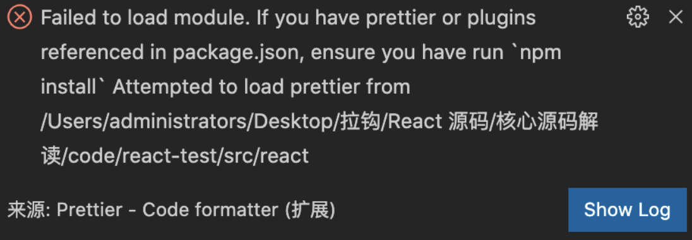

### 1. 配置 React 源码本地调试环境

1. 使用 create-react-app 脚手架创建项目

   `npx create-react-app react-test`

2. 弹射 create-react-app 脚手架内部配置

   `npm run eject`

3. 克隆 react 官方源码 (在项目的根目录下进行克隆)

   `git clone --branch v16.13.1 --depth=1 https://github.com/facebook/react.git src/react`

4. 链接本地源码

   ```javascript
   // 文件位置: react-test/config/webpack.config.js
   resolve: {
     alias: {
       "react-native": "react-native-web",
       "react": path.resolve(__dirname, "../src/react/packages/react"),
       "react-dom": path.resolve(__dirname, "../src/react/packages/react-dom"),
       "shared": path.resolve(__dirname, "../src/react/packages/shared"),
       "react-reconciler": path.resolve(__dirname, "../src/react/packages/react-reconciler"),
       "legacy-events": path.resolve(__dirname, "../src/react/packages/legacy-events"),
       'scheduler': path.resolve(__dirname, '../src/react/packages/scheduler'),
     }
   }
   ```

5. 修改环境变量

   ```javascript
   // 文件位置: react-test/config/env.js
   const stringified = {
   	"process.env": Object.keys(raw).reduce((env, key) => {
      	env[key] = JSON.stringify(raw[key])
         return env
      }, {}),
      __DEV__: true,
      SharedArrayBuffer: true,
      spyOnDev: true,
      spyOnDevAndProd: true,
      spyOnProd: true,
      __PROFILE__: true,
      __UMD__: true,
      __EXPERIMENTAL__: true,
      __VARIANT__: true,
      gate: true,
      trustedTypes: true
    }
   ```

6. 告诉 babel 在转换代码时忽略类型检查

   `npm install @babel/plugin-transform-flow-strip-types -D`

   ```javascript
   // 文件位置: react-test/config/webpack.config.js [babel-loader]
   plugins: [
     require.resolve("@babel/plugin-transform-flow-strip-types"),
   ]
   ```

7. 导出 HostConfig

   ```javascript
   // 文件位置: /react/packages/react-reconciler/src/ReactFiberHostConfig.js
   + export * from './forks/ReactFiberHostConfig.dom';
   - invariant(false, 'This module must be shimmed by a specific renderer.');
   ```

8. 修改 ReactSharedInternals.js 文件

   ```javascript
   // 文件位置: /react/packages/shared/ReactSharedInternals.js
   - import * as React from 'react';
   - const ReactSharedInternals = React.__SECRET_INTERNALS_DO_NOT_USE_OR_YOU_WILL_BE_FIRED;
   + import ReactSharedInternals from '../react/src/ReactSharedInternals';
   ```

9. 关闭 eslint 扩展

   ```javascript
   // 文件位置: react/.eslingrc.js [module.exports]
   // 删除 extends
   extends: [
     'fbjs',
     'prettier'
   ]
   
   ```

10. 禁止 invariant 报错

    ```javascript
    // 文件位置: /react/packages/shared/invariant.js
    export default function invariant(condition, format, a, b, c, d, e, f) {
      if (condition) return;
      throw new Error(
        'Internal React error: invariant() is meant to be replaced at compile ' +
          'time. There is no runtime version.',
      );
    }
    ```

11. eslint 配置

    在 react 源码文件夹中新建 .eslintrc.json 并添加如下配置

    ```react
    {
      "extends": "react-app",
      "globals": {
        "SharedArrayBuffer": true,
        "spyOnDev": true,
        "spyOnDevAndProd": true,
        "spyOnProd": true,
        "__PROFILE__": true,
        "__UMD__": true,
        "__EXPERIMENTAL__": true,
        "__VARIANT__": true,
        "gate": true,
        "trustedTypes": true
      }
    }
    ```

12. 修改 react react-dom 引入方式

    ```javascript
    import * as React from "react"
    import * as ReactDOM from "react-dom"
    ```

13. 解决 vsCode 中 flow 报错

     ```javascript
    "javascript.validate.enable": false
     ```

14. 可选项配置

    如果你的 vscode 编辑器安装了 prettier 插件并且在保存 react 源码文件时右下角出现如下错误，按照如下步骤解决

    

    1. 全局安装 prettier

       `npm i prettier -g`

    2. 配置 prettier path

       Settings > Extensions > Prettier > Prettier path

       

15. \_\_DEV\_\_ 报错

    删除 node_modules 文件夹，执行 npm install