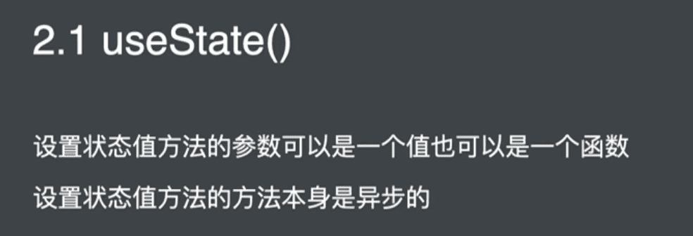
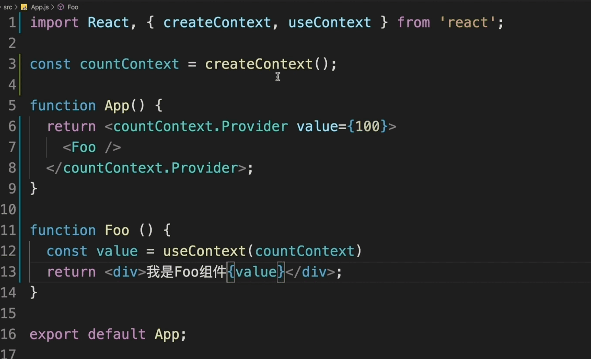
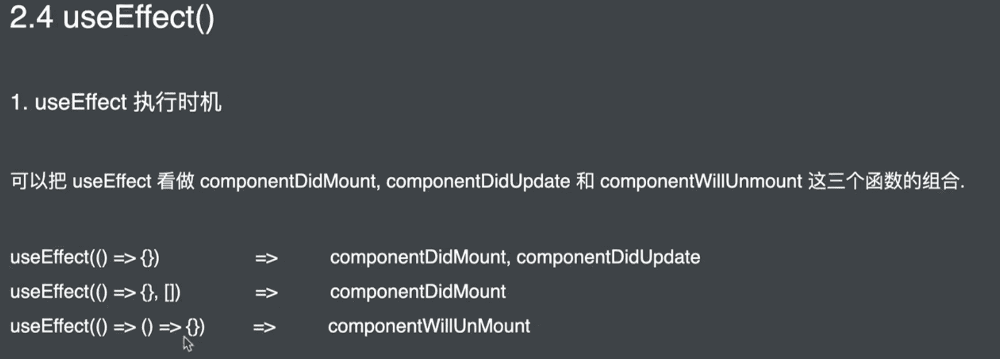
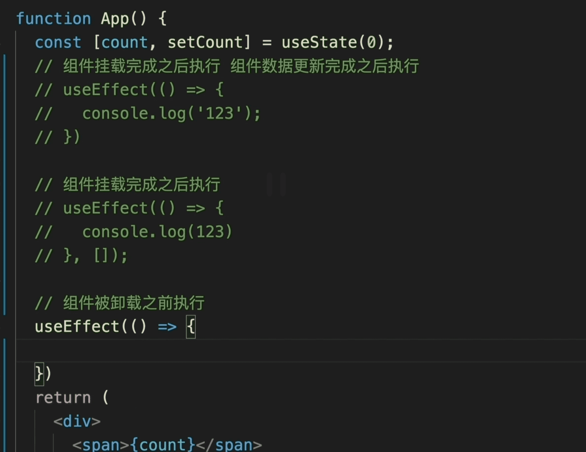
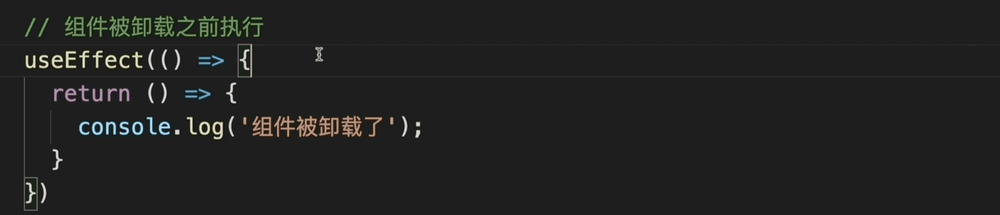
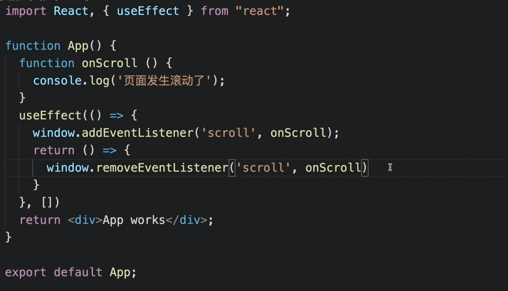
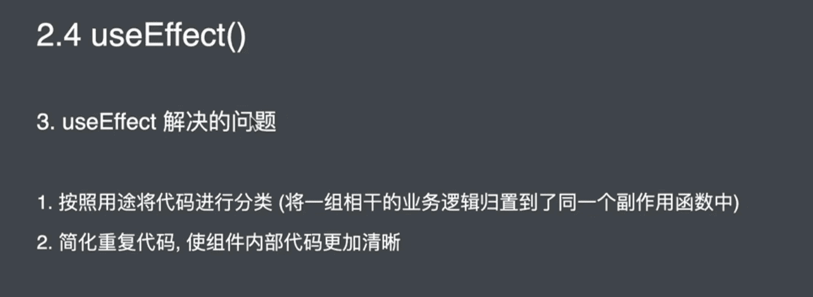
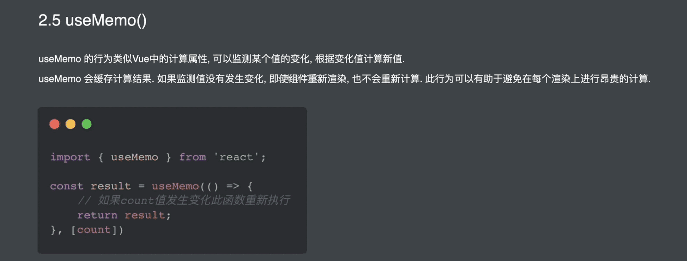
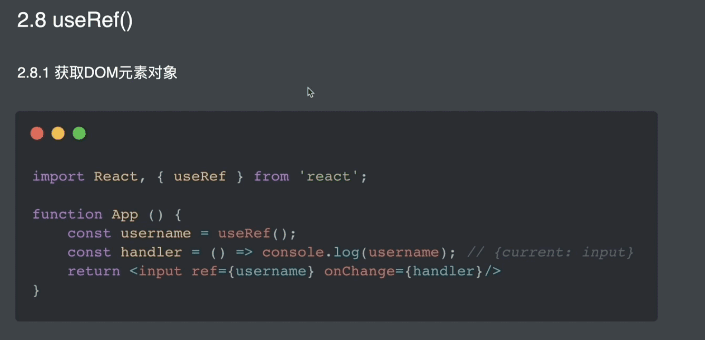

#### 1.React Hooks 介绍

对函数组件进行增强，让函数型组件可以存储状态，可以拥有处理副作用的能力。让开发者在不使用类组件的情况下，实现相同的功能。

> 副作用：在一个组件中，只要不是转化成视图的代码就是副作用。比如获取dom，为Dom 添加元素、设置定时器、发送ajax 等。在类组件中通常使用声明周期处理副作用，在函数组件中使用hooks处理

#### 2.Hooks 要解决的问题

1. 类组件的不足（Hooks 要解决的问题）

   1. 缺少逻辑复用机制

      为了复用逻辑增加无实际渲染效果的组件，增加了组件层级显示十分臃肿增加了调试的难度以及运行效率的降低

   2. 类组件经常变得很复杂难以维护

      将一组件相干的业务拆分到了多个生命周期函数中

      在一个生命周期函数内，存在多个不相干的业务逻辑

   3. 类成员方法不能保证this指向的正确性

#### 3.Hooks 使用

##### 1.useState（）

定义：用于为函数组件引入状态

###### 1.useState方法的使用细节


​	参数是函数的情况：


###### 2.设置状态值方法的使用细节




##### 2.useReducer()

useReducer是另一种让函数组件保存状态的方式。


##### 3.useContext()

在跨组件层级获取数据时简化获取数据的代码



##### 4.useEffect()

让函数型组件拥有处理副作用的能力，类似声明周期函数。







###### useEffect 例子



`ReactDOM.unmountComponentAtNode()` 卸载组件

###### useEffect 解决的问题



###### useEffect 钩子函数的第二个参数

当数据发生改变的时候执行useEffect，第二个参数指定 具体数据发生改变时执行函数

只有指定数据发生变化时触发effect

```
useEffect(()=>{
	document.title = count;
},[count]);
```

###### useEffect 钩子函数结合异步函数


##### 5.useMemo()



```react

import React, { useState, useMemo } from "react";
// bool 的改变导致组件重新渲染，但是不会重新计算result，因为count 没发生变化
export default function App() {
  const [count, setCount] = useState(0);
  const [bool, setBool] = useState(true);
  const result = useMemo(() => {
    console.log("重新渲染了");
    return count * 2;
  }, [count]);
  return (
    <div>
      <span>
        {count} {result}
      </span>
      <span> {bool ? "真" : "假"} </span>
      <button
        onClick={() => {
          setCount(count + 1);
        }}
      >
        +1
      </button>
      <button
        onClick={() => {
          console.log("s");
          setBool(!bool);
        }}
      >
        reset
      </button>
    </div>
  );
}

```

##### 6.memo 方法


```react
import "./styles.css";
import React, { useState } from "react";

export default function App() {
  const [count, setCount] = useState(0);
  return (
    <div>
      <span> {count} </span>
      <button
        onClick={() => {
          setCount(count + 1);
        }}
      >
        +1
      </button>
      <FooMemo />
    </div>
  );
}
const FooMemo = React.memo(Foo);
function Foo() {
  console.log("Foo 重新渲染");
  return <div>我是Foo组件</div>;
}

```

##### 7.useCallback钩子函数


防止Counter组件重新渲染时，resetCount 函数重新生成导致Test组件重新渲染。

```react
import React, { useState, useCallback } from "react";

export default function App() {
  const [count, setCount] = useState(0);
  const resetCount = useCallback(() => {
    setCount(0);
  }, [setCount]);
  return (
    <div>
      <span> {count} </span>
      <button
        onClick={() => {
          setCount(count + 1);
        }}
      >
        +1
      </button>
      <FooMemo resetCount={resetCount} />
    </div>
  );
}
const FooMemo = React.memo(Foo);
function Foo(props) {
  console.log("Foo 重新渲染");
  return (
    <div>
      <button onClick={props.resetCount}>reset</button>
      我是Foo组件
    </div>
  );
}
```

##### 8.useRef()

1.绑定Dom 后者 类组件，函数组件不行，函数组件要用 `forwardRef()`



2.保存数据，跨组件周期

```react
// 用useRef 保存 timerId
import React, { useState, useEffect } from "react";

function App() {
  const [count, setCount] = useState(0);
  let timerId = null;
  useEffect(() => {
    timerId = setInterval(() => {
      setCount((count) => count + 1);
    }, 500);
  }, []);
  const stopCount = () => {
    clearInterval(timerId);
  };
  return (
    <div>
      {count}
      <button onClick={stopCount}>停止</button>
    </div>
  );
}

export default App;
```

