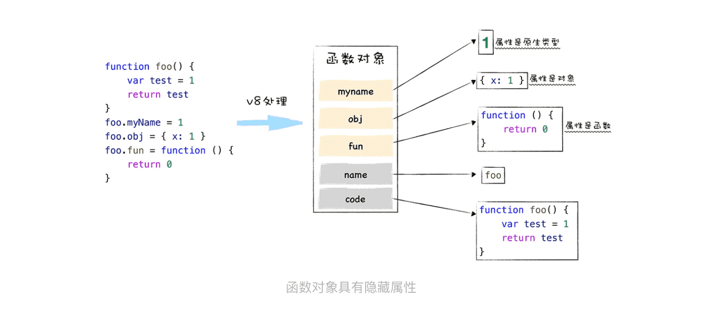
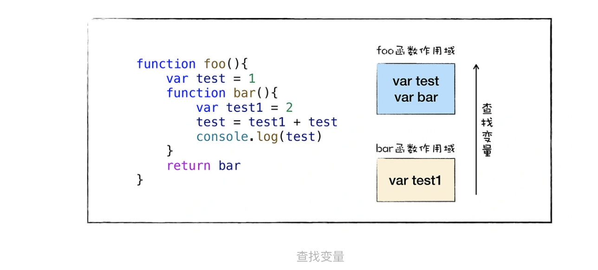

> 一篇文章彻底搞懂JavaScript的函数特点

### 1.什么是JavaScript 中的对象？

JavaScript 是一门基于对象（Object-Based）的语言。

### 2.函数的本质

函数除了可以拥有常用类型的属性值之外，还拥有两个隐藏属性：**name**属性和**code**属。



> 该函数对象的默认的 name 属性值就是 anonymous，表示该函数对象没有被设置名称。另外一个隐藏属性是 code 属性，其值表示函数代码，以字符串的形式存储在内存中。当执行到一个函数调用语句时，V8 便会从函数对象中取出 code 属性值，也就是函数代码，然后再解释执行这段函数代码。

### 3.函数是一等公民

**如果某个编程语言的函数，可以和这个语言的数据类型做一样的事情，我们就把这个语言中的函数称为一等公民。**

在执行 JavaScript 函数的过程中，为了实现变量的查找，V8 会为其维护一个作用域链，如果函数中使用了某个变量，但是在函数内部又没有定义该变量，那么函数就会沿着作用域链去外部的作用域中查找该变量。




```javascript
function foo(){
    var number = 1
    function bar(){
        number++
        console.log(number)
    }
    return bar
}
var mybar = foo()
mybar()
```

在 foo 函数中定义了一个新的 bar 函数，并且 bar 函数引用了 foo 函数中的变量 number，当调用 foo 函数的时候，它会返回 bar 函数。

那么所谓的“函数是一等公民”就体现在，如果要返回函数 bar 给外部，那么即便 foo 函数执行结束了，其内部定义的 number 变量也不能被销毁，因为 bar 函数依然引用了该变量。

**我们也把这种将外部变量和和函数绑定起来的技术称为闭包。**

另外基于函数是一等公民，我们可以轻松使用 JavaScript 来实现目前比较流行的函数式编程，函数式编程规则很少，非常优美。


