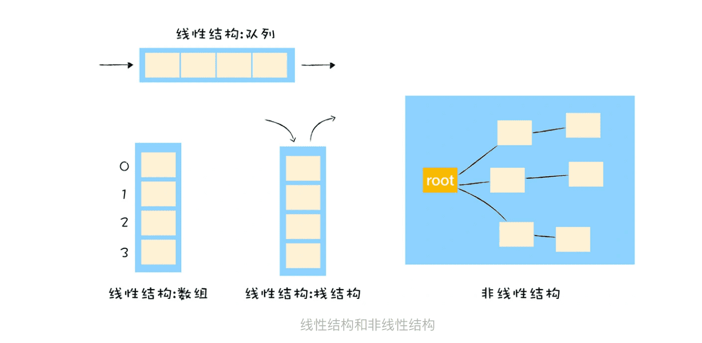

> V8是怎么样提升对象属性访问速度的？

而在 V8 实现对象存储时，并没有完全采用字典的存储方式，这主要是出于性能的考量。因为字典是非线性的数据结构，查询效率会低于线性的数据结构，V8 为了提升存储和查找效率，采用了一套复杂的存储策略。



### 1.常规属性 (properties) 和排序属性 (element)

```javascript
function Boo() {
    this[100] = 'value-100'
    this[1] = 'value-1'
    this["B"] = 'boo-B'
    this[50] = 'value-50'
    this[9] = 'value-9'
    this[8] = 'value-8'
    this[3] = 'value-3'
    this[5] = 'value-5'
    this["A"] = 'boo-A'
    this["C"] = 'boo-C'
}
let instance = new Boo()

for (key in instance) {
    console.log(`index:${key}  value:${instance[key]}`)
}
/* 打印结果
index:1    value:value-1
index:3    value:value-3
index:5    value:value-5
index:8    value:value-8
index:9    value:value-9
index:50   value:value-50
index:100  value:value-100
index:B    value:boo-B
index:A    value:boo-A
index:C    value:boo-C
打印出来的属性顺序并不是设置的顺序 */
```

之所以出现这样的结果，是**因为在 ECMAScript 规范中定义了数字属性应该按照索引值大小升序排列，字符串属性根据创建时的顺序升序排列。**

在这里把对象中的数字属性称为**排序属性**，在 V8 中被称为 **elements**，字符串属性就被称为**常规属性**，在 V8 中被称为 **properties**。

在 V8 内部，为了有效地提升存储和访问这两种属性的性能，分别使用了两个线性数据结构来分别保存排序属性和常规属性。


bar 对象包含了两个隐藏属性：elements 属性和 properties 属性，elements 属性指向了 elements 对象，在 elements 对象中，会按照顺序存放**排序属性**，properties 属性则指向了 properties 对象，在 properties 对象中，会按照创建时的顺序保存了**常规属性**。

### 2.快属性和慢属性

将不同的属性分别保存到 elements 属性和 properties 属性中，无疑简化了程序的复杂度，但是在查找元素时，却多了一步操作。

> 比如执行 bar.B这个语句来查找 B 的属性值，那么在 V8 会先查找出 properties 属性所指向的对象 properties，然后再在 properties 对象中查找 B 属性，这种方式在查找过程中增加了一步操作，因此会影响到元素的查找效率。

基于这个原因，V8 采取了一个权衡的策略以加快查找属性的效率，这个策略是将部分常规属性直接存储到对象本身，我们把这称为**对象内属性 (in-object properties)**。


> 采用对象内属性之后，常规属性就被保存到 bar 对象本身了，这样当再次使用bar.B来查找 B 的属性值时，V8 就可以直接从 bar 对象本身去获取该值就可以了，这种方式减少查找属性值的步骤，增加了查找效率。

**不过对象内属性的数量是固定的，默认是 10 个**，如果添加的属性超出了对象分配的空间，则它们将被保存在常规属性存储中。虽然属性存储多了一层间接层，但可以自由地扩容。

通常，我们将保存在线性数据结构中的属性称之为“**快属性**”，因为线性数据结构中只需要通过索引即可以访问到属性，虽然访问线性结构的速度快，但是如果从线性结构中添加或者删除大量的属性时，则执行效率会非常低，这主要因为会产生大量时间和内存开销。

因此，如果一个对象的属性过多时，V8 就会采取另外一种存储策略，那就是“**慢属性**”策略，但慢属性的对象内部会有独立的非线性数据结构 (词典) 作为属性存储容器。所有的属性元信息不再是线性存储的，而是直接保存在属性字典中。

> **element**
>
> element没有内置。
> element默认应该采用连续的存储结构，通过浪费空间换取时间，直接下标访问，提升访问速度。
> 但当element的序号十分不连续时，会优化成为hash表，因为要浪费的空间太大了，不合算。
>
> **property**
>
> property有内置，只有十个，但建议把这十个单独考虑，后面就容易考虑清楚了。
> property默认采用链表结构，当数据量很小时，查找也会很快，但数据量上升到某个数值后，会优化成为hash表。
> 因为超过某个数值，顺序查找就不够快了，需要通过hash表结构查找，提升速度。
>
> **hash表不是应该查找一次吗？为何是慢查询**
>
> hash表要解决key冲突问题，一般会用list存储多个冲突的key，所以计算hash后，还是要做顺序访问，所以要多次访问。
> 此外，还涉及到hash扩容的问题，那就更慢了。
> 所以，整体上来说，hash慢于按地址访问的；
> 在数据量小的时候，也慢于链表的顺序访问。
>
> **hash表如何存储property顺序？**
>
> 再用一个链表记录插入属性就好了，类似于Java中的 LinkedHashMap ，就可以解决问题


[1]: https://www.cnblogs.com/chargeworld/p/12236848.html


