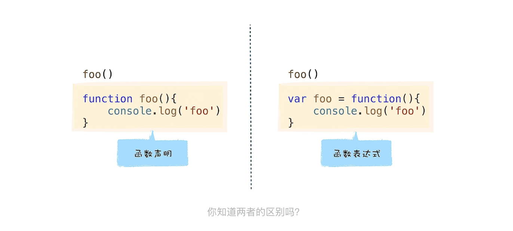

> 涉及大量概念，函数表达式到底该怎么学？

### 1.函数声明与函数表达式的差异

****

****

因为语义不同，所以给这两种定义函数的方式使用了不同的名称，第一种称之为**函数声明**，第二种称之为**函数表达式**。

### 2.V8 是怎么处理函数声明的？

```javascript
var x = 5
function foo(){
    console.log('Foo')
}
```


在编译阶段，如果解析到函数声明，那么 V8 会将这个函数声明转换为内存中的函数对象，并将其放到作用域中。同样，如果解析到了某个变量声明，也会将其放到作用域中，但是会将其值设置为 undefined，表示该变量还未被使用。

然后在 V8 执行阶段，如果使用了某个变量，或者调用了某个函数，那么 V8 便会去作用域查找相关内容。

> 使用“d8 --print-scopes test.js”命令即可查看作用域的状态。
>
> ```javascript
> 
> Global scope:
> global { // (0x7fb62281ca48) (0, 50)
>   // will be compiled
>   // 1 stack slots
>   // temporary vars:
>   TEMPORARY .result;  // (0x7fb62281cfe8) local[0]
>   // local vars:
>   VAR x;  // (0x7fb62281cc98)
>   VAR foo;  // (0x7fb62281cf40)
> 
> 
>   function foo () { // (0x7fb62281cd50) (22, 50)
>     // lazily parsed
>     // 2 heap slots
>   }
> }
> ```

因为在执行之前，这些变量都被提升到作用域中了，所以在执行阶段，V8 当然就能获取到所有的定义变量了。我们把这种在编译阶段，将所有的变量提升到作用域的过程称为**变量提升**。

> 表达式就是表示值的式子，而语句是操作值的式子。
>
> ```javascript
> x = 5
> ```
>
> 就是表达式，因为执行这段代码，它会返回一个值。同样，6 === 5 也是一个表达式，因为它会返回 False。
>
> 而语句则不同了，比如你定义了一个变量：
>
> ```
> var x
> ```
>
> 这就是一个语句，执行该语句时，V8 并不会返回任何值给你。
>
> 同样，当我声明了一个函数时，这个函数声明也是一个语句，比如下面这段函数声明：
>
> ```javascript
> function foo(){
>   return 1
> }
> ```
>
> 当执行到这段代码时，V8 并没有返回任何的值，它只是解析 foo 函数，并将函数对象存储到内存中。
>
> 


了解了表达式和语句的区别，接下来我们继续分析上面的问题。我们知道，在 V8 执行var x = 5这段代码时，会认为它是两段代码，一段是定义变量的语句，一段是赋值的表达式，如下所示：

```javascript
var x = undefined
x = 5
```

首先，在变量提升阶段，V8 并不会执行赋值的表达式，该阶段只会分析基础的语句，比如变量的定义，函数的声明。

而这两行代码是在不同的阶段完成的，var x 是在编译阶段完成的，也可以说是在变量提升阶段完成的，而x = 5是表达式，所有的表达式都是在执行阶段完成的。

在变量提升阶段，V8 将这些变量存放在作用域时，还会给它们赋一个默认的 undefined 值，所以在定义一个普通的变量之前，使用该变量，那么该变量的值就是 undefined。

**表达式是不会在编译阶段执行的，**

**总的来说，在 V8 解析 JavaScript 源码的过程中，如果遇到普通的变量声明，那么便会将其提升到作用域中，并给该变量赋值为 undefined，如果遇到的是函数声明，那么 V8 会在内存中为声明生成函数对象，并将该对象提升到作用域中。**


