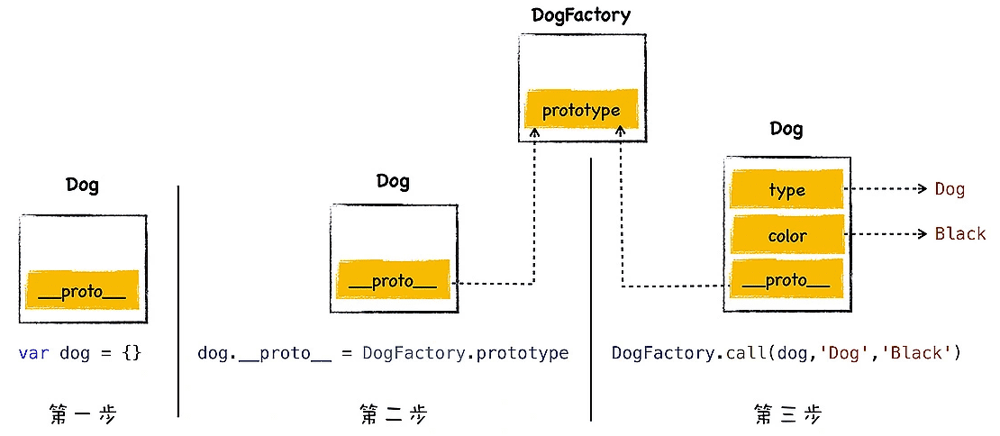
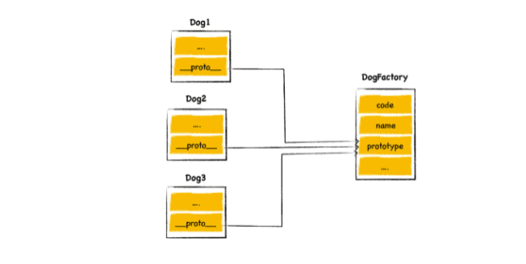

> V8是如何实现对象继承的？

不同的语言实现继承的方式是不同的，其中最典型的两种方式是**基于类的设计**和**基于原型继承的设计**。

> C++、Java、C# 这些语言都是基于经典的类继承的设计模式，这种模式最大的特点就是提供了非常复杂的规则，并提供了非常多的关键字，诸如 class、friend、protected、private、interface 等，通过组合使用这些关键字，就可以实现继承。
>
> 使用基于类的继承时，如果业务复杂，那么你需要创建大量的对象，然后需要维护非常复杂的继承关系，这会导致代码过度复杂和臃肿，另外引入了这么多关键字也给设计带来了更大的复杂度。
>
> 而 JavaScript 的继承方式和其他面向对象的继承方式有着很大差别，JavaScript 本身不提供一个 class 实现。虽然标准委员会在 ES2015/ES6 中引入了 class 关键字，但那只是语法糖，JavaScript 的继承依然和基于类的继承没有一点关系。所以当你看到 JavaScript 出现了 class 关键字时，不要以为 JavaScript 也是面向对象语言了。
>
> JavaScript 仅仅在对象中引入了一个原型的属性，就实现了语言的继承机制，基于原型的继承省去了很多基于类继承时的繁文缛节，简洁而优美。

### 1.原型继承是如何实现的

不要将原型链接和作用域链搞混淆了，**作用域链是沿着函数的作用域一级一级来查找变量的，而原型链是沿着对象的原型一级一级来查找属性的**。

**继承就是一个对象可以访问另外一个对象中的属性和方法，在JavaScript 中，我们通过原型和原型链的方式来实现了继承特性。**

> 还有一点我们要注意，通常隐藏属性是不能使用 JavaScript 来直接与之交互的。虽然现代浏览器都开了一个口子，让 JavaScript 可以访问隐藏属性 _proto_，但是在实际项目中，我们不应该直接通过 _proto_ 来访问或者修改该属性，其主要原因有两个：
>
> 首先，这是隐藏属性，并不是标准定义的 ;
>
> 其次，使用该属性会造成严重的性能问题。

### 2.构造函数是怎么创建对象的？

```javascript
function DogFactory(type,color){
    this.type = type
    this.color = color
}

var dog = new DogFactory('Dog','Black')
```




- 首先，创建了一个空白对象 dog；
- 然后，将 DogFactory 的 prototype 属性设置为 dog 的原型对象，这就是给 dog 对象设置原型对象的关键一步，我们后面来介绍；
- 最后，再使用 dog 来调用 DogFactory，这时候 DogFactory 函数中的 this 就指向了对象 dog，然后在 DogFactory 函数中，利用 this 对对象 dog 执行属性填充操作，最终就创建了对象 dog。

### 3.构造函数怎么实现继承

**每个函数对象中都有一个公开的 prototype 属性，当你将这个函数作为构造函数来创建一个新的对象时，新创建对象的原型对象就指向了该函数的 prototype 属性。**



```javascript

function DogFactory(type,color){
    this.type = type
    this.color = color
    //Mammalia
}
DogFactory. prototype.constant_temperature = 1
var dog1 = new DogFactory('Dog','Black')
var dog2 = new DogFactory('Dog','Black')
var dog3 = new DogFactory('Dog','Black')
```

这样我们三个 dog 对象的原型对象都指向了 prototype，而 prototype 又包含了 constant_temperature 属性，这就是我们实现继承的正确方式。

### 4.思考题

DogFactory 是一个函数，那么“DogFactory.prototype”和“DogFactory._proto_”这两个属性之间有关联吗？

DogFactory 是 Function 构造函数的一个实例，所以 DogFactory.__proto__ === Function.prototype

DogFactory.prototype 是调用 Object 构造函数的一个实例，所以 DogFactory.prototype.__proto__ === Object.prototype

因此 DogFactory._proto_ 和 DogFactory.prototype 没有直接关系。


