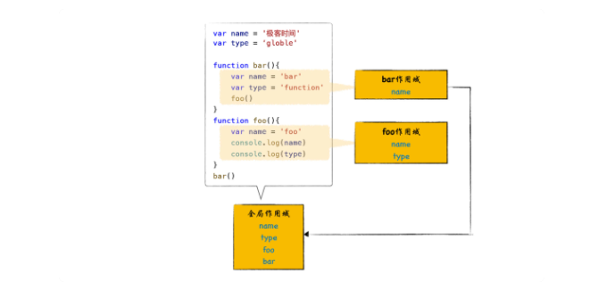

> V8是如何查找变量的

### 1.什么是函数作用域和全局作用域？

**每个函数在执行时都需要查找自己的作用域，我们称为函数作用域。**

**全局作用域是在 V8 启动过程中就创建了，且一直保存在内存中不会被销毁的，直至 V8 退出。 而函数作用域是在执行该函数时创建的，当函数执行结束之后，函数作用域就随之被销毁掉了**

### 2.作用域链是怎么工作的？

因为 JavaScript 是基于词法作用域的，词法作用域就是指，查找作用域的顺序是按照函数定义时的位置来决定的。

> 因为词法作用域是根据函数在代码中的位置来确定的，作用域是在声明函数时就确定好的了，所以我们也将词法作用域称为静态作用域。