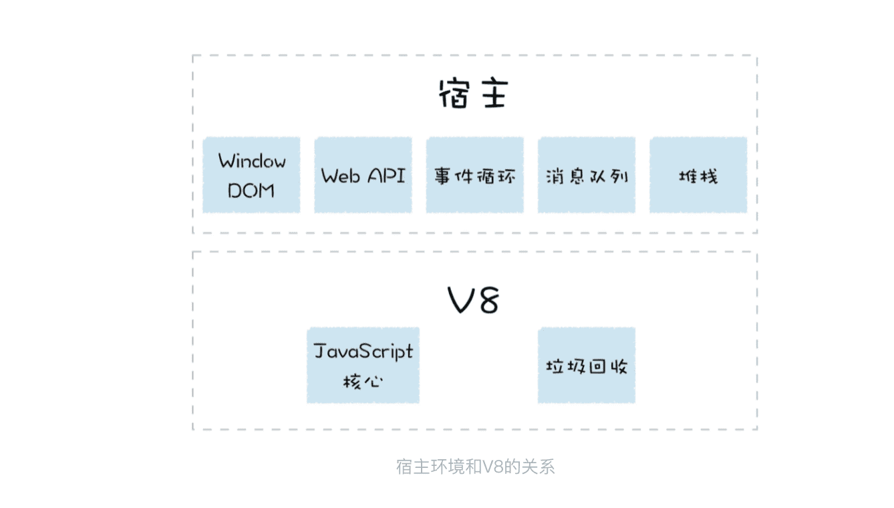
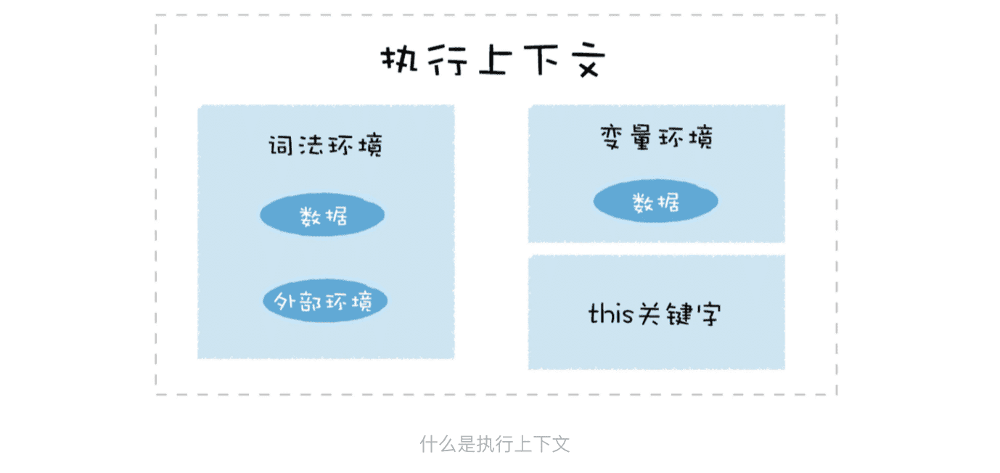

> 运行时环境：运行JavaScript代码的基石

在执行 JavaScript 代码之前，V8 就已经准备好了代码的运行时环境，这个环境包括了堆空间和栈空间、全局执行上下文、全局作用域、内置的内建函数、宿主环境提供的扩展函数和对象，还有消息循环系统。

### 1.什么是宿主环境？

### 2.构造数据存储空间：堆空间和栈空间

栈空间主要是用来管理 JavaScript 函数调用的，栈是内存中连续的一块空间，同时栈结构是“先进后出”的策略。

栈空间的最大的特点是空间连续，所以在栈中每个元素的地址都是固定的，因此栈空间的查找效率非常高，但是通常在内存中，很难分配到一块很大的连续空间，因此，V8 对栈空间的大小做了限制，如果函数调用层过深，那么 V8 就有可能抛出栈溢出的错误。

### 3.全局执行上下文和全局作用域

执行上下文中主要包含三部分，变量环境、词法环境和 this 关键字。比如在浏览器的环境中，全局执行上下文中就包括了 window 对象，还有默认指向 window 的 this 关键字，另外还有一些 Web API 函数，诸如 setTimeout、XMLHttpRequest 等内容。

### 4.构造事件循环系统

V8 还需要有一个主线程，用来执行 JavaScript 和执行垃圾回收等工作。V8 是寄生在宿主环境中的，它并没有自己的主线程，而是使用宿主所提供的主线程，V8 所执行的代码都是在宿主的主线程上执行的。

因为所有的任务都是运行在主线程的，在浏览器的页面中，V8 会和页面共用主线程，共用消息队列，所以如果 V8 执行一个函数过久，会影响到浏览器页面的交互性能。

