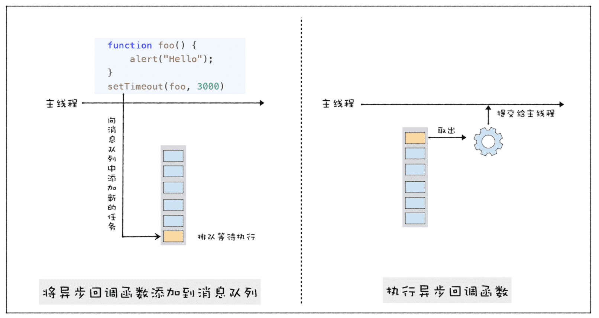
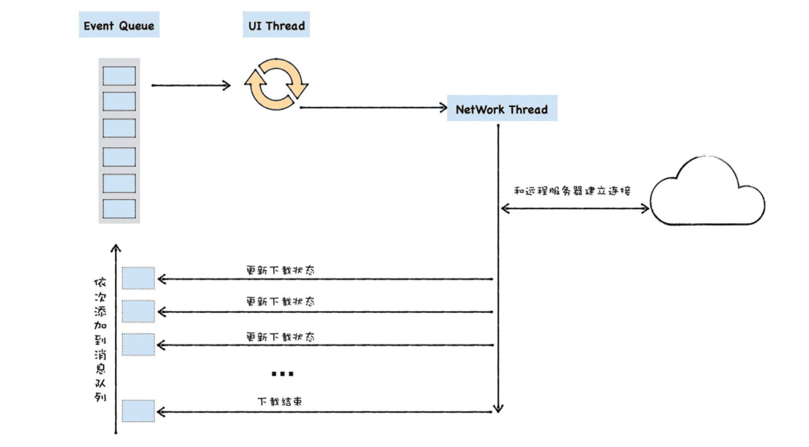

> V8是怎么实现回调函数的?

### 1.什么是回调函数?

**同步回调函数是在执行函数内部被执行的，而异步回调函数是在执行函数外部被执行的。**

### 2.UI线程的宏观架构

通用UI线程架构:

### 3.异步回调函数的调用时机

#### 1.setTimeout

>  settimeout是立即放入消息队列还是等时间到了再放入的？
>
> 定时器有单独的队列，每次执行新的宏任务时，主线程会先在这两个队列中查找即将要执行的事件，然后执行

#### 2.XMLHttpRequest

