> V8是如何实现微任务的?

基于这套基础 UI 框架，JavaScript 又延伸出很多新的技术，其中应用最广泛的当属**宏任务**和**微任务**。

**宏任务，就是指消息队列中的等待被主线程执行的事件**。

**微任务可以看成是一个需要异步执行的函数，执行时机是在主函数执行结束之后、当前宏任务结束之前。**

> JavaScript 中之所以要引入微任务，主要是由于主线程执行消息队列中宏任务的时间颗粒度太粗了，无法胜任一些对精度和实时性要求较高的场景，那么**微任务可以在实时性和效率之间做一个有效的权衡**
>
> 另外使用微任务，可以改变我们现在的异步编程模型，使得我们可以使用同步形式的代码来编写异步调用。

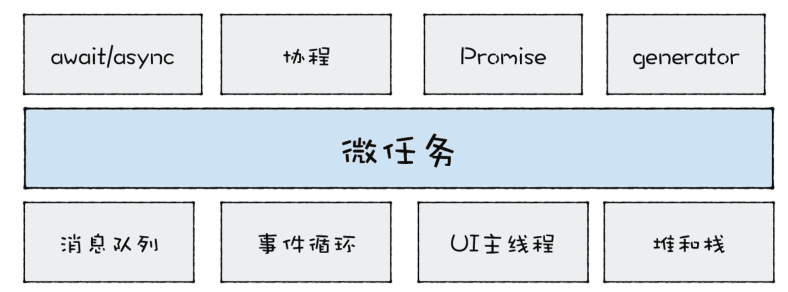

微任务是基于消息队列、事件循环、UI 主线程还有堆栈而来的，然后基于微任务，又可以延伸出协程、Promise、Generator、await/async 等现代前端经常使用的一些技术。

### 1.主线程、调用栈、消息队列

**调用栈是一种数据结构，用来管理在主线程上执行的函数的调用关系。**

**由于栈空间在内存中是连续的，所以通常我们都会限制调用栈的大小，如果当函数嵌套层数过深时，过多的执行上下文堆积在栈中便会导致栈溢出，**

> 以使用 setTimeout 来解决栈溢出的问题，setTimeout 的本质是将同步函数调用改成异步函数调用，这里的异步调用是将 foo 封装成事件，并将其添加进消息队列中，然后主线程再按照一定规则循环地从消息队列中读取下一个任务。

```javascript
function foo() {
  setTimeout(foo, 0)
}
foo()
```

从**调用栈**、**主线程**、**消息队列**三者的角度分析这段代码：


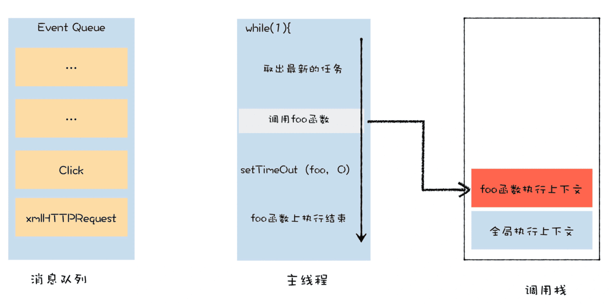


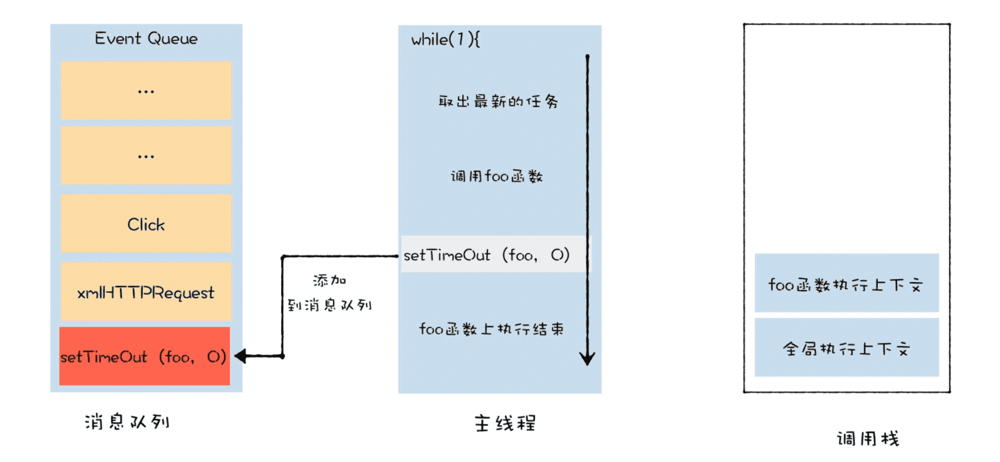

等 foo 函数执行结束，V8 就会结束当前的宏任务，调用栈也会被清空。

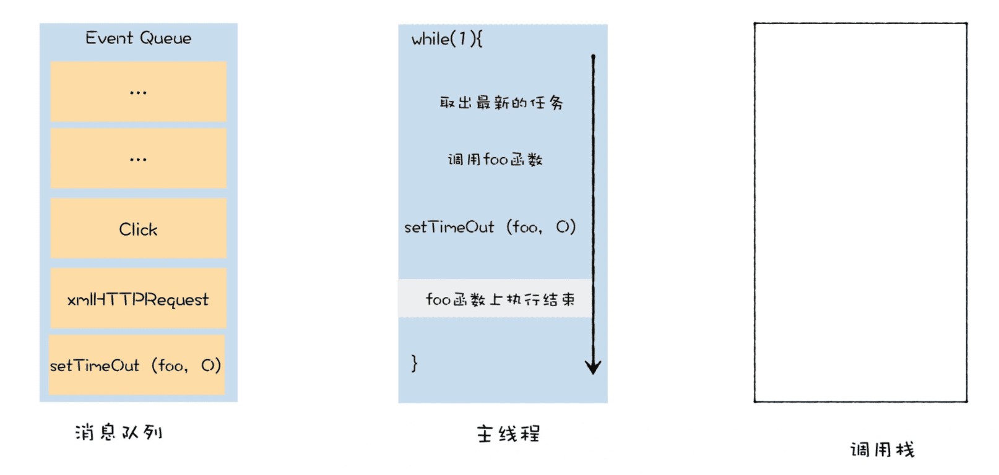

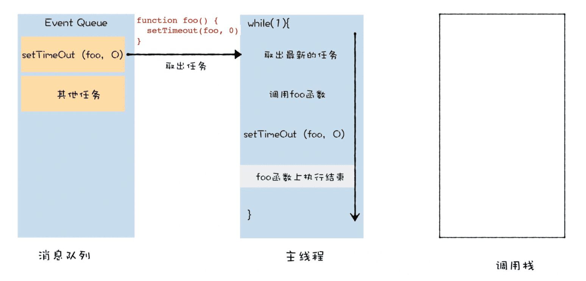

### 2.微任务解决了宏任务执行时机不可控的问题

```javascript
function bar(){
  console.log('bar')
  Promise.resolve().then(
    (str) =>console.log('micro-bar')
  ) 
  setTimeout((str) =>console.log('macro-bar'),0)
}


function foo() {
  console.log('foo')
  Promise.resolve().then(
    (str) =>console.log('micro-foo')
  ) 
  setTimeout((str) =>console.log('macro-foo'),0)
  
  bar()
}
foo()
console.log('global')
Promise.resolve().then(
  (str) =>console.log('micro-global')
) 
setTimeout((str) =>console.log('macro-global'),0)
```

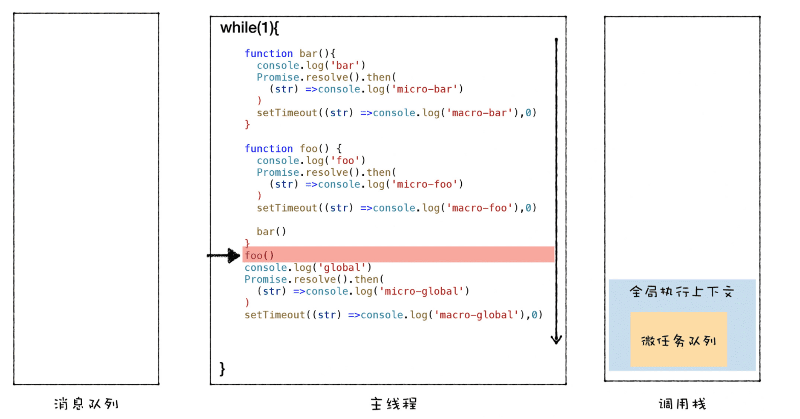


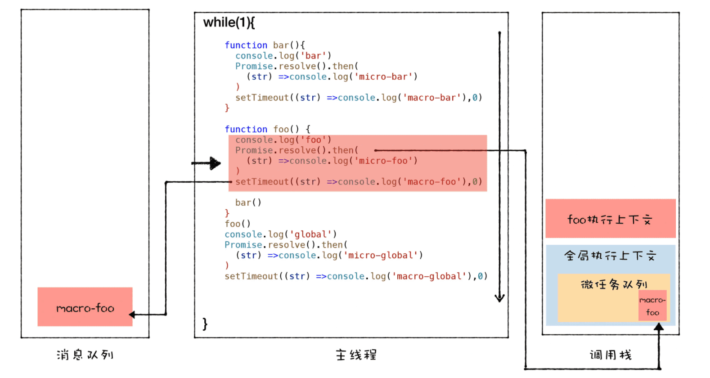

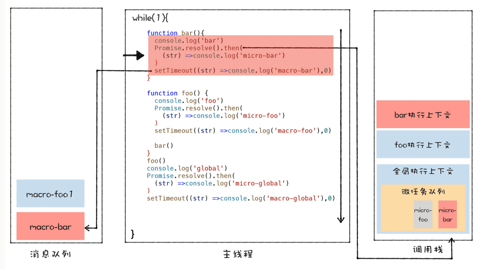

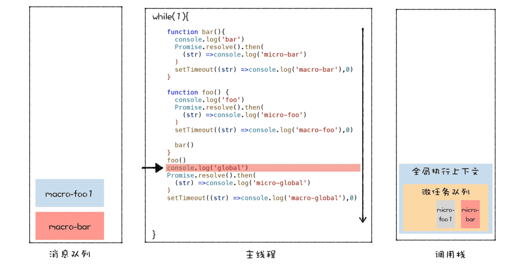

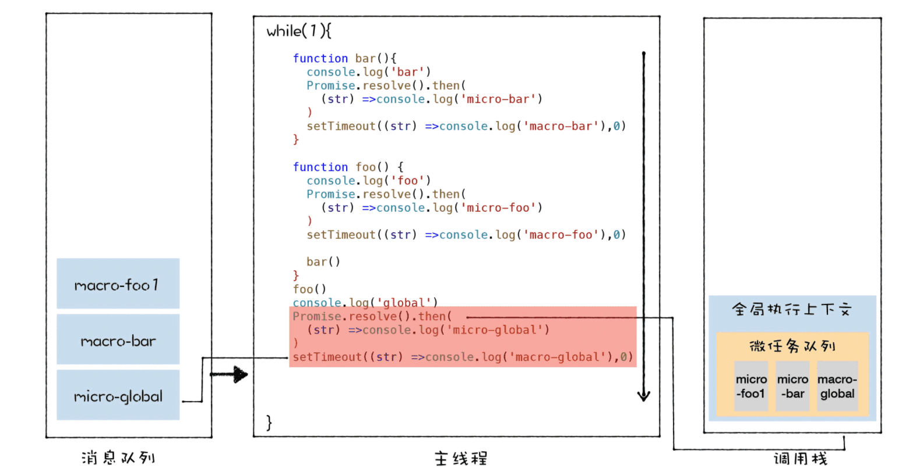

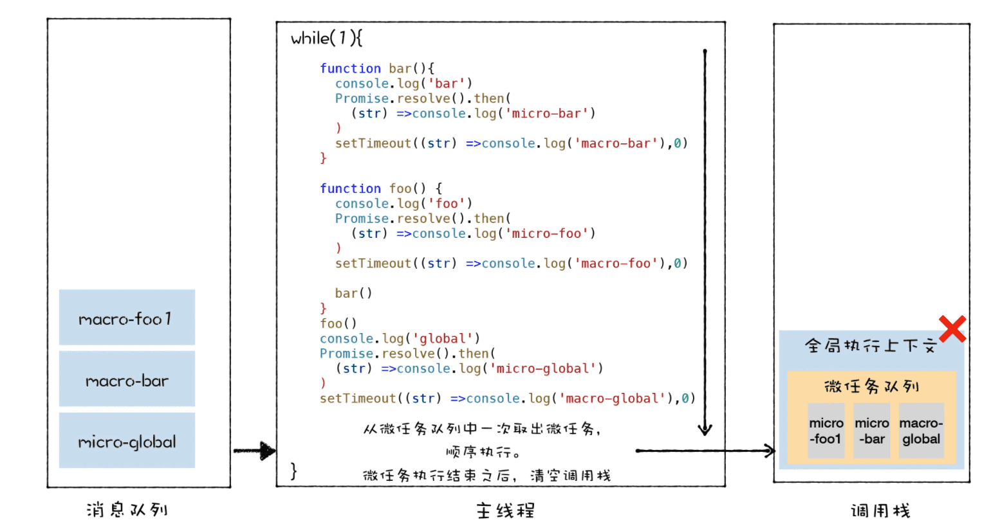

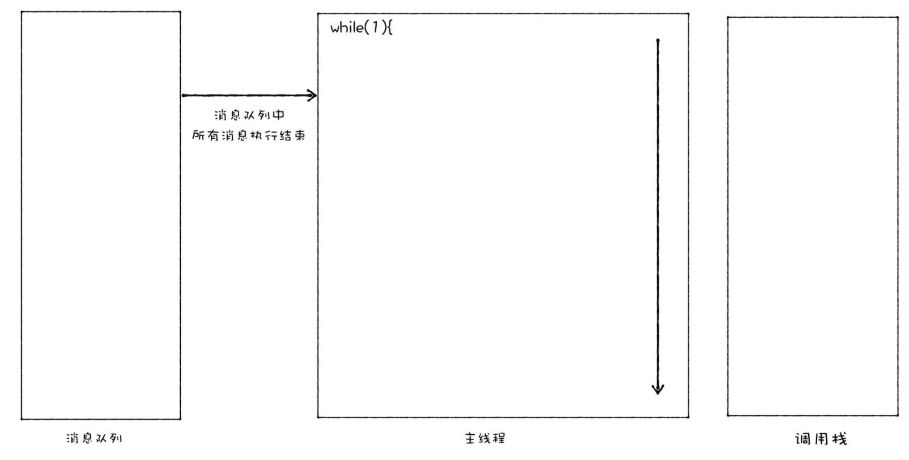


### 3.能否在微任务中循环地触发新的微任务？

```javascript
function foo() {
  return Promise.resolve().then(foo)
}
foo()
```

当执行 foo 函数时，由于 foo 函数中调用了 Promise.resolve()，这会触发一个微任务，那么此时，V8 会将该微任务添加进微任务队列中，退出当前 foo 函数的执行。

然后，V8 在准备退出当前的宏任务之前，会检查微任务队列，发现微任务队列中有一个微任务，于是先执行微任务。由于这个微任务就是调用 foo 函数本身，所以在执行微任务的过程中，需要继续调用 foo 函数，在执行 foo 函数的过程中，又会触发了同样的微任务。

**那么这个循环就会一直持续下去，当前的宏任务无法退出，也就意味着消息队列中其他的宏任务是无法被执行的，比如通过鼠标、键盘所产生的事件。这些事件会一直保存在消息队列中，页面无法响应这些事件，具体的体现就是页面的卡死。**

不过，由于 V8 每次执行微任务时，都会退出当前 foo 函数的调用栈，所以这段代码是不会造成栈溢出的。


