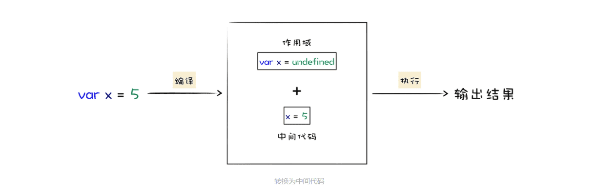
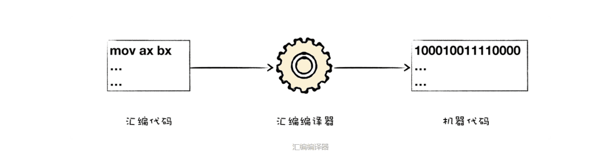
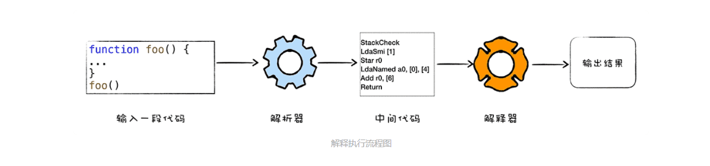
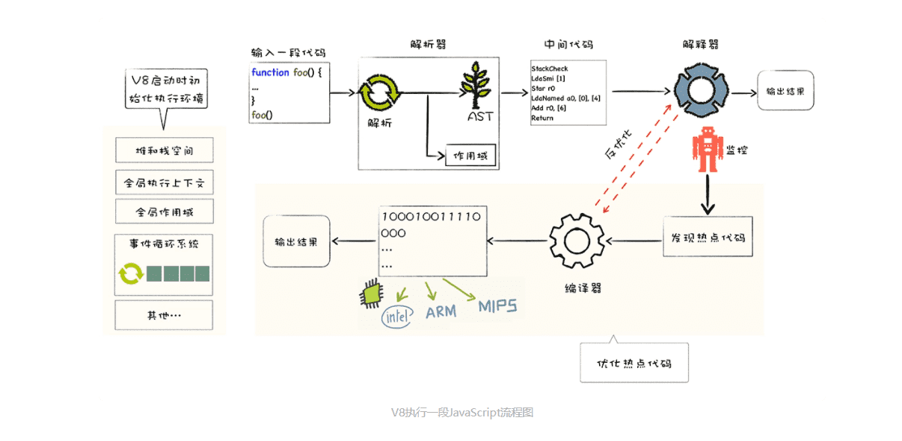

### 1.什么是V8？

V8 是一个由 Google 开发的开源 JavaScript 引擎，目前用在 Chrome 浏览器和 Node.js 中，其核心功能是执行易于人类理解的 JavaScript 代码。

V8执行JavaScript代码主要核心流程分为编译和执行两步。




可以把 V8 看成是一个虚构出来的计算机，也称为虚拟机，虚拟机通过模拟实际计算机的各种功能来实现代码的执行，如模拟实际计算机的 CPU、堆栈、寄存器等，虚拟机还具有它自己的一套指令系统。

所以对于 JavaScript 代码来说，V8 就是它的整个世界，当 V8 执行 JavaScript 代码时，你并不需要担心现实中不同操作系统的差异，也不需要担心不同体系结构计算机的差异，你只需要按照虚拟机的规范写好代码就可以了。

### 2.高级代码为什么需要先编译再执行？

为了能够完成复杂的任务，工程师们为 CPU 提供了一大堆指令，来实现各种功能，我们就把这一大堆指令称为**指令集（Instructions）**，也就是**机器语言**。

注意，CPU 只能识别二进制的指令，但是对程序员来说，二进制代码难以阅读和记忆，于是我们又将二进制指令集转换为人类可以识别和记忆的符号，这就是汇编指令集。




虽然汇编语言对机器语言做了一层抽象，减少了程序员理解机器语言的复杂度，但是汇编语言依然是复杂且繁琐的，即便你写一个非常简单的功能，也需要实现大量的汇编代码，这主要表现在以下两点。

首先，**不同的 CPU 有着不同的指令集**，如果要使用机器语言或者汇编语言来实现一个功能，那么你需要为每种架构的 CPU 编写特定的汇编代码，这会带来巨大的、枯燥繁琐的操作。

其次**，在编写汇编代码时，我们还需要了解和处理器架构相关的硬件知识，**比如你需要使用寄存器、内存、操作 CPU 等。大部分程序员在编写应用的时候，只想专心处理业务逻辑，并不想要过多地理会这些处理器架构相关的细节。

因此我们需要一种屏蔽了计算机架构细节的语言，能适应多种不同 CPU 架构的语言，能专心处理业务逻辑的语言，诸如 C、C++、Java、C#、Python、JavaScript 等，这些“高级语言”就应运而生了。

和汇编语言一样，处理器也不能直接识别由高级语言所编写的代码，那怎么办呢？通常，要有两种方式来执行这些代码。

第一种是**解释执行**，需要先将输入的源代码通过解析器编译成中间代码，之后直接使用解释器解释执行中间代码，然后直接输出结果。具体流程如下图所示：



第二种是**编译执行**。采用这种方式时，也需要先将源代码转换为中间代码，然后我们的编译器再将中间代码编译成机器代码。通常编译成的机器代码是以二进制文件形式存储的，需要执行这段程序的时候直接执行二进制文件就可以了。还可以使用虚拟机将编译后的机器代码保存在内存中，然后直接执行内存中的二进制代码。

### 3.V8 是怎么执行 JavaScript 代码的？

V8 作为 JavaScript 的虚拟机的一种，采用混合编译执行和解释执行两种手段，该技术称为JIT（Just In Time） 技术。

这是一种权衡策略，因为这两种方法都各自有各自的优缺点，解释执行的启动速度快，但是执行时的速度慢，而编译执行的启动速度慢，但是执行时的速度快。你可以参考下面完整的 V8 执行 JavaScript 的流程图：



先看上图中的最左边的部分，在 V8 启动执行 JavaScript 之前，它还需要准备执行 JavaScript 时所需要的一些基础环境，这些基础环境包括了“堆空间”“栈空间”“全局执行上下文”“全局作用域”“消息循环系统”“内置函数”等，这些内容都是在执行 JavaScript 过程中需要使用到的，比如：

- JavaScript 全局执行上下文就包含了执行过程中的全局信息，比如一些内置函数，全局变量等信息；
- 全局作用域包含了一些全局变量，在执行过程中的数据都需要存放在内存中；
- 而 V8 是采用了经典的堆和栈的内存管理模式，所以 V8 还需要初始化内存中的堆和栈结构；
- 另外，想要我们的 V8 系统活起来，还需要初始化消息循环系统，消息循环系统包含了消息驱动器和消息队列，它如同 V8 的心脏，不断接受消息并决策如何处理消息。

基础环境准备好之后，接下来就可以向 V8 提交要执行的 JavaScript 代码了。

首先 V8 会接收到要执行的 JavaScript 源代码，不过这对 V8 来说只是一堆字符串，V8 并不能直接理解这段字符串的含义，它需要结构化这段字符串。结构化，是指信息经过分析后可分解成多个互相关联的组成部分，各组成部分间有明确的层次结构，方便使用和维护，并有一定的操作规范。

V8 源代码的结构化之后，就生成了抽象语法树 (AST)，我们称为 AST，AST 是便于 V8 理解的结构。

有了 AST 和作用域之后，接下来就可以生成字节码了，字节码是介于 AST 和机器代码的中间代码。

但是与特定类型的机器代码无关，解释器可以直接解释执行字节码，或者通过编译器将其编译为二进制的机器代码再执行。

好了，生成了字节码之后，解释器就登场了，它会按照顺序解释执行字节码，并输出执行结果。

在解释器附近画了个监控机器人，这是一个监控解释器执行状态的模块，**在解释执行字节码的过程中，如果发现了某一段代码会被重复多次执行，那么监控机器人就会将这段代码标记为热点代码。**

某段代码被标记为热点代码后，V8 就会将这段字节码丢给优化编译器，优化编译器会在后台将字节码编译为二进制代码，然后再对编译后的二进制代码执行优化操作，优化后的二进制机器代码的执行效率会得到大幅提升。如果下面再执行到这段代码时，那么 V8 会优先选择优化之后的二进制代码，这样代码的执行速度就会大幅提升。

不过，和静态语言不同的是，JavaScript 是一种非常灵活的动态语言，对象的结构和属性是可以在运行时任意修改的，而经过优化编译器优化过的代码只能针对某种固定的结构，一旦在执行过程中，对象的结构被动态修改了，那么优化之后的代码势必会变成无效的代码，这时候优化编译器就需要执行反优化操作，经过反优化的代码，下次执行时就会回退到解释器解释执行。

### 4.跟踪一段实际代码的执行流程

```javascript
var test = 'GeekTime'
```

查看AST`d8 --print-ast test.js`

在生成 AST 的同时，还会生成作用域，查看作用域`d8 --print-scopes test.js`

生成了 AST 和作用域之后，就可以使用解释器生成字节码，查看字节码 `d8 --print-bytecode test.js`

生成字节码之后，解释器会解释执行这段字节码，如果重复执行了某段代码，监控器就会将其标记为热点代码，并提交给编译器优化执行，查看那些代码被优化`d8 --trace-opt test.js`,查看那些代码被反优化`pt --trace-deopt test.js`

### 5.总结

深入分析 V8 执行一段 JavaScript 代码所经历的主要流程了，这包括了：

- 初始化基础环境；
- 解析源码生成 AST 和作用域；
- 依据 AST 和作用域生成字节码；
- 解释执行字节码；
- 监听热点代码；
- 优化热点代码为二进制的机器代码
- 反优化生成的二进制机器代码。

> 除了 V8 采用了 JIT 技术，还有哪些虚拟机采用了 JIT 技术？
>
> java 中的 JVM 


