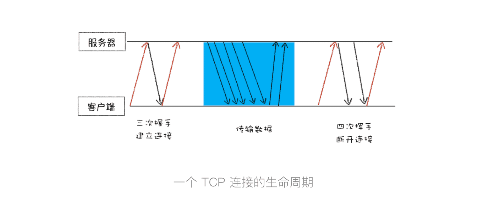

> 如何保证页面文件能被完整送达浏览器？

### 一个数据包的“旅程”

#### 1.  IP：把数据包送达目的主机

计算机的地址就称为 IP 地址，访问任何网站实际上只是你的计算机向另外一台计算机请求信息。

#### 2.UDP：把数据包送达应用程序

UDP 中一个最重要的信息是端口号，端口号其实就是一个数字，每个想访问网络的程序都需要绑定一个端口号。通过端口号 UDP 就能把指定的数据包发送给指定的程序了。

所以 IP 通过 IP 地址信息把数据包发送给指定的电脑，而 UDP 通过端口号把数据包分发给正确的程序。

#### 3.TCP：把数据完整地送达应用程序

TCP（Transmission Control Protocol，传输控制协议）是一种面向连接的、可靠的、基于字节流的传输层通信协议。

一个完整的 TCP 连接的生命周期包括了“建立连接”“传输数据”和“断开连接”三个阶段。

#### 问答：

1. HTTP协议和TCP协议都是TCP/IP协议簇的子集。

   HTTP协议属于应用层，TCP协议属于传输层，HTTP协议位于TCP协议的上层。

   请求方要发送的数据包，在应用层加上HTTP头以后会交给传输层的TCP协议处理，应答方接收到的数据包，在传输层拆掉TCP头以后交给应用层的HTTP协议处理。建立 TCP 连接后会顺序收发数据，请求方和应答方都必须依据 HTTP 规范构建和解析HTTP报文。

2. 现在的浏览器可以同时打开多个页签，他们端口一样吗？如果一样，数据怎么知道去哪个页签？

   端口一样的，网络进程知道每个tcp链接所对应的标签是那个，所以接收到数据后，会把数据分发给对应的渲染进程

​	